# 🚀 Multi-Agent Infrastructure at Scale Documentation

## Complete Technical Architecture & Flow Documentation

---

## 📋 Table of Contents

1. [🎯 Overview](#-overview)
2. [🏗️ System Architecture](#️-system-architecture)
3. [🔄 Component Flow Charts](#-component-flow-charts)
4. [📊 Deployment Workflows](#-deployment-workflows)
5. [🔐 Security Architecture](#-security-architecture)
6. [📡 API Documentation](#-api-documentation)
7. [🛠️ Implementation Guide](#️-implementation-guide)
8. [📈 Monitoring & Operations](#-monitoring--operations)

---

## 🎯 Overview

The **Multi-Agent Infrastructure at Scale** is an infrastructure backend platform that enables automated deployment and management of Eliza-based AI agents through a streamlined interface with Docker and Kubernetes orchestration.

### Key Features
- 🤖 **Automated Agent Deployment** - Deploy Eliza agents with simple configuration
- 🔒 **Container Security** - Image scanning and vulnerability management
- 📊 **Real-time Monitoring** - Health checks, metrics, and alerting
- 🛡️ **Secure API** - API key authentication and rate limiting
- ⚡ **Auto-scaling** - Dynamic resource management
- 🔧 **Simple Management** - Easy agent lifecycle operations

---

## 🏗️ System Architecture

### High-Level Architecture Overview

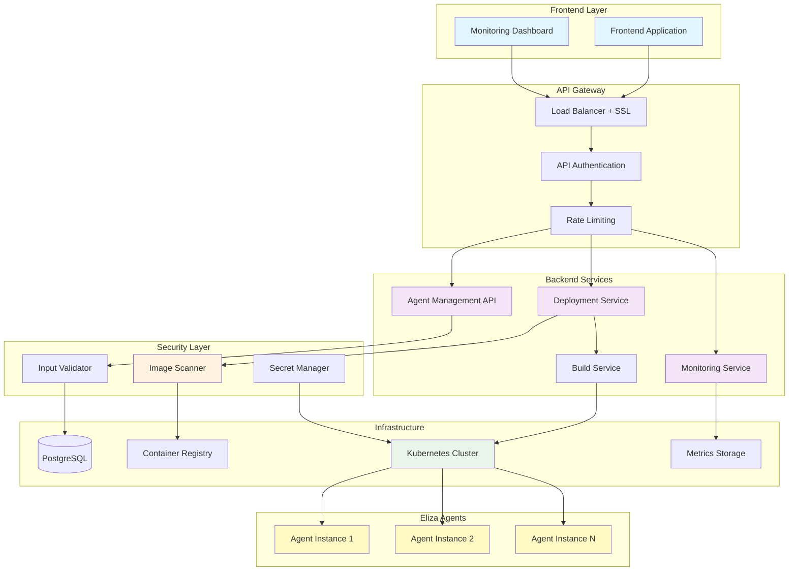

### Component Responsibilities

| Component | Responsibility | Technology |
|-----------|---------------|------------|
| **Frontend Application** | User interface for agent management | React/Vue/Angular |
| **API Gateway** | Request routing, SSL termination, rate limiting | NGINX/Traefik |
| **Agent Management API** | CRUD operations for agent configurations | Node.js/Python |
| **Deployment Service** | Orchestrates agent deployment pipeline | Node.js/Go |
| **Build Service** | Builds and packages agent containers | Docker |
| **Monitoring Service** | Health checks and metrics collection | Prometheus/Grafana |
| **Image Scanner** | Vulnerability scanning for containers | Trivy |
| **Secret Manager** | Secure credential management | Kubernetes Secrets |
| **Kubernetes Cluster** | Container orchestration platform | Kubernetes |
| **PostgreSQL** | Primary data storage | PostgreSQL with encryption |

---

## 🔄 Component Flow Charts

### 1. Agent Creation Flow

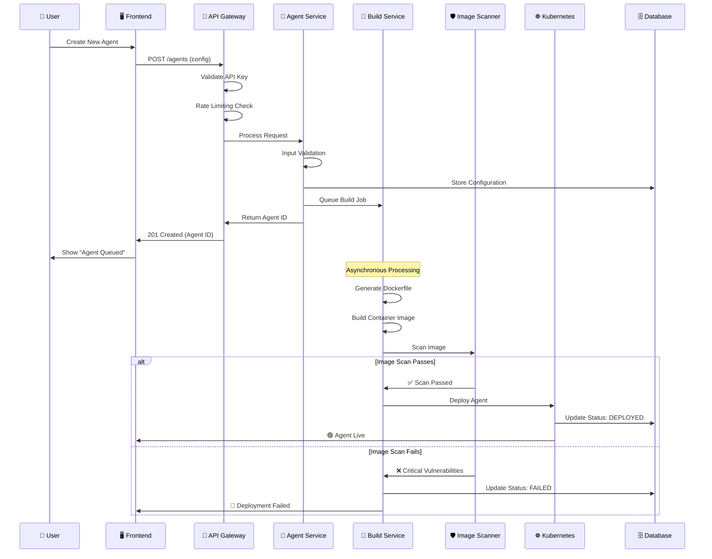

### 2. Agent Deployment Pipeline

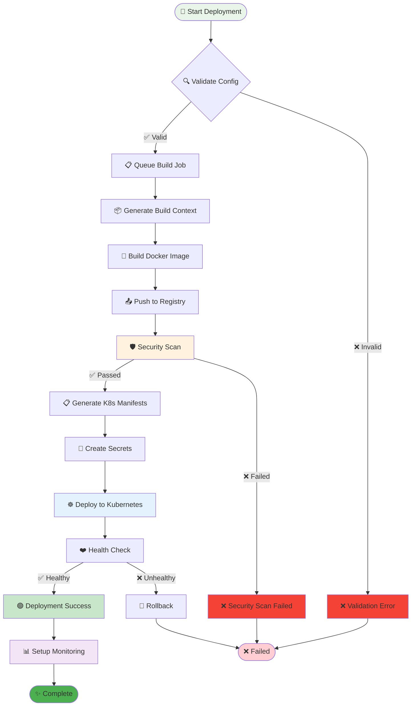

### 3. Monitoring & Health Check Flow

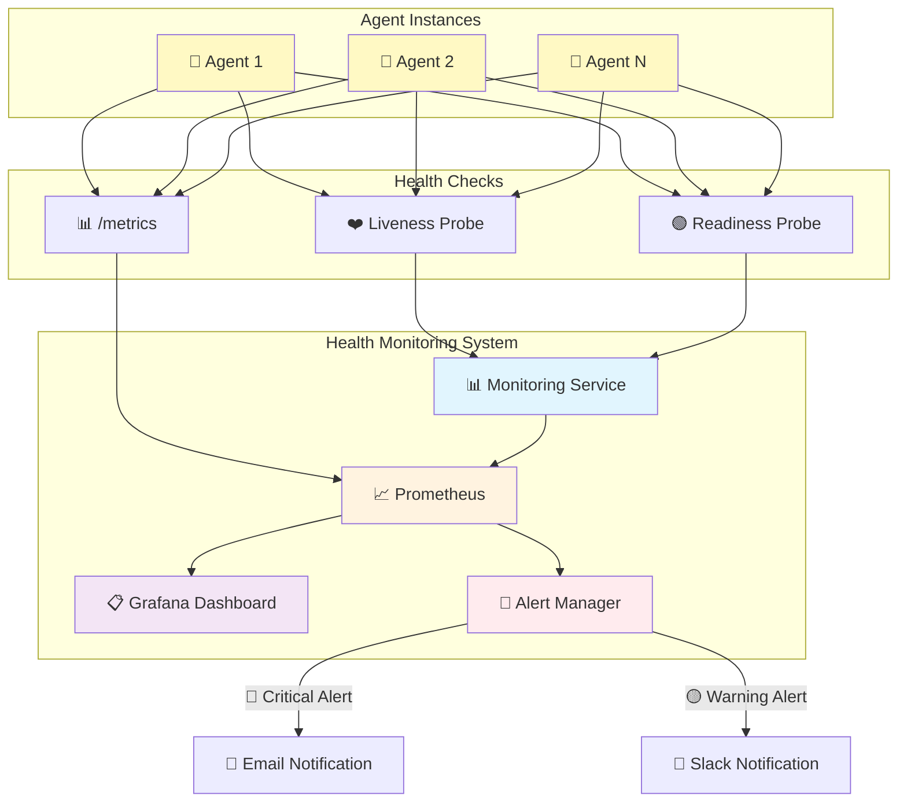

---

## 📊 Deployment Workflows

### Deployment State Machine

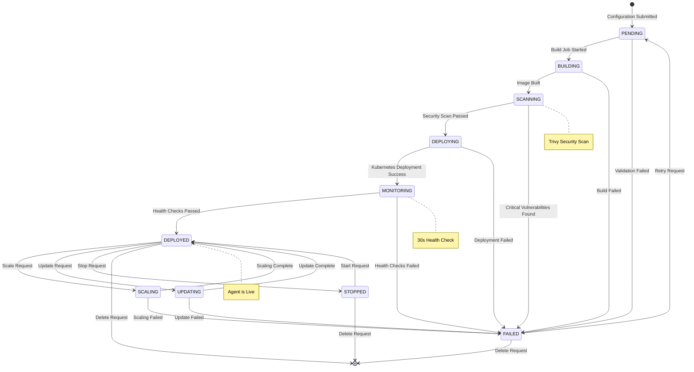

### Deployment Timeline Visualization

```mermaid
gantt
    title Agent Deployment Timeline
    dateFormat X
    axisFormat %s
    
    section Build Phase
    Validate Config     :done, validate, 0, 10s
    Generate Context    :done, context, after validate, 15s
    Build Image         :done, build, after context, 60s
    Push to Registry    :done, push, after build, 20s
    
    section Security Phase
    Security Scan       :done, scan, after push, 30s
    Vulnerability Check :done, vuln, after scan, 10s
    
    section Deploy Phase
    Generate Manifests  :done, manifest, after vuln, 15s
    Create Secrets      :done, secrets, after manifest, 10s
    Deploy to K8s       :done, deploy, after secrets, 45s
    
    section Validation Phase
    Health Checks       :done, health, after deploy, 30s
    Setup Monitoring    :done, monitor, after health, 20s
    Agent Ready         :milestone, ready, after monitor, 0s
```

---

## 🔐 Security Architecture

### Security Components Flow

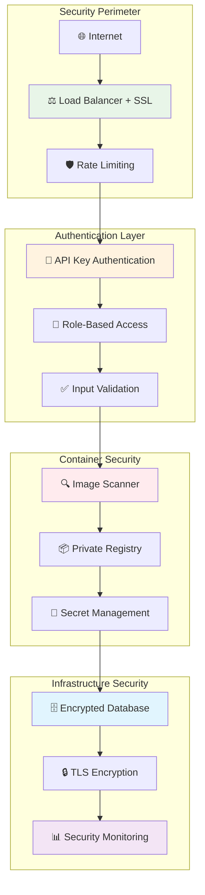

### Security Validation Process

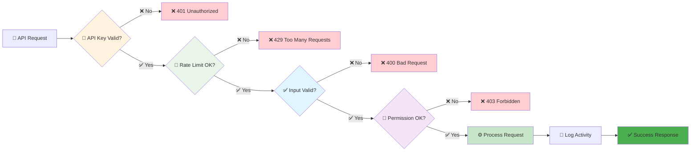

---

## 📡 API Documentation

### Core API Endpoints

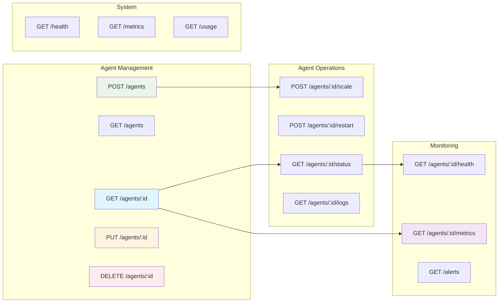

### API Authentication Flow

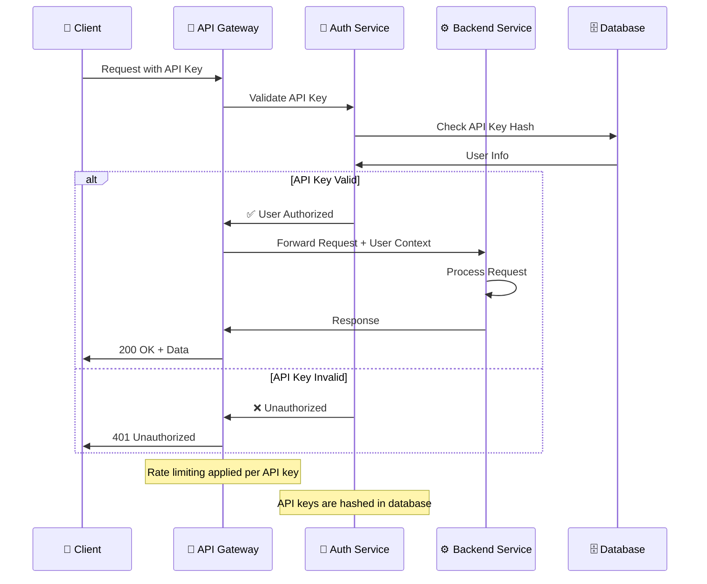

---

## 🛠️ Implementation Guide

### Development Environment Setup

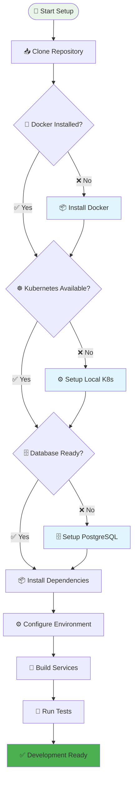

### Deployment Architecture Layers

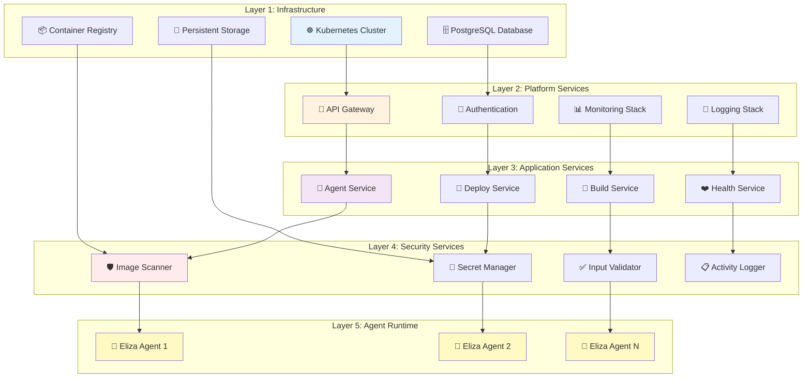

---

## 📈 Monitoring & Operations

### Monitoring Dashboard Overview

```mermaid
graph TB
    subgraph "System Metrics"
        CPU[💻 CPU Usage]
        Memory[🧠 Memory Usage]
        Disk[💾 Disk Usage]
        Network[🌐 Network I/O]
    end
    
    subgraph "Application Metrics"
        Requests[📊 Request Rate]
        Errors[❌ Error Rate]
        Latency[⏱️ Response Time]
        Throughput[📈 Throughput]
    end
    
    subgraph "Agent Metrics"
        ActiveAgents[🤖 Active Agents]
        Deployments[🚀 Deployments/Hour]
        FailureRate[📉 Failure Rate]
        HealthScore[❤️ Health Score]
    end
    
    subgraph "Security Metrics"
        AuthRequests[🔐 Auth Requests]
        RateLimits[🚦 Rate Limit Hits]
        ScanResults[🛡️ Security Scans]
        Vulnerabilities[⚠️ Vulnerabilities]
    end
    
    subgraph "Alerting"
        Critical[🔴 Critical Alerts]
        Warning[🟡 Warning Alerts]
        Info[🟢 Info Alerts]
    end
    
    CPU --> Critical
    Memory --> Critical
    Errors --> Warning
    FailureRate --> Warning
    Vulnerabilities --> Critical
    
    style CPU fill:#ffebee
    style Memory fill:#ffebee
    style Errors fill:#fff3e0
    style FailureRate fill:#fff3e0
    style Vulnerabilities fill:#ffebee
    style Critical fill:#f44336
    style Warning fill:#ff9800
    style Info fill:#4caf50
```

### Alert Escalation Flow

```mermaid
flowchart TD
    Alert[🚨 Alert Triggered] --> Severity{📊 Alert Severity}
    
    Severity -->|🔴 Critical| Immediate[📞 Immediate Notification]
    Severity -->|🟡 Warning| Delayed[⏰ 5-min Delay]
    Severity -->|🟢 Info| Log[📝 Log Only]
    
    Immediate --> PagerDuty[📱 PagerDuty]
    Immediate --> Email[📧 Email]
    Immediate --> Slack[💬 Slack #critical]
    
    Delayed --> EmailTeam[📧 Team Email]
    Delayed --> SlackGeneral[💬 Slack #alerts]
    
    Log --> Dashboard[📊 Dashboard Update]
    
    PagerDuty --> Escalation{👤 Acknowledged?}
    Escalation -->|❌ No (15min)| Manager[👔 Escalate to Manager]
    Escalation -->|✅ Yes| Investigating[🔍 Investigating]
    
    Manager --> OnCall[☎️ On-call Engineer]
    Investigating --> Resolution[✅ Resolution]
    OnCall --> Resolution
    
    Resolution --> PostMortem[📋 Post-mortem]
    PostMortem --> Documentation[📚 Update Docs]
    
    style Alert fill:#ffebee
    style Immediate fill:#f44336
    style Critical fill:#d32f2f
    style Resolution fill:#4caf50
    style PostMortem fill:#e1f5fe
```

---

## 🔗 Quick Links

- [🏠 Home](/) 
- [🚀 Getting Started](/getting-started)
- [📡 API Reference](/api-reference)
- [🔧 Configuration](/configuration)
- [📊 Monitoring](/monitoring)
- [🔐 Security](/security)
- [❓ FAQ](/faq)
- [🐛 Troubleshooting](/troubleshooting)

---

## 📝 Contributing

We welcome contributions! Please see our [Contributing Guide](CONTRIBUTING.md) for details.

## 📄 License

This project is licensed under the MIT License - see the [LICENSE](LICENSE) file for details.

---

<div align="center">

[⬆️ Back to Top](#-ai-agent-launchpad-documentation)

</div> 