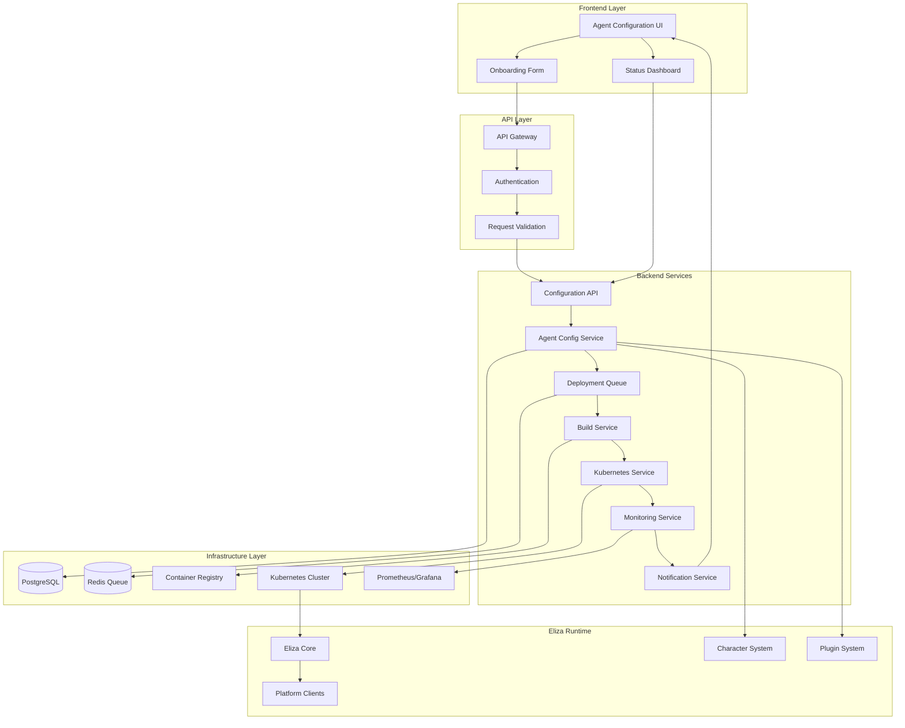
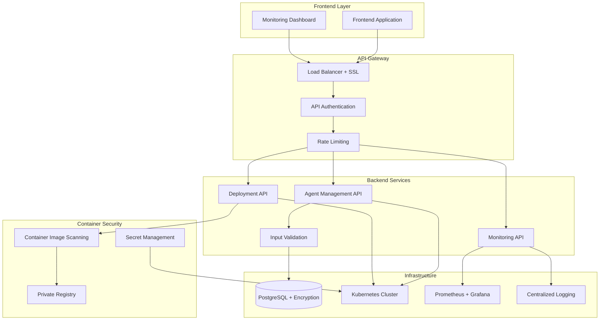
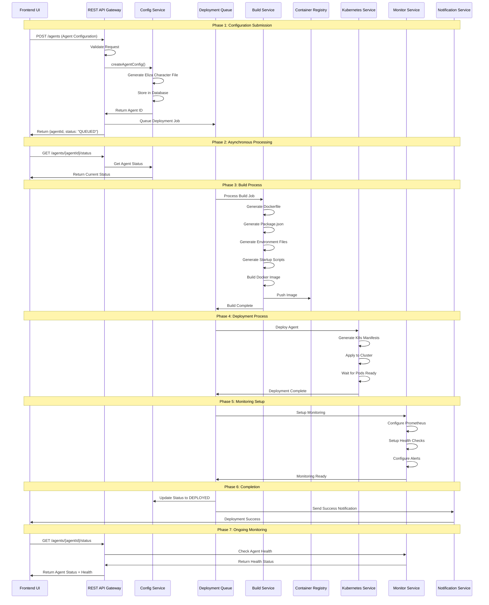

# AI Agent Launchpad: Complete Deployment Workflow

## 🎯 Executive Summary

This document outlines the complete technical architecture and deployment workflow for the AI Agent Launchpad platform - a system that enables users to create, configure, and automatically deploy Eliza-based AI agents through a streamlined interface with Docker and Kubernetes orchestration.

**🔐 Solid Security Foundation**: This deployment plan implements practical security measures including API authentication, container scanning, basic monitoring, and essential security controls focused on agent deployment and infrastructure management.

## 🏗️ System Architecture Overview

### Core Components Relationship



## 🔐 Infrastructure Backend Security

### Simple & Solid Security Approach

The AI Agent Launchpad backend focuses on **essential security controls** for infrastructure management:



### 🔑 Simple API Authentication

#### API Key Authentication

```typescript
// src/auth/api-auth.service.ts
export class ApiAuthService {
  constructor(
    private db: PrismaClient,
    private logger: Logger
  ) {}

  async validateApiKey(apiKey: string): Promise<User | null> {
    try {
      // Hash the provided API key
      const hashedKey = crypto.createHash('sha256').update(apiKey).digest('hex');
      
      // Find user with this API key
      const user = await this.db.user.findFirst({
        where: {
          apiKeyHash: hashedKey,
          isActive: true
        }
      });

      if (user) {
        // Update last used timestamp
        await this.db.user.update({
          where: { id: user.id },
          data: { lastApiKeyUsed: new Date() }
        });
        
        return user;
      }

      return null;
    } catch (error) {
      this.logger.error('API key validation failed', error);
      return null;
    }
  }

  async generateApiKey(userId: string): Promise<string> {
    // Generate a random API key
    const apiKey = 'alk_' + crypto.randomBytes(32).toString('hex');
    const hashedKey = crypto.createHash('sha256').update(apiKey).digest('hex');

    // Store the hashed version in database
    await this.db.user.update({
      where: { id: userId },
      data: {
        apiKeyHash: hashedKey,
        apiKeyCreated: new Date()
      }
    });

    return apiKey;
  }
}
```

#### Simple Role-Based Access

```typescript
// src/auth/simple-auth.service.ts
export class SimpleAuthService {
  private readonly permissions = {
    ADMIN: ['agents:*', 'deployments:*', 'system:*'],
    USER: ['agents:create', 'agents:read', 'agents:update', 'deployments:read']
  };

  hasPermission(userRole: string, action: string): boolean {
    const userPermissions = this.permissions[userRole] || [];
    
    // Check for wildcard permission
    const resourceAction = action.split(':');
    const wildcardPermission = `${resourceAction[0]}:*`;
    
    return userPermissions.includes(action) || 
           userPermissions.includes(wildcardPermission);
  }
}

// Simple auth guard
export class ApiKeyGuard implements CanActivate {
  constructor(private authService: ApiAuthService) {}

  async canActivate(context: ExecutionContext): Promise<boolean> {
    const request = context.switchToHttp().getRequest();
    const apiKey = request.headers['x-api-key'];

    if (!apiKey) {
      throw new UnauthorizedException('API key required');
    }

    const user = await this.authService.validateApiKey(apiKey);
    if (!user) {
      throw new UnauthorizedException('Invalid API key');
    }

    request.user = user;
    return true;
  }
}
```

### 🛡️ Basic API Security

#### Rate Limiting & Basic Validation

```typescript
// src/middleware/basic-security.middleware.ts
export class BasicSecurityMiddleware {
  private readonly rateLimiter = rateLimit({
    windowMs: 15 * 60 * 1000, // 15 minutes
    max: 100, // limit each API key to 100 requests per windowMs
    message: 'Too many requests from this API key',
    standardHeaders: true
  });

  use(req: Request, res: Response, next: NextFunction) {
    // Apply rate limiting
    this.rateLimiter(req, res, () => {
      // Basic request validation
      this.validateRequest(req);
      next();
    });
  }

  private validateRequest(req: Request) {
    // Check request size (10MB limit)
    if (req.headers['content-length'] && 
        parseInt(req.headers['content-length']) > 10 * 1024 * 1024) {
      throw new BadRequestException('Request too large');
    }

    // Validate Content-Type for POST/PUT
    if (['POST', 'PUT'].includes(req.method)) {
      if (!req.headers['content-type']?.includes('application/json')) {
        throw new BadRequestException('Content-Type must be application/json');
      }
    }
  }
}
```

#### Simple Input Validation

```typescript
// src/validation/basic-validation.service.ts
export class BasicValidationService {
  validateAgentConfiguration(config: AgentConfigurationPayload): ValidationResult {
    const errors: string[] = [];

    // Validate agent name (alphanumeric, hyphens, underscores only)
    if (!this.isValidAgentName(config.agentName)) {
      errors.push('Agent name must be 3-50 characters, alphanumeric, hyphens, and underscores only');
    }

    // Validate plugin selections against whitelist
    if (!this.areValidPlugins(config.selectedPlugins)) {
      errors.push('One or more selected plugins are not allowed');
    }

    // Validate resource limits
    if (!this.areValidResourceLimits(config.resources)) {
      errors.push('Resource limits exceed maximum allowed values');
    }

    // Basic sanitization of text fields
    if (config.description) {
      config.description = this.sanitizeText(config.description);
    }

    return {
      isValid: errors.length === 0,
      errors
    };
  }

  private isValidAgentName(name: string): boolean {
    return /^[a-zA-Z0-9_-]+$/.test(name) && name.length >= 3 && name.length <= 50;
  }

  private areValidPlugins(plugins: string[]): boolean {
    const allowedPlugins = [
      '@elizaos/plugin-discord',
      '@elizaos/plugin-telegram',
      '@elizaos/plugin-web3',
      '@elizaos/plugin-coinbase',
      '@elizaos/plugin-twitter'
    ];
    
    return plugins.every(plugin => allowedPlugins.includes(plugin));
  }

  private areValidResourceLimits(resources: ResourceConfig): boolean {
    const limits = {
      maxMemoryGB: 4,
      maxCpuCores: 2,
      maxReplicas: 5
    };
    
    const memoryGB = parseInt(resources.memory.replace('Gi', ''));
    const cpuCores = parseFloat(resources.cpu.replace('m', '')) / 1000;
    
    return memoryGB <= limits.maxMemoryGB && 
           cpuCores <= limits.maxCpuCores &&
           (resources.replicas || 1) <= limits.maxReplicas;
  }

  private sanitizeText(text: string): string {
    // Remove potentially dangerous characters
    return text
      .replace(/<script\b[^<]*(?:(?!<\/script>)<[^<]*)*<\/script>/gi, '')
      .replace(/javascript:/gi, '')
      .replace(/on\w+\s*=/gi, '')
      .trim();
  }
}
```

### 🔒 Container Security

#### Basic Image Scanning

```typescript
// src/security/image-scanner.service.ts
export class ImageScanner {
  constructor(
    private logger: Logger
  ) {}

  async scanImage(imageTag: string): Promise<ScanResult> {
    try {
      // Use Trivy for vulnerability scanning
      const scanCommand = `trivy image --format json --exit-code 1 ${imageTag}`;
      const result = await this.execCommand(scanCommand);
      
      const scanData = JSON.parse(result.stdout);
      const vulnerabilities = this.extractVulnerabilities(scanData);
      
      // Count vulnerabilities by severity
      const counts = {
        critical: vulnerabilities.filter(v => v.severity === 'CRITICAL').length,
        high: vulnerabilities.filter(v => v.severity === 'HIGH').length,
        medium: vulnerabilities.filter(v => v.severity === 'MEDIUM').length,
        low: vulnerabilities.filter(v => v.severity === 'LOW').length
      };

      // Simple blocking rule: no critical vulnerabilities
      const passed = counts.critical === 0;

      if (!passed) {
        this.logger.warn(`Image ${imageTag} has ${counts.critical} critical vulnerabilities`);
      }

      return {
        imageTag,
        passed,
        vulnerabilities: counts,
        scannedAt: new Date()
      };

    } catch (error) {
      this.logger.error(`Image scan failed for ${imageTag}:`, error);
      throw new Error(`Image scanning failed: ${error.message}`);
    }
  }

  private extractVulnerabilities(scanData: any): Vulnerability[] {
    const vulnerabilities = [];
    
    if (scanData.Results) {
      for (const result of scanData.Results) {
        if (result.Vulnerabilities) {
          vulnerabilities.push(...result.Vulnerabilities);
        }
      }
    }
    
    return vulnerabilities;
  }

  private async execCommand(command: string): Promise<{ stdout: string; stderr: string }> {
    return new Promise((resolve, reject) => {
      exec(command, (error, stdout, stderr) => {
        if (error) {
          reject(error);
        } else {
          resolve({ stdout, stderr });
        }
      });
    });
  }
}
```

#### Simple Secret Management

```typescript
// src/security/secret-manager.service.ts
export class SecretManager {
  constructor(
    private k8sClient: KubernetesClient,
    private logger: Logger
  ) {}

  async createAgentSecrets(agentId: string, secrets: AgentSecrets): Promise<void> {
    try {
      const secretName = `agent-${agentId}-secrets`;
      
      // Create Kubernetes secret
      const secretManifest = {
        apiVersion: 'v1',
        kind: 'Secret',
        metadata: {
          name: secretName,
          namespace: 'agents',
          labels: {
            'app': 'eliza-agent',
            'agent-id': agentId
          }
        },
        type: 'Opaque',
        stringData: {
          'DISCORD_TOKEN': secrets.discordToken || '',
          'TELEGRAM_TOKEN': secrets.telegramToken || '',
          'OPENAI_API_KEY': secrets.openaiApiKey || '',
          'AGENT_ID': agentId
        }
      };

      await this.k8sClient.createSecret(secretManifest);
      this.logger.log(`Created secrets for agent ${agentId}`);

    } catch (error) {
      this.logger.error(`Failed to create secrets for agent ${agentId}:`, error);
      throw error;
    }
  }

  async deleteAgentSecrets(agentId: string): Promise<void> {
    try {
      const secretName = `agent-${agentId}-secrets`;
      await this.k8sClient.deleteSecret(secretName, 'agents');
      this.logger.log(`Deleted secrets for agent ${agentId}`);
    } catch (error) {
      this.logger.error(`Failed to delete secrets for agent ${agentId}:`, error);
    }
  }

  async rotateAgentSecrets(agentId: string, newSecrets: AgentSecrets): Promise<void> {
    // Delete old secrets and create new ones
    await this.deleteAgentSecrets(agentId);
    await this.createAgentSecrets(agentId, newSecrets);
  }
}
```

### 🌐 Network Security

#### Kubernetes Network Policies

```yaml
# Network security policies for agent isolation
apiVersion: networking.k8s.io/v1
kind: NetworkPolicy
metadata:
  name: agent-network-policy
  namespace: agents
spec:
  podSelector:
    matchLabels:
      app: eliza-agent
  policyTypes:
  - Ingress
  - Egress
  ingress:
  - from:
    - namespaceSelector:
        matchLabels:
          name: ingress-nginx
    - namespaceSelector:
        matchLabels:
          name: monitoring
    ports:
    - protocol: TCP
      port: 3000
    - protocol: TCP
      port: 9090  # Metrics port
  egress:
  - to: []
    ports:
    - protocol: TCP
      port: 443    # HTTPS
    - protocol: TCP
      port: 80     # HTTP
    - protocol: TCP
      port: 53     # DNS
    - protocol: UDP
      port: 53     # DNS
  - to:
    - namespaceSelector:
        matchLabels:
          name: database
    ports:
    - protocol: TCP
      port: 5432   # PostgreSQL
  - to:
    - namespaceSelector:
        matchLabels:
          name: redis
    ports:
    - protocol: TCP
      port: 6379   # Redis
```

#### Service Mesh Security (Istio)

```yaml
# Service mesh security configuration
apiVersion: security.istio.io/v1beta1
kind: PeerAuthentication
metadata:
  name: agent-mtls
  namespace: agents
spec:
  selector:
    matchLabels:
      app: eliza-agent
  mtls:
    mode: STRICT

---
apiVersion: security.istio.io/v1beta1
kind: AuthorizationPolicy
metadata:
  name: agent-access-control
  namespace: agents
spec:
  selector:
    matchLabels:
      app: eliza-agent
  rules:
  - from:
    - source:
        namespaces: ["ingress-nginx"]
    - source:
        namespaces: ["monitoring"]
    to:
    - operation:
        methods: ["GET", "POST"]
        paths: ["/health", "/metrics", "/api/*"]
```

### 🔐 Data Protection & Encryption

#### Encryption at Rest and Transit

```typescript
// src/security/encryption.service.ts
export class EncryptionService {
  constructor(
    private keyManagementService: KeyManagementService,
    private auditLogger: AuditLogger
  ) {}

  async encryptSensitiveData(data: any, dataType: string): Promise<EncryptedData> {
    const encryptionKey = await this.keyManagementService.getKey(dataType);
    const iv = crypto.randomBytes(16);
    
    const cipher = crypto.createCipher('aes-256-gcm', encryptionKey);
    cipher.setAAD(Buffer.from(dataType));
    
    let encrypted = cipher.update(JSON.stringify(data), 'utf8', 'hex');
    encrypted += cipher.final('hex');
    
    const authTag = cipher.getAuthTag();
    
    await this.auditLogger.logSecurityEvent('DATA_ENCRYPTED', {
      dataType,
      keyId: encryptionKey.id
    });
    
    return {
      encryptedData: encrypted,
      iv: iv.toString('hex'),
      authTag: authTag.toString('hex'),
      keyId: encryptionKey.id
    };
  }

  async decryptSensitiveData(encryptedData: EncryptedData, dataType: string): Promise<any> {
    const decryptionKey = await this.keyManagementService.getKey(dataType, encryptedData.keyId);
    
    const decipher = crypto.createDecipher('aes-256-gcm', decryptionKey);
    decipher.setAAD(Buffer.from(dataType));
    decipher.setAuthTag(Buffer.from(encryptedData.authTag, 'hex'));
    
    let decrypted = decipher.update(encryptedData.encryptedData, 'hex', 'utf8');
    decrypted += decipher.final('utf8');
    
    return JSON.parse(decrypted);
  }
}
```

#### Secret Management

```typescript
// src/security/secret-manager.service.ts
export class SecretManagerService {
  constructor(
    private vaultClient: VaultClient,
    private k8sClient: KubernetesClient,
    private encryptionService: EncryptionService
  ) {}

  async storeAgentSecrets(agentId: string, secrets: AgentSecrets): Promise<void> {
    // Encrypt secrets before storing
    const encryptedSecrets = await this.encryptionService.encryptSensitiveData(
      secrets, 
      'agent-secrets'
    );
    
    // Store in Vault
    await this.vaultClient.write(`agents/${agentId}/secrets`, encryptedSecrets);
    
    // Create Kubernetes secret for runtime
    await this.createKubernetesSecret(agentId, secrets);
  }

  private async createKubernetesSecret(agentId: string, secrets: AgentSecrets): Promise<void> {
    const secretManifest = {
      apiVersion: 'v1',
      kind: 'Secret',
      metadata: {
        name: `agent-${agentId}-secrets`,
        namespace: 'agents',
        labels: {
          'app': 'eliza-agent',
          'agent-id': agentId
        }
      },
      type: 'Opaque',
      data: {
        'DISCORD_TOKEN': Buffer.from(secrets.discordToken || '').toString('base64'),
        'TELEGRAM_TOKEN': Buffer.from(secrets.telegramToken || '').toString('base64'),
        'OPENAI_API_KEY': Buffer.from(secrets.openaiApiKey || '').toString('base64')
      }
    };

    await this.k8sClient.createSecret(secretManifest);
  }
}
```

### 📊 Security Monitoring & Incident Response

#### Security Information and Event Management (SIEM)

```typescript
// src/security/siem.service.ts
export class SiemService {
  constructor(
    private elasticClient: ElasticsearchClient,
    private alertManager: AlertManager,
    private incidentManager: IncidentManager
  ) {}

  async processSecurityEvent(event: SecurityEvent): Promise<void> {
    // Enrich event with context
    const enrichedEvent = await this.enrichEvent(event);
    
    // Store in SIEM
    await this.elasticClient.index({
      index: 'security-events',
      body: enrichedEvent
    });
    
    // Check for security patterns
    const threats = await this.detectThreats(enrichedEvent);
    
    for (const threat of threats) {
      await this.handleThreat(threat);
    }
  }

  private async detectThreats(event: SecurityEvent): Promise<Threat[]> {
    const threats: Threat[] = [];
    
    // Detect brute force attacks
    if (event.eventType === 'AUTH_FAILED') {
      const recentFailures = await this.getRecentAuthFailures(event.sourceIp);
      if (recentFailures.length > 5) {
        threats.push({
          type: 'BRUTE_FORCE',
          severity: 'HIGH',
          sourceIp: event.sourceIp,
          evidence: recentFailures
        });
      }
    }
    
    // Detect privilege escalation
    if (event.eventType === 'PERMISSION_DENIED') {
      const userEvents = await this.getUserEvents(event.userId);
      if (this.isPrivilegeEscalation(userEvents)) {
        threats.push({
          type: 'PRIVILEGE_ESCALATION',
          severity: 'CRITICAL',
          userId: event.userId,
          evidence: userEvents
        });
      }
    }
    
    return threats;
  }

  private async handleThreat(threat: Threat): Promise<void> {
    // Create incident
    const incident = await this.incidentManager.createIncident(threat);
    
    // Take automated response
    switch (threat.type) {
      case 'BRUTE_FORCE':
        await this.blockIpAddress(threat.sourceIp);
        break;
      case 'PRIVILEGE_ESCALATION':
        await this.suspendUser(threat.userId);
        break;
    }
    
    // Send alert
    await this.alertManager.sendSecurityAlert(threat, incident);
  }
}
```

### 🔍 Security Audit & Compliance

#### Comprehensive Audit Logging

```typescript
// src/security/audit-logger.service.ts
export class AuditLogger {
  constructor(
    private elasticClient: ElasticsearchClient,
    private encryptionService: EncryptionService
  ) {}

  async logSecurityEvent(eventType: string, details: any, context?: AuditContext): Promise<void> {
    const auditEvent: AuditEvent = {
      id: uuidv4(),
      timestamp: new Date().toISOString(),
      eventType,
      userId: context?.userId,
      sessionId: context?.sessionId,
      sourceIp: context?.sourceIp,
      userAgent: context?.userAgent,
      resource: context?.resource,
      action: context?.action,
      result: context?.result,
      details: await this.sanitizeDetails(details),
      severity: this.calculateSeverity(eventType),
      category: this.categorizeEvent(eventType)
    };

    // Store in secure audit log
    await this.elasticClient.index({
      index: `security-audit-${this.getDateString()}`,
      body: auditEvent
    });
  }

  private async sanitizeDetails(details: any): Promise<any> {
    // Remove sensitive information from audit logs
    const sanitized = { ...details };
    
    const sensitiveFields = ['password', 'token', 'secret', 'apiKey', 'privateKey'];
    sensitiveFields.forEach(field => {
      if (sanitized[field]) {
        sanitized[field] = '[REDACTED]';
      }
    });
    
    return sanitized;
  }

  private calculateSeverity(eventType: string): 'LOW' | 'MEDIUM' | 'HIGH' | 'CRITICAL' {
    const severityMap = {
      'AUTH_SUCCESS': 'LOW',
      'AUTH_FAILED': 'MEDIUM',
      'PRIVILEGE_ESCALATION': 'CRITICAL',
      'CONTAINER_QUARANTINED': 'HIGH',
      'SECURITY_SCAN_FAILED': 'HIGH',
      'UNAUTHORIZED_ACCESS': 'CRITICAL'
    };
    
    return severityMap[eventType] || 'MEDIUM';
  }
}
```

## 🔄 Complete Deployment Workflow

### End-to-End Process Flow



## 🧩 Component Architecture

### 🔵 Eliza Components (Existing Framework)

These are the core components provided by the Eliza framework:

```typescript
// Eliza Core Structure
eliza/
├── packages/
│   ├── core/              # Core ElizaOS functionality
│   ├── client-web/        # Web interface  
│   ├── client-discord/    # Discord client
│   ├── client-telegram/   # Telegram client
│   ├── plugin-*/          # Various plugins (@elizaos/plugin-*)
│   └── cli/              # CLI tool (elizaos command)
```

**What Eliza provides:**
- Agent runtime environment
- Character system (personality definitions)
- Plugin architecture
- Multi-platform clients (Discord, Telegram, etc.)
- Memory management and RAG
- CLI tools for development

### 🟡 Agent Launchpad Services (New Implementation)

These are the new services that need to be built:

```typescript
// Agent Launchpad Backend Structure
agent-launchpad-backend/
├── src/
│   ├── controllers/
│   │   ├── agent.controller.ts
│   │   ├── deployment.controller.ts
│   │   └── monitoring.controller.ts
│   ├── services/
│   │   ├── agent-config.service.ts
│   │   ├── build.service.ts
│   │   ├── kubernetes.service.ts
│   │   ├── health-monitor.service.ts
│   │   ├── deployment-orchestrator.service.ts
│   │   └── notification.service.ts
│   ├── infrastructure/
│   │   ├── docker/
│   │   └── kubernetes/
│   └── types/
│       └── interfaces.ts
```

## 📊 Technical Implementation Details

### 1. Agent Configuration Service

```typescript
// src/services/agent-config.service.ts
export class AgentConfigurationService {
  constructor(
    private db: PrismaClient,
    private validator: ConfigValidator
  ) {}

  async createAgentConfig(payload: AgentConfigurationPayload): Promise<AgentConfiguration> {
    // Validate configuration
    const validationResult = await this.validator.validate(payload);
    if (!validationResult.isValid) {
      throw new ValidationError(validationResult.errors);
    }

    // Generate unique agent ID
    const agentId = this.generateAgentId();
    
    // Convert UI payload to Eliza Character format
    const characterFile = this.convertToElizaCharacter(payload);
    
    // Store in database
    const agentConfig = await this.db.agentConfiguration.create({
      data: {
        agentId,
        name: payload.agentName,
        description: payload.description,
        characterFile: JSON.stringify(characterFile),
        plugins: payload.selectedPlugins,
        platformConfigs: payload.platforms,
        resources: payload.resources,
        status: 'PENDING',
        createdAt: new Date()
      }
    });

    return agentConfig;
  }

  private convertToElizaCharacter(payload: AgentConfigurationPayload): Character {
    // Convert UI format to Eliza Character format
    return {
      name: payload.agentName,
      system: payload.personality.system,
      bio: payload.personality.bio,
      lore: payload.personality.lore,
      knowledge: payload.personality.knowledge,
      messageExamples: payload.personality.messageExamples,
      adjectives: payload.personality.adjectives,
      topics: payload.personality.topics,
      style: payload.personality.style,
      plugins: payload.selectedPlugins,
      settings: this.generateSettings(payload)
    };
  }

  private generateSettings(payload: AgentConfigurationPayload): Record<string, any> {
    const settings: Record<string, any> = {
      ragKnowledge: true,
      secrets: {}
    };

    // Add platform-specific settings
    if (payload.platforms.discord) {
      settings.discord = {
        shouldRespondOnlyToMentions: false
      };
      settings.secrets.DISCORD_TOKEN = payload.platforms.discord.token;
    }

    if (payload.platforms.telegram) {
      settings.telegram = {
        enabled: true
      };
      settings.secrets.TELEGRAM_TOKEN = payload.platforms.telegram.token;
    }

    return settings;
  }
}
```

### 2. Build Service

```typescript
// src/services/build.service.ts
export class AgentBuildService {
  constructor(
    private docker: Docker,
    private registry: ContainerRegistry,
    private storage: ObjectStorage
  ) {}

  async buildAgent(agentId: string): Promise<BuildResult> {
    const config = await this.getAgentConfiguration(agentId);
    
    try {
      // Update status to building
      await this.updateBuildStatus(agentId, 'BUILDING');

      // Generate build context
      const buildContext = await this.generateBuildContext(agentId, config);
      
      // Build Docker image
      const imageTag = await this.buildDockerImage(agentId, buildContext);
      
      // Push to registry
      await this.pushToRegistry(imageTag);
      
      // Store build artifacts
      await this.storeBuildArtifacts(agentId, buildContext);
      
      // Update status to success
      await this.updateBuildStatus(agentId, 'SUCCESS', imageTag);
      
      return {
        success: true,
        agentId,
        imageTag,
        buildTime: new Date()
      };
      
    } catch (error) {
      await this.updateBuildStatus(agentId, 'FAILED', null, error.message);
      throw new BuildError(`Build failed for agent ${agentId}: ${error.message}`);
    }
  }

  private generateDockerfile(config: AgentConfiguration): string {
    return `
FROM node:23-alpine
WORKDIR /app

# Install system dependencies
RUN apk add --no-cache \\
    python3 \\
    make \\
    g++ \\
    cairo-dev \\
    pango-dev \\
    giflib-dev \\
    librsvg-dev

# Install bun
RUN curl -fsSL https://bun.sh/install | bash
ENV PATH="/root/.bun/bin:$PATH"

# Install Eliza CLI
RUN npm install -g @elizaos/cli

# Copy configuration files
COPY character.json ./
COPY package.json ./
COPY .env ./
COPY startup.sh ./

# Install dependencies
RUN npm install

# Make startup script executable
RUN chmod +x startup.sh

# Create non-root user
RUN addgroup -g 1001 -S elizauser
RUN adduser -S elizauser -u 1001
USER elizauser

# Health check
HEALTHCHECK --interval=30s --timeout=10s --start-period=30s --retries=3 \\
  CMD curl -f http://localhost:3000/health || exit 1

EXPOSE 3000
CMD ["./startup.sh"]
    `;
  }

  private generateStartupScript(config: AgentConfiguration): string {
    return `#!/bin/bash
# Start Eliza agent with character configuration
elizaos start --character character.json --plugins ${config.plugins.join(',')}
    `;
  }
}
```

### 3. Kubernetes Deployment Service

```typescript
// src/services/kubernetes.service.ts
export class KubernetesDeploymentService {
  constructor(
    private k8sClient: KubernetesClient,
    private manifestGenerator: ManifestGenerator,
    private configService: AgentConfigurationService
  ) {}

  async deployAgent(agentId: string, imageTag: string): Promise<DeploymentResult> {
    const config = await this.configService.getAgentConfiguration(agentId);
    
    try {
      // Generate Kubernetes manifests
      const manifests = await this.manifestGenerator.generateManifests(agentId, config, imageTag);
      
      // Create namespace if not exists
      await this.ensureNamespace('agents');
      
      // Apply manifests
      await this.applyManifests(manifests);
      
      // Wait for deployment to be ready
      await this.waitForDeploymentReady(agentId);
      
      // Setup monitoring
      await this.setupAgentMonitoring(agentId);
      
      // Update configuration status
      await this.configService.updateAgentStatus(agentId, 'DEPLOYED');
      
      return {
        success: true,
        agentId,
        url: `https://${agentId}.agents.yourdomain.com`,
        status: 'DEPLOYED',
        deployedAt: new Date()
      };
      
    } catch (error) {
      await this.handleDeploymentFailure(agentId, error);
      throw new DeploymentError(`Deployment failed for agent ${agentId}: ${error.message}`);
    }
  }

  private async waitForDeploymentReady(agentId: string, timeout: number = 300000): Promise<void> {
    const startTime = Date.now();
    
    while (Date.now() - startTime < timeout) {
      const deployment = await this.k8sClient.getDeployment(`agent-${agentId}`, 'agents');
      
      if (deployment.status.readyReplicas === deployment.status.replicas) {
        return;
      }
      
      await this.sleep(5000);
    }
    
    throw new Error(`Deployment timeout for agent ${agentId}`);
  }
}
```

### 4. Kubernetes Manifest Generator

```typescript
// src/services/manifest-generator.service.ts
export class ManifestGenerator {
  generateManifests(agentId: string, config: AgentConfiguration, imageTag: string): K8sManifest[] {
    return [
      this.generateDeployment(agentId, config, imageTag),
      this.generateService(agentId),
      this.generateIngress(agentId),
      this.generateServiceMonitor(agentId),
      this.generateHPA(agentId, config),
      this.generateNetworkPolicy(agentId)
    ];
  }

  private generateDeployment(agentId: string, config: AgentConfiguration, imageTag: string): K8sManifest {
    return {
      apiVersion: 'apps/v1',
      kind: 'Deployment',
      metadata: {
        name: `agent-${agentId}`,
        namespace: 'agents',
        labels: {
          app: 'eliza-agent',
          'agent-id': agentId,
          'agent-name': config.name
        }
      },
      spec: {
        replicas: 1,
        selector: {
          matchLabels: {
            app: 'eliza-agent',
            'agent-id': agentId
          }
        },
        template: {
          metadata: {
            labels: {
              app: 'eliza-agent',
              'agent-id': agentId
            },
            annotations: {
              'prometheus.io/scrape': 'true',
              'prometheus.io/port': '3000',
              'prometheus.io/path': '/metrics'
            }
          },
          spec: {
            containers: [
              {
                name: 'eliza-agent',
                image: imageTag,
                ports: [
                  { containerPort: 3000, name: 'http' }
                ],
                resources: {
                  requests: {
                    memory: config.resources.memory || '512Mi',
                    cpu: config.resources.cpu || '250m'
                  },
                  limits: {
                    memory: config.resources.memory || '1Gi',
                    cpu: config.resources.cpu || '500m'
                  }
                },
                env: this.generateEnvironmentVariables(config),
                livenessProbe: {
                  httpGet: {
                    path: '/health',
                    port: 3000
                  },
                  initialDelaySeconds: 30,
                  periodSeconds: 30,
                  timeoutSeconds: 10,
                  failureThreshold: 3
                },
                readinessProbe: {
                  httpGet: {
                    path: '/ready',
                    port: 3000
                  },
                  initialDelaySeconds: 5,
                  periodSeconds: 5,
                  timeoutSeconds: 3,
                  failureThreshold: 3
                }
              }
            ],
            restartPolicy: 'Always'
          }
        }
      }
    };
  }

  private generateService(agentId: string): K8sManifest {
    return {
      apiVersion: 'v1',
      kind: 'Service',
      metadata: {
        name: `agent-${agentId}-service`,
        namespace: 'agents'
      },
      spec: {
        selector: {
          app: 'eliza-agent',
          'agent-id': agentId
        },
        ports: [
          {
            port: 80,
            targetPort: 3000,
            protocol: 'TCP'
          }
        ],
        type: 'ClusterIP'
      }
    };
  }

  private generateIngress(agentId: string): K8sManifest {
    return {
      apiVersion: 'networking.k8s.io/v1',
      kind: 'Ingress',
      metadata: {
        name: `agent-${agentId}-ingress`,
        namespace: 'agents',
        annotations: {
          'nginx.ingress.kubernetes.io/rewrite-target': '/',
          'cert-manager.io/cluster-issuer': 'letsencrypt-prod'
        }
      },
      spec: {
        tls: [
          {
            hosts: [`${agentId}.agents.yourdomain.com`],
            secretName: `agent-${agentId}-tls`
          }
        ],
        rules: [
          {
            host: `${agentId}.agents.yourdomain.com`,
            http: {
              paths: [
                {
                  path: '/',
                  pathType: 'Prefix',
                  backend: {
                    service: {
                      name: `agent-${agentId}-service`,
                      port: {
                        number: 80
                      }
                    }
                  }
                }
              ]
            }
          }
        ]
      }
    };
  }

  private generateHPA(agentId: string, config: AgentConfiguration): K8sManifest {
    return {
      apiVersion: 'autoscaling/v2',
      kind: 'HorizontalPodAutoscaler',
      metadata: {
        name: `agent-${agentId}-hpa`,
        namespace: 'agents'
      },
      spec: {
        scaleTargetRef: {
          apiVersion: 'apps/v1',
          kind: 'Deployment',
          name: `agent-${agentId}`
        },
        minReplicas: 1,
        maxReplicas: config.scaling?.maxReplicas || 3,
        metrics: [
          {
            type: 'Resource',
            resource: {
              name: 'cpu',
              target: {
                type: 'Utilization',
                averageUtilization: 70
              }
            }
          },
          {
            type: 'Resource',
            resource: {
              name: 'memory',
              target: {
                type: 'Utilization',
                averageUtilization: 80
              }
            }
          }
        ]
      }
    };
  }

  private generateNetworkPolicy(agentId: string): K8sManifest {
    return {
      apiVersion: 'networking.k8s.io/v1',
      kind: 'NetworkPolicy',
      metadata: {
        name: `agent-${agentId}-policy`,
        namespace: 'agents'
      },
      spec: {
        podSelector: {
          matchLabels: {
            'agent-id': agentId
          }
        },
        policyTypes: ['Ingress', 'Egress'],
        ingress: [
          {
            from: [
              { namespaceSelector: { matchLabels: { name: 'ingress-nginx' } } }
            ],
            ports: [{ protocol: 'TCP', port: 3000 }]
          }
        ],
        egress: [
          {
            to: [],
            ports: [
              { protocol: 'TCP', port: 443 }, // HTTPS
              { protocol: 'TCP', port: 80 },  // HTTP
              { protocol: 'TCP', port: 53 },  // DNS
              { protocol: 'UDP', port: 53 }   // DNS
            ]
          }
        ]
      }
    };
  }
}
```

### 5. Health Monitoring Service

```typescript
// src/services/health-monitor.service.ts
export class HealthMonitoringService {
  constructor(
    private k8sClient: KubernetesClient,
    private prometheusClient: PrometheusClient,
    private alertManager: AlertManager
  ) {}

  async checkAgentHealth(agentId: string): Promise<HealthStatus> {
    const [k8sHealth, applicationHealth, resourceHealth] = await Promise.all([
      this.checkKubernetesHealth(agentId),
      this.checkApplicationHealth(agentId),
      this.checkResourceHealth(agentId)
    ]);

    return {
      agentId,
      overall: this.calculateOverallHealth([k8sHealth, applicationHealth, resourceHealth]),
      kubernetes: k8sHealth,
      application: applicationHealth,
      resources: resourceHealth,
      timestamp: new Date()
    };
  }

  private async checkApplicationHealth(agentId: string): Promise<ComponentHealth> {
    try {
      const healthUrl = `https://${agentId}.agents.yourdomain.com/health`;
      const response = await fetch(healthUrl, { timeout: 5000 });
      
      if (response.ok) {
        const healthData = await response.json();
        return {
          status: 'HEALTHY',
          details: healthData
        };
      } else {
        return {
          status: 'UNHEALTHY',
          details: { httpStatus: response.status }
        };
      }
    } catch (error) {
      return {
        status: 'UNHEALTHY',
        details: { error: error.message }
      };
    }
  }

  async setupAgentMonitoring(agentId: string): Promise<void> {
    const alertRules = [
      {
        alert: `AgentDown`,
        expr: `up{job="agent-${agentId}"} == 0`,
        for: '5m',
        labels: { severity: 'critical', agentId },
        annotations: {
          summary: `Agent ${agentId} is down`,
          description: `Agent ${agentId} has been down for more than 5 minutes`
        }
      },
      {
        alert: `AgentHighCPU`,
        expr: `rate(container_cpu_usage_seconds_total{pod=~"agent-${agentId}-.*"}[5m]) > 0.8`,
        for: '10m',
        labels: { severity: 'warning', agentId },
        annotations: {
          summary: `Agent ${agentId} high CPU usage`,
          description: `Agent ${agentId} CPU usage is above 80% for more than 10 minutes`
        }
      },
      {
        alert: `AgentHighMemory`,
        expr: `container_memory_usage_bytes{pod=~"agent-${agentId}-.*"} / container_spec_memory_limit_bytes > 0.9`,
        for: '10m',
        labels: { severity: 'warning', agentId },
        annotations: {
          summary: `Agent ${agentId} high memory usage`,
          description: `Agent ${agentId} memory usage is above 90% for more than 10 minutes`
        }
      }
    ];

    await this.alertManager.createAlertRules(agentId, alertRules);
  }
}
```

### 6. Deployment Orchestrator

```typescript
// src/services/deployment-orchestrator.service.ts
export class DeploymentOrchestrator {
  constructor(
    private configService: AgentConfigurationService,
    private buildService: AgentBuildService,
    private kubernetesService: KubernetesDeploymentService,
    private monitoringService: HealthMonitoringService,
    private notificationService: NotificationService
  ) {}

  async deployAgent(agentId: string): Promise<DeploymentResult> {
    const deployment = await this.createDeploymentRecord(agentId);
    
    try {
      // Phase 1: Build
      await this.updateDeploymentStatus(deployment.id, 'BUILDING');
      const buildResult = await this.buildService.buildAgent(agentId);
      
      // Phase 2: Deploy
      await this.updateDeploymentStatus(deployment.id, 'DEPLOYING');
      const deployResult = await this.kubernetesService.deployAgent(agentId, buildResult.imageTag);
      
      // Phase 3: Verify
      await this.updateDeploymentStatus(deployment.id, 'VERIFYING');
      await this.verifyDeployment(agentId);
      
      // Phase 4: Monitor
      await this.updateDeploymentStatus(deployment.id, 'MONITORING');
      await this.monitoringService.setupAgentMonitoring(agentId);
      
      // Phase 5: Complete
      await this.updateDeploymentStatus(deployment.id, 'COMPLETED');
      await this.notificationService.sendDeploymentSuccess(agentId);
      
      return {
        success: true,
        agentId,
        deploymentId: deployment.id,
        url: deployResult.url,
        completedAt: new Date()
      };
      
    } catch (error) {
      await this.handleDeploymentFailure(deployment.id, agentId, error);
      throw error;
    }
  }

  private async verifyDeployment(agentId: string): Promise<void> {
    const maxRetries = 10;
    const retryDelay = 30000; // 30 seconds
    
    for (let i = 0; i < maxRetries; i++) {
      const health = await this.monitoringService.checkAgentHealth(agentId);
      
      if (health.overall === 'HEALTHY') {
        return;
      }
      
      if (i < maxRetries - 1) {
        await this.sleep(retryDelay);
      }
    }
    
    throw new Error(`Deployment verification failed for agent ${agentId}`);
  }
}
```

## 📋 Secure REST API Endpoints

### Simple Agent Management
```typescript
// src/controllers/agent.controller.ts
@Controller('agents')
@UseGuards(ApiKeyGuard)
export class AgentController {
  constructor(
    private configService: AgentConfigurationService,
    private deploymentService: DeploymentService,
    private monitoringService: MonitoringService,
    private validator: BasicValidationService,
    private logger: Logger
  ) {}

  @Post()
  async createAgent(
    @Body() payload: AgentConfigurationPayload,
    @Req() req: Request
  ): Promise<{ agentId: string; status: string }> {
    try {
      // 1. Basic validation
      const validationResult = this.validator.validateAgentConfiguration(payload);
      if (!validationResult.isValid) {
        this.logger.warn(`Agent creation failed validation: ${validationResult.errors.join(', ')}`);
        throw new BadRequestException(validationResult.errors);
      }

      // 2. Check user quota (simple limit)
      const userAgents = await this.configService.getUserAgentCount(req.user.id);
      if (userAgents >= 5) {
        throw new BadRequestException('Maximum 5 agents per user');
      }

      // 3. Create agent configuration
      const agentConfig = await this.configService.createAgentConfig(payload, req.user.id);
      
      // 4. Queue deployment
      await this.deploymentService.queueDeployment(agentConfig.agentId);
      
      this.logger.log(`Agent ${agentConfig.agentId} created by user ${req.user.id}`);
      
      return {
        agentId: agentConfig.agentId,
        status: 'QUEUED'
      };
    } catch (error) {
      this.logger.error(`Agent creation failed:`, error);
      throw error;
    }
  }

  @Get(':agentId/status')
  async getAgentStatus(
    @Param('agentId') agentId: string,
    @Req() req: Request
  ): Promise<AgentStatus> {
    // Check if user owns this agent or is admin
    await this.checkAgentAccess(agentId, req.user);
    
    const config = await this.configService.getAgentConfiguration(agentId);
    const health = await this.monitoringService.checkAgentHealth(agentId);
    
    return {
      agentId,
      status: config.status,
      url: config.status === 'DEPLOYED' ? `https://${agentId}.agents.yourdomain.com` : null,
      health: health,
      createdAt: config.createdAt,
      lastUpdated: config.updatedAt
    };
  }

  @Get()
  async listAgents(
    @Query() query: any,
    @Req() req: Request
  ): Promise<{ agents: any[]; total: number }> {
    // Users can only see their own agents unless they're admin
    const filterUserId = req.user.role === 'ADMIN' ? query.userId : req.user.id;
    
    const agents = await this.configService.listAgents(filterUserId);
    
    return {
      agents,
      total: agents.length
    };
  }

  @Post(':agentId/scale')
  async scaleAgent(
    @Param('agentId') agentId: string,
    @Body() { replicas }: { replicas: number },
    @Req() req: Request
  ): Promise<void> {
    // Basic validation
    if (replicas < 1 || replicas > 5) {
      throw new BadRequestException('Replicas must be between 1 and 5');
    }
    
    await this.checkAgentAccess(agentId, req.user);
    
    await this.deploymentService.scaleAgent(agentId, replicas);
    
    this.logger.log(`Agent ${agentId} scaled to ${replicas} replicas by user ${req.user.id}`);
  }

  @Delete(':agentId')
  async deleteAgent(
    @Param('agentId') agentId: string,
    @Req() req: Request
  ): Promise<void> {
    await this.checkAgentAccess(agentId, req.user);
    
    await this.deploymentService.deleteAgent(agentId);
    
    this.logger.log(`Agent ${agentId} deleted by user ${req.user.id}`);
  }

  @Post(':agentId/restart')
  async restartAgent(
    @Param('agentId') agentId: string,
    @Req() req: Request
  ): Promise<void> {
    await this.checkAgentAccess(agentId, req.user);
    
    await this.deploymentService.restartAgent(agentId);
    
    this.logger.log(`Agent ${agentId} restarted by user ${req.user.id}`);
  }

  private async checkAgentAccess(agentId: string, user: any): Promise<void> {
    const agent = await this.configService.getAgentConfiguration(agentId);
    
    if (agent.ownerId !== user.id && user.role !== 'ADMIN') {
      this.logger.warn(`Unauthorized access attempt to agent ${agentId} by user ${user.id}`);
      throw new ForbiddenException('Access denied');
    }
  }
}
```

### Security Management Controller
```typescript
// src/controllers/security.controller.ts
@Controller('security')
@UseGuards(JwtAuthGuard)
export class SecurityController {
  constructor(
    private siemService: SiemService,
    private imageScanner: ImageSecurityScanner,
    private auditLogger: AuditLogger
  ) {}

  @Get('events')
  @RequirePermission('system:monitor')
  async getSecurityEvents(
    @Query() query: SecurityEventQuery,
    @Req() req: Request
  ): Promise<SecurityEventResponse> {
    const context = this.buildAuditContext(req);
    
    const events = await this.siemService.getSecurityEvents(query);
    
    await this.auditLogger.logSecurityEvent('SECURITY_EVENTS_ACCESSED', {
      query,
      resultCount: events.length
    }, context);
    
    return { events, total: events.length };
  }

  @Get('threats')
  @RequirePermission('system:monitor')
  async getActiveThreats(@Req() req: Request): Promise<ThreatResponse> {
    const context = this.buildAuditContext(req);
    
    const threats = await this.siemService.getActiveThreats();
    
    await this.auditLogger.logSecurityEvent('THREATS_ACCESSED', {
      threatCount: threats.length
    }, context);
    
    return { threats };
  }

  @Post('scan/:agentId')
  @RequirePermission('system:monitor')
  async scanAgent(
    @Param('agentId') agentId: string,
    @Req() req: Request
  ): Promise<SecurityScanResult> {
    const context = this.buildAuditContext(req);
    
    const imageTag = await this.getAgentImageTag(agentId);
    const scanResult = await this.imageScanner.scanImage(imageTag);
    
    await this.auditLogger.logSecurityEvent('SECURITY_SCAN_INITIATED', {
      agentId,
      imageTag,
      riskScore: scanResult.riskScore
    }, context);
    
    return scanResult;
  }

  @Post('quarantine/:agentId')
  @RequirePermission('system:configure')
  async quarantineAgent(
    @Param('agentId') agentId: string,
    @Body() reason: { reason: string },
    @Req() req: Request
  ): Promise<void> {
    const context = this.buildAuditContext(req);
    
    await this.kubernetesService.quarantineAgent(agentId, reason.reason);
    
    await this.auditLogger.logSecurityEvent('AGENT_QUARANTINED', {
      agentId,
      reason: reason.reason
    }, context);
  }
}
```

### User Management Controller
```typescript
// src/controllers/user.controller.ts
@Controller('users')
@UseGuards(JwtAuthGuard)
export class UserController {
  constructor(
    private userService: UserService,
    private auditLogger: AuditLogger
  ) {}

  @Get('profile')
  async getProfile(@Req() req: Request): Promise<UserProfile> {
    const context = this.buildAuditContext(req);
    
    const profile = await this.userService.getUserProfile(req.user.sub);
    
    await this.auditLogger.logSecurityEvent('PROFILE_ACCESSED', {
      userId: req.user.sub
    }, context);
    
    return profile;
  }

  @Put('profile')
  async updateProfile(
    @Body() profileData: UpdateProfileData,
    @Req() req: Request
  ): Promise<UserProfile> {
    const context = this.buildAuditContext(req);
    
    const updatedProfile = await this.userService.updateProfile(req.user.sub, profileData);
    
    await this.auditLogger.logSecurityEvent('PROFILE_UPDATED', {
      userId: req.user.sub,
      changes: Object.keys(profileData)
    }, context);
    
    return updatedProfile;
  }

  @Post('mfa/enable')
  async enableMfa(@Req() req: Request): Promise<MfaSetupResponse> {
    const context = this.buildAuditContext(req);
    
    const mfaSetup = await this.userService.enableMfa(req.user.sub);
    
    await this.auditLogger.logSecurityEvent('MFA_ENABLED', {
      userId: req.user.sub
    }, context);
    
    return mfaSetup;
  }

  @Post('mfa/disable')
  async disableMfa(@Req() req: Request): Promise<void> {
    const context = this.buildAuditContext(req);
    
    await this.userService.disableMfa(req.user.sub);
    
    await this.auditLogger.logSecurityEvent('MFA_DISABLED', {
      userId: req.user.sub
    }, context);
  }

  @Get()
  @RequirePermission('users:read')
  async listUsers(
    @Query() query: UserListQuery,
    @Req() req: Request
  ): Promise<UserListResponse> {
    const context = this.buildAuditContext(req);
    
    const users = await this.userService.listUsers(query);
    
    await this.auditLogger.logSecurityEvent('USERS_LISTED', {
      count: users.length,
      filters: query
    }, context);
    
    return { users, total: users.length };
  }

  @Post()
  @RequirePermission('users:create')
  async createUser(
    @Body() userData: CreateUserData,
    @Req() req: Request
  ): Promise<UserProfile> {
    const context = this.buildAuditContext(req);
    
    const user = await this.userService.createUser(userData);
    
    await this.auditLogger.logSecurityEvent('USER_CREATED', {
      newUserId: user.id,
      username: userData.username
    }, context);
    
    return user;
  }

  @Delete(':userId')
  @RequirePermission('users:delete')
  async deleteUser(
    @Param('userId') userId: string,
    @Req() req: Request
  ): Promise<void> {
    const context = this.buildAuditContext(req);
    
    await this.userService.deleteUser(userId);
    
    await this.auditLogger.logSecurityEvent('USER_DELETED', {
      deletedUserId: userId
    }, context);
  }
}
```

## 📊 Data Models & Interfaces

### Agent Configuration Types
```typescript
// src/types/interfaces.ts
export interface AgentConfigurationPayload {
  agentName: string;
  description: string;
  logo?: File;
  
  personality: {
    system: string;
    bio: string[];
    lore: string[];
    knowledge: string[];
    messageExamples: MessageExample[];
    adjectives: string[];
    topics: string[];
    style: {
      all: string[];
      chat: string[];
      post: string[];
    };
  };
  
  selectedPlugins: string[];
  pluginConfigs: Record<string, any>;
  
  resources: {
    memory: string;
    cpu: string;
    replicas?: number;
  };
  
  platforms: {
    discord?: { token: string; guildId?: string };
    telegram?: { token: string };
    web?: { enabled: boolean };
  };
}

export interface AgentConfiguration {
  agentId: string;
  name: string;
  description: string;
  characterFile: string; // JSON string
  plugins: string[];
  resources: ResourceConfig;
  status: DeploymentStatus;
  createdAt: Date;
  updatedAt: Date;
}

export interface BuildResult {
  success: boolean;
  agentId: string;
  imageTag: string;
  buildTime: Date;
}

export interface DeploymentResult {
  success: boolean;
  agentId: string;
  deploymentId?: string;
  url?: string;
  completedAt: Date;
}

export interface HealthStatus {
  agentId: string;
  overall: 'HEALTHY' | 'UNHEALTHY' | 'UNKNOWN';
  kubernetes: ComponentHealth;
  application: ComponentHealth;
  resources: ComponentHealth;
  timestamp: Date;
}

export interface ComponentHealth {
  status: 'HEALTHY' | 'UNHEALTHY' | 'UNKNOWN';
  details: Record<string, any>;
}

export type DeploymentStatus = 
  | 'PENDING'
  | 'BUILDING'
  | 'DEPLOYING'
  | 'MONITORING'
  | 'DEPLOYED'
  | 'FAILED'
  | 'SCALING'
  | 'UPDATING';
```

## 🚀 Deployment States & Monitoring

### Deployment State Machine
| State | Description | Frontend Display |
|-------|-------------|------------------|
| `PENDING` | Configuration saved, waiting for processing | "Queued for deployment" |
| `BUILDING` | Docker image being built | "Building agent image..." |
| `DEPLOYING` | Deploying to Kubernetes | "Deploying to cluster..." |
| `MONITORING` | Setting up health checks | "Configuring monitoring..." |
| `DEPLOYED` | Agent is live and operational | "🟢 Live - Agent URL" |
| `FAILED` | Deployment failed | "❌ Deployment failed" |
| `SCALING` | Adjusting resources | "Scaling resources..." |
| `UPDATING` | Rolling update in progress | "Updating agent..." |

### Health Check Configuration
```yaml
# Health check endpoints for agents
livenessProbe:
  httpGet:
    path: /health
    port: 3000
  initialDelaySeconds: 30
  periodSeconds: 30
  timeoutSeconds: 10
  failureThreshold: 3

readinessProbe:
  httpGet:
    path: /ready
    port: 3000
  initialDelaySeconds: 5
  periodSeconds: 5
  timeoutSeconds: 3
  failureThreshold: 3
```

## 📈 Monitoring & Observability

### Prometheus Metrics
- **CPU Usage**: `rate(container_cpu_usage_seconds_total[5m])`
- **Memory Usage**: `container_memory_usage_bytes`
- **HTTP Requests**: `rate(http_requests_total[5m])`
- **Response Time**: `histogram_quantile(0.95, rate(http_request_duration_seconds_bucket[5m]))`
- **Error Rate**: `rate(http_requests_total{status=~"5.."}[5m])`

### Security-Enhanced Alert Rules
```yaml
groups:
- name: eliza-agents-operational
  rules:
  - alert: AgentDown
    expr: up{job=~"agent-.*"} == 0
    for: 5m
    labels:
      severity: critical
      category: operational
    annotations:
      summary: "Agent {{ $labels.job }} is down"
      description: "Agent has been down for more than 5 minutes"
      runbook_url: "https://runbooks.company.com/agent-down"

  - alert: AgentHighCPU
    expr: rate(container_cpu_usage_seconds_total{pod=~"agent-.*"}[5m]) > 0.8
    for: 10m
    labels:
      severity: warning
      category: performance
    annotations:
      summary: "Agent {{ $labels.pod }} high CPU usage"
      description: "CPU usage is above 80% for more than 10 minutes"
      runbook_url: "https://runbooks.company.com/high-cpu"

  - alert: AgentHighMemory
    expr: container_memory_usage_bytes{pod=~"agent-.*"} / container_spec_memory_limit_bytes > 0.9
    for: 10m
    labels:
      severity: warning
      category: performance
    annotations:
      summary: "Agent {{ $labels.pod }} high memory usage"
      description: "Memory usage is above 90% for more than 10 minutes"

- name: eliza-agents-security
  rules:
  - alert: SecurityScanFailed
    expr: increase(container_security_scan_failures_total[5m]) > 0
    for: 1m
    labels:
      severity: critical
      category: security
    annotations:
      summary: "Security scan failed for container"
      description: "Container security scan failed, deployment blocked"
      runbook_url: "https://runbooks.company.com/security-scan-failed"

  - alert: CriticalVulnerabilityDetected
    expr: container_security_vulnerabilities{severity="critical"} > 0
    for: 1m
    labels:
      severity: critical
      category: security
    annotations:
      summary: "Critical vulnerability detected in container"
      description: "{{ $labels.container }} has {{ $value }} critical vulnerabilities"
      runbook_url: "https://runbooks.company.com/critical-vulnerabilities"

  - alert: HighFailedLoginAttempts
    expr: increase(failed_login_attempts_total[5m]) > 5
    for: 1m
    labels:
      severity: warning
      category: security
    annotations:
      summary: "High number of failed login attempts"
      description: "{{ $value }} failed login attempts in the last 5 minutes"

  - alert: SuspiciousContainerActivity
    expr: increase(falco_events_total{priority="critical"}[5m]) > 0
    for: 1m
    labels:
      severity: critical
      category: security
    annotations:
      summary: "Suspicious container activity detected"
      description: "Falco detected suspicious activity: {{ $labels.rule }}"
      runbook_url: "https://runbooks.company.com/suspicious-activity"

  - alert: UnauthorizedAPIAccess
    expr: increase(http_requests_total{status="403"}[5m]) > 10
    for: 2m
    labels:
      severity: warning
      category: security
    annotations:
      summary: "High number of unauthorized API requests"
      description: "{{ $value }} 403 responses in the last 5 minutes from {{ $labels.source_ip }}"

  - alert: RateLimitExceeded
    expr: increase(rate_limit_exceeded_total[5m]) > 0
    for: 1m
    labels:
      severity: warning
      category: security
    annotations:
      summary: "Rate limit exceeded"
      description: "Rate limit exceeded for {{ $labels.user }} from {{ $labels.source_ip }}"

  - alert: SecurityPolicyViolation
    expr: increase(opa_policy_violations_total[5m]) > 0
    for: 1m
    labels:
      severity: warning
      category: security
    annotations:
      summary: "Security policy violation detected"
      description: "Policy {{ $labels.policy }} violated {{ $value }} times"

  - alert: MaliciousIPDetected
    expr: increase(malicious_ip_requests_total[5m]) > 0
    for: 1m
    labels:
      severity: high
      category: security
    annotations:
      summary: "Requests from known malicious IP"
      description: "{{ $value }} requests from malicious IP {{ $labels.source_ip }}"

  - alert: TLSCertificateExpiring
    expr: (tls_certificate_expiry_seconds - time()) / 86400 < 7
    for: 1h
    labels:
      severity: warning
      category: security
    annotations:
      summary: "TLS certificate expiring soon"
      description: "Certificate {{ $labels.cert }} expires in {{ $value }} days"

  - alert: ContainerEscapeAttempt
    expr: increase(container_escape_attempts_total[5m]) > 0
    for: 1m
    labels:
      severity: critical
      category: security
    annotations:
      summary: "Container escape attempt detected"
      description: "Potential container escape attempt in {{ $labels.container }}"
      runbook_url: "https://runbooks.company.com/container-escape"

- name: eliza-agents-compliance
  rules:
  - alert: AuditLogGap
    expr: increase(audit_log_entries_total[5m]) == 0
    for: 10m
    labels:
      severity: warning
      category: compliance
    annotations:
      summary: "Audit log gap detected"
      description: "No audit log entries for 10 minutes"

  - alert: DataRetentionViolation
    expr: audit_log_age_days > 90
    for: 1h
    labels:
      severity: warning
      category: compliance
    annotations:
      summary: "Data retention policy violation"
      description: "Audit logs older than 90 days detected"

  - alert: EncryptionKeyRotationDue
    expr: encryption_key_age_days > 90
    for: 1h
    labels:
      severity: warning
      category: compliance
    annotations:
      summary: "Encryption key rotation due"
      description: "Encryption key {{ $labels.key_id }} needs rotation"

  - alert: ComplianceCheckFailed
    expr: increase(compliance_check_failures_total[5m]) > 0
    for: 1m
    labels:
      severity: high
      category: compliance
    annotations:
      summary: "Compliance check failed"
      description: "{{ $labels.check }} compliance check failed"

- name: eliza-agents-incident-response
  rules:
  - alert: SecurityIncidentOpen
    expr: security_incidents_open > 0
    for: 1m
    labels:
      severity: high
      category: incident
    annotations:
      summary: "Open security incident"
      description: "{{ $value }} open security incidents requiring attention"

  - alert: IncidentResponseSLABreach
    expr: security_incident_age_hours > 4
    for: 1m
    labels:
      severity: critical
      category: incident
    annotations:
      summary: "Security incident SLA breach"
      description: "Incident {{ $labels.incident_id }} open for {{ $value }} hours"
```

## 🔧 Infrastructure Requirements

### Kubernetes Cluster Specifications
- **Minimum**: 3 nodes, 8 CPU cores, 32GB RAM
- **Recommended**: 5 nodes, 16 CPU cores, 64GB RAM
- **Storage**: 1TB+ for container images and logs
- **Network**: Load balancer with SSL termination

### Required Components

#### Core Infrastructure
- **Container Runtime**: containerd or Docker with security hardening
- **CNI**: Calico (recommended for network policies) or Flannel
- **Ingress Controller**: NGINX Ingress Controller with security configurations
- **Certificate Management**: cert-manager with Let's Encrypt or enterprise CA
- **Monitoring**: Prometheus, Grafana, AlertManager with security metrics
- **Service Mesh**: Istio (recommended for security) with mTLS enforcement

#### Security Infrastructure
- **Identity Provider**: OAuth 2.0 + OpenID Connect (Auth0, Keycloak, or Azure AD)
- **Secrets Management**: HashiCorp Vault or AWS Secrets Manager
- **Container Registry**: Private Docker registry with security scanning
- **Image Scanning**: Trivy, Grype, or commercial solution (Aqua, Twistlock)
- **Runtime Security**: Falco for container runtime monitoring
- **SIEM**: ELK Stack (Elasticsearch, Logstash, Kibana) or Splunk
- **Vulnerability Management**: Clair, Anchore, or commercial solution
- **WAF**: Web Application Firewall (Cloudflare, AWS WAF, or F5)
- **DDoS Protection**: Cloudflare, AWS Shield, or similar
- **Backup & DR**: Velero for Kubernetes backup, encrypted storage

#### Security Monitoring & Compliance
- **Log Management**: Fluentd or Filebeat for log collection
- **Metrics Collection**: Prometheus with security-focused exporters
- **Alerting**: AlertManager with security-focused alert rules
- **Compliance**: Open Policy Agent (OPA) for policy enforcement
- **Audit**: Kubernetes audit logs + custom audit trails
- **Threat Intelligence**: Integration with threat intelligence feeds

### Simple Database Schema
```sql
-- Users table for API key authentication
CREATE TABLE users (
    id UUID PRIMARY KEY DEFAULT gen_random_uuid(),
    username VARCHAR(255) UNIQUE NOT NULL,
    email VARCHAR(255) UNIQUE NOT NULL,
    role VARCHAR(50) DEFAULT 'USER', -- USER or ADMIN
    api_key_hash VARCHAR(255) UNIQUE,
    api_key_created TIMESTAMP,
    last_api_key_used TIMESTAMP,
    is_active BOOLEAN DEFAULT TRUE,
    created_at TIMESTAMP DEFAULT NOW(),
    updated_at TIMESTAMP DEFAULT NOW()
);

-- Agent configurations table
CREATE TABLE agent_configurations (
    id UUID PRIMARY KEY DEFAULT gen_random_uuid(),
    agent_id VARCHAR(255) UNIQUE NOT NULL,
    owner_id UUID NOT NULL REFERENCES users(id) ON DELETE CASCADE,
    name VARCHAR(255) NOT NULL,
    description TEXT,
    character_file JSONB NOT NULL,
    plugins TEXT[] NOT NULL,
    platform_configs JSONB,
    resources JSONB NOT NULL,
    status VARCHAR(50) NOT NULL, -- PENDING, BUILDING, DEPLOYING, DEPLOYED, FAILED
    image_tag VARCHAR(255),
    created_at TIMESTAMP DEFAULT NOW(),
    updated_at TIMESTAMP DEFAULT NOW()
);

-- Deployment history table
CREATE TABLE deployment_history (
    id UUID PRIMARY KEY DEFAULT gen_random_uuid(),
    agent_id VARCHAR(255) REFERENCES agent_configurations(agent_id),
    deployed_by UUID NOT NULL REFERENCES users(id),
    status VARCHAR(50) NOT NULL,
    image_tag VARCHAR(255),
    started_at TIMESTAMP,
    completed_at TIMESTAMP,
    error_message TEXT,
    created_at TIMESTAMP DEFAULT NOW()
);

-- Container security scans table
CREATE TABLE container_scans (
    id UUID PRIMARY KEY DEFAULT gen_random_uuid(),
    agent_id VARCHAR(255) REFERENCES agent_configurations(agent_id),
    image_tag VARCHAR(255) NOT NULL,
    scan_status VARCHAR(50) NOT NULL, -- PENDING, PASSED, FAILED
    critical_count INTEGER DEFAULT 0,
    high_count INTEGER DEFAULT 0,
    medium_count INTEGER DEFAULT 0,
    low_count INTEGER DEFAULT 0,
    scan_result JSONB,
    created_at TIMESTAMP DEFAULT NOW()
);

-- Agent metrics table
CREATE TABLE agent_metrics (
    id UUID PRIMARY KEY DEFAULT gen_random_uuid(),
    agent_id VARCHAR(255) REFERENCES agent_configurations(agent_id),
    cpu_usage DECIMAL(5,2),
    memory_usage BIGINT,
    request_count INTEGER,
    error_count INTEGER,
    timestamp TIMESTAMP DEFAULT NOW()
);

-- Basic activity logs table
CREATE TABLE activity_logs (
    id UUID PRIMARY KEY DEFAULT gen_random_uuid(),
    user_id UUID REFERENCES users(id),
    action VARCHAR(100) NOT NULL,
    resource_type VARCHAR(50), -- agent, deployment, user
    resource_id VARCHAR(255),
    details JSONB,
    ip_address INET,
    created_at TIMESTAMP DEFAULT NOW()
);

-- API rate limiting (simple memory-based table)
CREATE TABLE api_usage (
    id UUID PRIMARY KEY DEFAULT gen_random_uuid(),
    user_id UUID REFERENCES users(id),
    endpoint VARCHAR(255),
    request_count INTEGER DEFAULT 1,
    window_start TIMESTAMP DEFAULT NOW(),
    created_at TIMESTAMP DEFAULT NOW()
);

-- Create useful indices
CREATE INDEX idx_agent_configurations_owner_id ON agent_configurations(owner_id);
CREATE INDEX idx_agent_configurations_status ON agent_configurations(status);
CREATE INDEX idx_deployment_history_agent_id ON deployment_history(agent_id);
CREATE INDEX idx_container_scans_agent_id ON container_scans(agent_id);
CREATE INDEX idx_agent_metrics_agent_id ON agent_metrics(agent_id);
CREATE INDEX idx_agent_metrics_timestamp ON agent_metrics(timestamp);
CREATE INDEX idx_activity_logs_user_id ON activity_logs(user_id);
CREATE INDEX idx_activity_logs_created_at ON activity_logs(created_at);
CREATE INDEX idx_api_usage_user_id ON api_usage(user_id);
CREATE INDEX idx_api_usage_window_start ON api_usage(window_start);

-- Insert default admin user (change password in production!)
INSERT INTO users (username, email, role, is_active) VALUES
('admin', 'admin@yourdomain.com', 'ADMIN', true);
```

## 🎯 Implementation Timeline

### Phase 1: Core Infrastructure (Weeks 1-3)
**Focus: Basic Backend Setup & Security Foundation**
- [ ] Setup Kubernetes cluster with basic security
- [ ] Implement API key authentication system
- [ ] Setup PostgreSQL database with encryption
- [ ] Create basic rate limiting and input validation
- [ ] Setup Container Registry (private Docker registry)
- [ ] Implement Agent Configuration Service
- [ ] Create simple secret management for K8s
- [ ] Setup basic logging and monitoring

### Phase 2: Agent Deployment Pipeline (Weeks 4-6)
**Focus: Container Security & Deployment**
- [ ] Implement container image scanning with Trivy
- [ ] Create Build Pipeline Service
- [ ] Implement Kubernetes Deployment Service
- [ ] Create Manifest Generator for K8s resources
- [ ] Build Deployment Orchestrator
- [ ] Setup basic health check endpoints
- [ ] Implement container security scanning gate
- [ ] Create deployment monitoring

### Phase 3: Monitoring & Management (Weeks 7-9)
**Focus: Agent Monitoring & Management APIs**
- [ ] Implement Health Monitoring Service
- [ ] Setup Prometheus and Grafana for metrics
- [ ] Create Metrics Collection Service
- [ ] Add auto-scaling (HPA) for agents
- [ ] Build REST API endpoints for management
- [ ] Implement basic alerting system
- [ ] Create agent lifecycle management
- [ ] Setup log aggregation

### Phase 4: Production Readiness (Weeks 10-12)
**Focus: Optimization & Reliability**
- [ ] Implement production monitoring and alerting
- [ ] Create backup and disaster recovery procedures
- [ ] Add performance optimization
- [ ] Create comprehensive testing suite
- [ ] Build operational runbooks
- [ ] Implement CI/CD pipeline for the platform
- [ ] Setup production deployment procedures
- [ ] Create documentation and user guides

### 🔒 Security Checkpoints

#### Phase 1 Checkpoint
- [ ] API key authentication working
- [ ] Database encryption enabled
- [ ] Basic rate limiting operational
- [ ] Container registry secured

#### Phase 2 Checkpoint
- [ ] Container scanning blocking critical vulnerabilities
- [ ] Deployment pipeline secure
- [ ] Secret management working
- [ ] Health checks operational

#### Phase 3 Checkpoint
- [ ] Monitoring system operational
- [ ] Alerting system functional
- [ ] API endpoints secured
- [ ] Access controls working

#### Phase 4 Checkpoint
- [ ] Production deployment tested
- [ ] Backup/recovery procedures verified
- [ ] Performance acceptable
- [ ] Documentation complete

### 🚨 Risk Mitigation Strategy

| Risk Level | Mitigation Strategy | Implementation Phase |
|------------|-------------------|---------------------|
| **Critical** | Container scanning, API authentication | Phase 1-2 |
| **High** | Access controls, monitoring | Phase 2-3 |
| **Medium** | Basic logging, rate limiting | Phase 1-3 |
| **Low** | Documentation, procedures | Phase 4 |

## 📚 Sample Configuration Examples

### Example Agent Configuration
```json
{
  "agentName": "TradingBot",
  "description": "AI-powered cryptocurrency trading assistant",
  "personality": {
    "system": "You are a professional cryptocurrency trading assistant with deep market knowledge and risk management expertise.",
    "bio": [
      "I'm an AI trading assistant specialized in cryptocurrency markets",
      "I provide technical analysis, market insights, and trading strategies",
      "I always emphasize risk management and responsible trading"
    ],
    "lore": [
      "I was trained on years of market data and trading strategies",
      "I combine technical analysis with fundamental analysis",
      "I've helped traders navigate both bull and bear markets"
    ],
    "messageExamples": [
      [
        {
          "name": "{{user1}}",
          "content": { "text": "What's your analysis on BTC right now?" }
        },
        {
          "name": "TradingBot",
          "content": { 
            "text": "Looking at BTC's current chart, I see we're testing resistance at $45,000. RSI is at 68, indicating some strength but approaching overbought territory. Volume is moderate. I'd suggest waiting for a clear breakout above $45,500 with strong volume before considering a long position.",
            "actions": ["REPLY", "ANALYZE_CHART"]
          }
        }
      ]
    ],
    "adjectives": ["analytical", "precise", "risk-aware", "data-driven"],
    "topics": ["cryptocurrency", "trading", "technical analysis", "market trends", "risk management"],
    "style": {
      "all": ["professional", "informative", "cautious about risks"],
      "chat": ["direct", "actionable", "educational"],
      "post": ["analytical", "detailed", "well-structured"]
    }
  },
  "selectedPlugins": [
    "@elizaos/plugin-discord",
    "@elizaos/plugin-web3",
    "@elizaos/plugin-coinbase"
  ],
  "resources": {
    "memory": "1Gi",
    "cpu": "500m",
    "replicas": 2
  },
  "platforms": {
    "discord": {
      "token": "your-discord-bot-token",
      "guildId": "your-server-id"
    },
    "web": {
      "enabled": true
    }
  }
}
```

## 🔐 Security Implementation Summary

### 🛡️ Simple & Solid Security Approach

This AI Agent Launchpad implements **essential security controls** for infrastructure management:

#### Core Security Components
- **API Key Authentication** - Simple, secure access control
- **Container Image Scanning** - Vulnerability detection with Trivy
- **Basic Rate Limiting** - Prevents abuse and DoS attacks
- **Input Validation** - Request sanitization and validation
- **Encrypted Database** - PostgreSQL with encryption at rest
- **Secret Management** - Kubernetes secrets for sensitive data
- **SSL/TLS** - Encrypted communications
- **Access Controls** - User ownership and admin roles

### 🔒 Security Features

| Security Aspect | Implementation |
|-----------------|----------------|
| **Authentication** | API key-based with secure hashing |
| **Authorization** | Simple role-based (USER/ADMIN) |
| **Data Protection** | Database encryption at rest |
| **Container Security** | Image scanning blocks critical vulnerabilities |
| **Network Security** | HTTPS/TLS for all communications |
| **Logging** | Basic activity logging and monitoring |
| **Secret Management** | Kubernetes secrets with proper access controls |

### 📊 Security Metrics

#### Key Security Indicators
- **Container Scan Coverage**: 100% of images
- **Critical Vulnerability Block**: Zero critical vulnerabilities allowed
- **API Authentication**: All endpoints protected
- **Rate Limiting**: 100 requests/15min per API key
- **SSL Coverage**: 100% encrypted communications

### 🎯 Security Validation

#### Pre-Deployment Checks
- [ ] **API Authentication** - API key system functional
- [ ] **Container Scanning** - Trivy scanning operational
- [ ] **Rate Limiting** - Protection against abuse
- [ ] **Database Encryption** - Data encrypted at rest
- [ ] **Secret Management** - Kubernetes secrets working
- [ ] **SSL/TLS** - All communications encrypted
- [ ] **Access Controls** - User permissions working

#### Security Testing
- [ ] **API Security** - Authentication and authorization tests
- [ ] **Container Security** - Image scanning validation
- [ ] **Network Security** - SSL/TLS configuration review
- [ ] **Input Validation** - Request sanitization tests
- [ ] **Access Control** - User permission validation

### 📋 Security Operations

#### Daily Operations
- Monitor deployment success/failure rates
- Check container scan results
- Review API usage patterns
- Validate system health metrics

#### Weekly Operations
- Review activity logs for anomalies
- Update container base images
- Check SSL certificate expiration
- Review user access patterns

#### Monthly Operations
- Security configuration review
- Update security documentation
- Review and update user permissions
- Performance and security optimization

### 🔐 Conclusion

This security implementation provides **solid, practical protection** for the AI Agent Launchpad infrastructure backend. The approach focuses on essential security controls that are:

- **Simple to implement** - No complex security frameworks
- **Easy to maintain** - Basic security operations
- **Effective protection** - Covers key attack vectors
- **Development-friendly** - Security doesn't impede development

The implementation covers the core security needs for agent deployment and monitoring while maintaining simplicity and operational efficiency. This approach ensures robust security without overwhelming complexity, making it suitable for teams focused on infrastructure and deployment rather than security operations. 