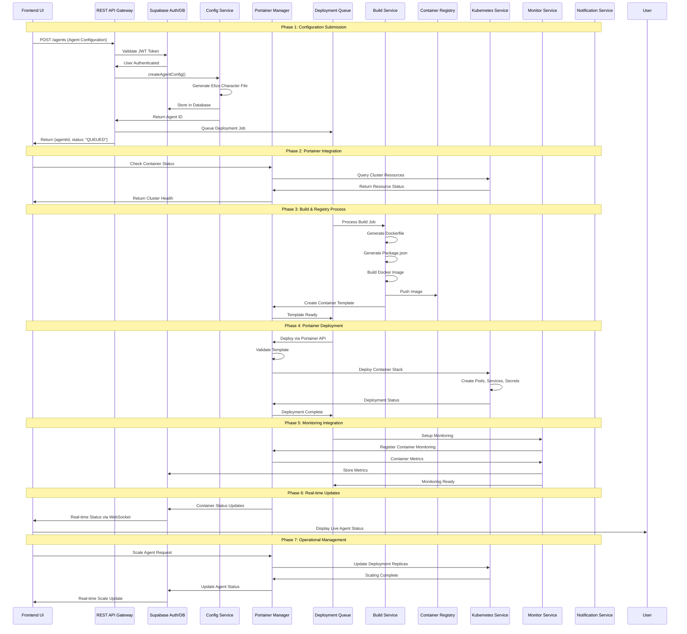

# 🏗️ System Architecture

## 🎯 Overview

The Multi-Agent Infrastructure at Scale is designed as a scalable, secure infrastructure backend that automates the deployment and management of Eliza-based AI agents. The system follows a microservices architecture with clear separation of concerns and robust security measures, with abstracted container management and orchestration through our unified API layer.

## 🧩 Core Components

### 🔵 Eliza Components (Existing Framework)

These are the core components provided by the **official Eliza framework** based on the [elizaOS monorepo structure](https://github.com/elizaOS/eliza):

```typescript
// Official Eliza Framework Structure
eliza/
├── packages/
│   ├── core/                    # @elizaos/core - Core ElizaOS functionality
│   ├── app/                     # @elizaos/app - Tauri-based cross-platform app
│   ├── cli/                     # @elizaos/cli - CLI tool (elizaos command)
│   ├── plugin-bootstrap/        # @elizaos/plugin-bootstrap - Essential communication core
│   ├── plugin-sql/              # @elizaos/plugin-sql - Database integration
│   ├── plugin-*/                # Various plugins (@elizaos/plugin-*)
│   ├── create-eliza/            # Project scaffolding tool
│   └── docs/                    # Official documentation
├── docs/                        # Documentation source files
├── examples/                    # Example projects and templates
└── scripts/                     # Build and utility scripts
```

**Core Eliza Components:**

#### **🤖 Agent Runtime**
- **Agent Runtime**: Orchestrates agent behavior, manages state, and coordinates components
- **Character System**: Personality definitions using character files (`.character.json`)
- **Memory Management**: RAG system for document processing and semantic memory
- **Task Management**: Manages scheduled and deferred operations

#### **📚 Services & Providers**
- **Services**: Multi-platform communication (Discord, Telegram, Twitter, etc.)
- **Providers**: Supply context to inform agent decisions in real-time
- **Evaluators**: Analyze conversations to extract insights and improve responses
- **Actions**: Executable capabilities for agents to respond and interact with systems

#### **🏗️ Structure & Development**
- **Worlds**: Organize environments like servers or projects
- **Rooms**: Spaces for conversation, like channels or DMs
- **Entities**: Represents users, bots, and other participants
- **Plugin System**: Highly extensible action and plugin architecture

#### **🛠️ Development Tools**
- **CLI Tools**: `elizaos` command for project creation and management
- **Project Templates**: Scaffolding for new projects and plugins
- **TypeScript Implementation**: 100% TypeScript with modular architecture

### 🟡 Multi-Agent Infrastructure at Scale Services (New Implementation)

These are the new services built to integrate with the official Eliza framework:

```typescript
// Multi-Agent Infrastructure at Scale Backend Structure
multi-agent-infra-backend/
├── src/
│   ├── controllers/
│   │   ├── agent.controller.ts
│   │   ├── deployment.controller.ts
│   │   ├── monitoring.controller.ts
│   │   └── portainer.controller.ts      # New: Portainer integration
│   ├── services/
│   │   ├── agent-config.service.ts
│   │   ├── build.service.ts
│   │   ├── kubernetes.service.ts
│   │   ├── health-monitor.service.ts
│   │   ├── deployment-orchestrator.service.ts
│   │   ├── notification.service.ts
│   │   └── portainer.service.ts         # New: Portainer service
│   ├── infrastructure/
│   │   ├── docker/
│   │   ├── kubernetes/
│   │   └── portainer/                   # New: Portainer configs
│   └── types/
│       └── interfaces.ts
```

**Integration with Eliza:**
- **Compatible Plugin Structure**: Follows `@elizaos/plugin-*` conventions
- **Character System**: Uses official `.character.json` format
- **CLI Integration**: Works with `elizaos` commands for development
- **Modular Architecture**: Aligns with Eliza's TypeScript monorepo structure

### 🟢 Portainer Container Management Layer (New Integration)

**Portainer** is now integrated as the central container management and orchestration layer:

```typescript
// Portainer Integration Structure
portainer-integration/
├── config/
│   ├── portainer-deployment.yaml       # Portainer Kubernetes deployment
│   ├── portainer-rbac.yaml            # Role-based access control
│   └── portainer-ingress.yaml         # Ingress configuration
├── api/
│   ├── portainer-client.ts            # Portainer API client
│   ├── container-manager.ts           # Container lifecycle management
│   └── stack-orchestrator.ts          # Stack deployment orchestration
├── templates/
│   ├── eliza-agent-template.json      # Eliza agent container template
│   ├── monitoring-stack.json          # Monitoring stack template
│   └── security-stack.json            # Security services template
└── workflows/
    ├── agent-deployment.workflow.ts   # Agent deployment workflow
    ├── scaling.workflow.ts            # Auto-scaling workflow
    └── maintenance.workflow.ts        # Maintenance operations
```

**Portainer Features:**
- **🎛️ Container Management**: Complete lifecycle management of Docker containers
- **☸️ Kubernetes Integration**: Native Kubernetes cluster management
- **🔌 REST API**: Comprehensive REST API for programmatic control
- **📊 Monitoring**: Built-in container monitoring and logging
- **🔒 Security**: Role-based access control and security policies
- **📦 Templates**: Pre-configured application templates
- **🌐 Multi-cluster**: Support for multiple Kubernetes clusters

## 🔄 Enhanced System Flow with Portainer

### Complete End-to-End Process Flow



## 🏗️ System Architecture Diagram

```mermaid
flowchart TB
    subgraph "👤 User Layer"
        User[👤 User/Developer]
        WebUI[🌐 Web Interface]
        API[🔌 REST API]
    end

    subgraph "🔐 Authentication & Security"
        SupaAuth[🔑 Supabase Auth<br/>OAuth, Email, Magic Links]
        JWT[🎫 JWT Tokens<br/>Auto-refresh & Validation]
        RLS[🛡️ Row-Level Security<br/>Data Isolation]
    end

    subgraph "📊 Database & Storage"
        SupaDB[(🗄️ Supabase Database<br/>PostgreSQL + Real-time)]
        AgentTable[🤖 Agents Table]
        MetricsTable[📈 Metrics Table]
        LogsTable[📋 Logs Table]
        SecretsTable[🔐 Secrets Table]
    end

    subgraph "🤖 Agent Management"
        AgentService[⚙️ Agent Service<br/>Creation & Management]
        CharacterConfig[🎭 Character Configuration<br/>Personality, Bio, Instructions]
        PluginConfig[🔌 Plugin Configuration<br/>Discord, Telegram, Twitter]
        SecretMgmt[🔐 Secret Management<br/>API Keys & Tokens]
    end

    subgraph "🎛️ Container Management Layer"
        ContainerService[🎛️ Container Service<br/>Abstracted Orchestration]
        DeploymentEngine[🔌 Deployment Engine<br/>Container Operations]
        TemplateEngine[📦 Template Engine<br/>Eliza Agent Templates]
        ContainerMonitor[📊 Container Monitor<br/>Health & Performance]
        ResourceManager[🏗️ Resource Manager<br/>Scaling & Load Balancing]
    end

    subgraph "🏗️ Deployment Pipeline"
        ContainerBuild[📦 Container Build<br/>Eliza + Plugins]
        SecurityScan[🛡️ Security Scan<br/>Trivy Vulnerability Check]
        Registry[📋 Container Registry<br/>Secure Image Storage]
        K8sDeploy[☸️ Kubernetes Deploy<br/>Pods, Services, Secrets]
    end

    subgraph "🌐 Platform Integrations"
        Discord[💬 Discord Bot<br/>Real-time Chat]
        Telegram[📱 Telegram Bot<br/>Messaging & Commands]
        Twitter[🐦 Twitter Bot<br/>Social Engagement]
        WebSocket[⚡ WebSocket<br/>Real-time Updates]
    end

    subgraph "📊 Monitoring & Analytics"
        RealTimeMetrics[📈 Real-time Metrics<br/>Performance & Health]
        LogStreaming[📋 Log Streaming<br/>Agent Activities]
        Prometheus[📊 Prometheus<br/>Metrics Collection]
        Grafana[📈 Grafana<br/>Dashboards & Alerts]
        SupaRealtime[⚡ Supabase Real-time<br/>Live Updates]
    end

    subgraph "🚨 Security & Compliance"
        ThreatDetection[🔍 Threat Detection<br/>Automated Response]
        SecurityEvents[🚨 Security Events<br/>Audit Logging]
        Compliance[📋 Compliance<br/>GDPR, SOC 2]
        Incident[🚑 Incident Response<br/>Auto-remediation]
    end

    subgraph "⚖️ Auto-scaling & Load Balancing"
        HPA[📊 Horizontal Pod Autoscaler]
        LoadBalancer[⚖️ Load Balancer]
        ResourceMgmt[💾 Resource Management]
    end

    %% User Interactions
    User --> WebUI
    User --> API
    WebUI --> SupaAuth
    API --> SupaAuth

    %% Authentication Flow
    SupaAuth --> JWT
    JWT --> RLS
    RLS --> SupaDB

    %% Database Connections
    SupaDB --> AgentTable
    SupaDB --> MetricsTable
    SupaDB --> LogsTable
    SupaDB --> SecretsTable

    %% Agent Management Flow
    JWT --> AgentService
    AgentService --> CharacterConfig
    AgentService --> PluginConfig
    AgentService --> SecretMgmt
    AgentService --> SupaDB

    %% Container Management Integration
    AgentService --> ContainerService
    ContainerService --> DeploymentEngine
    ContainerService --> TemplateEngine
    ContainerService --> ContainerMonitor
    ContainerService --> ResourceManager

    %% Deployment Pipeline
    AgentService --> ContainerBuild
    ContainerBuild --> SecurityScan
    SecurityScan --> Registry
    Registry --> DeploymentEngine
    DeploymentEngine --> K8sDeploy
    SecretMgmt --> K8sDeploy

    %% Platform Deployments
    K8sDeploy --> Discord
    K8sDeploy --> Telegram
    K8sDeploy --> Twitter
    K8sDeploy --> WebSocket

    %% Monitoring Connections
    K8sDeploy --> RealTimeMetrics
    ContainerMonitor --> RealTimeMetrics
    Discord --> LogStreaming
    Telegram --> LogStreaming
    Twitter --> LogStreaming
    RealTimeMetrics --> SupaDB
    LogStreaming --> SupaDB
    RealTimeMetrics --> Prometheus
    Prometheus --> Grafana
    SupaDB --> SupaRealtime
    SupaRealtime --> WebUI

    %% Security & Compliance
    SupaDB --> SecurityEvents
    ContainerService --> SecurityEvents
    SecurityEvents --> ThreatDetection
    ThreatDetection --> Incident
    SecurityEvents --> Compliance

    %% Auto-scaling
    RealTimeMetrics --> HPA
    ContainerMonitor --> HPA
    ResourceManager --> HPA
    HPA --> K8sDeploy
    K8sDeploy --> LoadBalancer
    LoadBalancer --> ResourceMgmt

    %% Real-time Updates
    SupaRealtime --> RealTimeMetrics
    SupaRealtime --> LogStreaming
    SupaRealtime --> SecurityEvents
    ContainerService --> SupaRealtime

    %% Enhanced Styling
    classDef userStyle fill:#e3f2fd,stroke:#1976d2,stroke-width:3px,color:#000
    classDef authStyle fill:#e8f5e8,stroke:#4caf50,stroke-width:3px,color:#000
    classDef dbStyle fill:#fff3e0,stroke:#ff9800,stroke-width:3px,color:#000
    classDef agentStyle fill:#f3e5f5,stroke:#9c27b0,stroke-width:3px,color:#000
    classDef containerStyle fill:#e1f5fe,stroke:#00bcd4,stroke-width:3px,color:#000
    classDef deployStyle fill:#e0f2f1,stroke:#009688,stroke-width:3px,color:#000
    classDef platformStyle fill:#e8eaf6,stroke:#3f51b5,stroke-width:3px,color:#000
    classDef monitorStyle fill:#fce4ec,stroke:#e91e63,stroke-width:3px,color:#000
    classDef securityStyle fill:#ffebee,stroke:#f44336,stroke-width:3px,color:#000
    classDef scalingStyle fill:#f1f8e9,stroke:#8bc34a,stroke-width:3px,color:#000

    class User,WebUI,API userStyle
    class SupaAuth,JWT,RLS authStyle
    class SupaDB,AgentTable,MetricsTable,LogsTable,SecretsTable dbStyle
    class AgentService,CharacterConfig,PluginConfig,SecretMgmt agentStyle
    class ContainerService,DeploymentEngine,TemplateEngine,ContainerMonitor,ResourceManager containerStyle
    class ContainerBuild,SecurityScan,Registry,K8sDeploy deployStyle
    class Discord,Telegram,Twitter,WebSocket platformStyle
    class RealTimeMetrics,LogStreaming,Prometheus,Grafana,SupaRealtime monitorStyle
    class ThreatDetection,SecurityEvents,Compliance,Incident securityStyle
    class HPA,LoadBalancer,ResourceMgmt scalingStyle
```



## 🛠️ Component Integration Details

### Portainer-Supabase Integration

```typescript
// Portainer Service Integration
export class PortainerService {
  constructor(
    private supabase: SupabaseClient,
    private portainerClient: PortainerClient
  ) {}

  async deployAgent(agentConfig: AgentConfig): Promise<DeploymentResult> {
    // 1. Create container template from Eliza config
    const template = await this.createElizaTemplate(agentConfig);
    
    // 2. Deploy via Portainer API
    const deployment = await this.portainerClient.deployStack(template);
    
    // 3. Store deployment info in Supabase
    await this.supabase
      .from('agent_deployments')
      .insert({
        agent_id: agentConfig.id,
        portainer_stack_id: deployment.id,
        status: 'deploying',
        created_at: new Date().toISOString()
      });
    
    // 4. Setup monitoring
    await this.setupContainerMonitoring(deployment.id);
    
    return deployment;
  }
}
```

### Unified API Layer

```typescript
// Enhanced API Controller with Portainer Integration
@Controller('/api/agents')
export class AgentController {
  constructor(
    private agentService: AgentService,
    private portainerService: PortainerService,
    private supabase: SupabaseClient
  ) {}

  @Post()
  async createAgent(@Body() config: AgentConfig, @Headers() headers: any) {
    // 1. Validate Supabase JWT
    const user = await this.supabase.auth.getUser(headers.authorization);
    
    // 2. Create agent config
    const agent = await this.agentService.createAgent(config);
    
    // 3. Deploy via Portainer
    const deployment = await this.portainerService.deployAgent(agent);
    
    // 4. Return unified response
    return {
      agent,
      deployment,
      status: 'deploying',
      portainer_url: `https://portainer.yourdomain.com/#!/1/docker/stacks/${deployment.id}`
    };
  }
}
```

## 🔧 Infrastructure Requirements

### Enhanced Kubernetes Cluster with Portainer

| Component | Minimum | Recommended | Purpose |
|-----------|---------|-------------|---------|
| **Portainer** | 1 vCPU, 2GB RAM | 2 vCPU, 4GB RAM | Container management |
| **Kubernetes Masters** | 4 vCPU, 8GB RAM | 8 vCPU, 16GB RAM | Cluster management |
| **Worker Nodes** | 8 vCPU, 32GB RAM | 16 vCPU, 64GB RAM | Agent workloads |
| **Supabase** | Cloud service | Cloud service | Database & Auth |
| **Registry** | 2 vCPU, 4GB RAM | 4 vCPU, 8GB RAM | Container images |

### Required Components

#### Core Infrastructure
- **Container Runtime**: containerd or Docker with security hardening
- **CNI**: Calico (recommended for network policies) or Flannel
- **Ingress Controller**: NGINX Ingress Controller with security configurations
- **Certificate Management**: cert-manager with Let's Encrypt or enterprise CA
- **Monitoring**: Prometheus, Grafana, AlertManager with security metrics
- **Portainer**: Container management platform with REST API

#### Portainer Configuration
- **Database**: PostgreSQL or SQLite for Portainer data
- **Authentication**: LDAP/OAuth integration or local users
- **RBAC**: Role-based access control for team management
- **Templates**: Custom Eliza agent templates
- **Endpoints**: Multi-cluster endpoint management

This enhanced architecture provides unified container management through Portainer while maintaining the robust Supabase authentication and Eliza agent framework integration. 