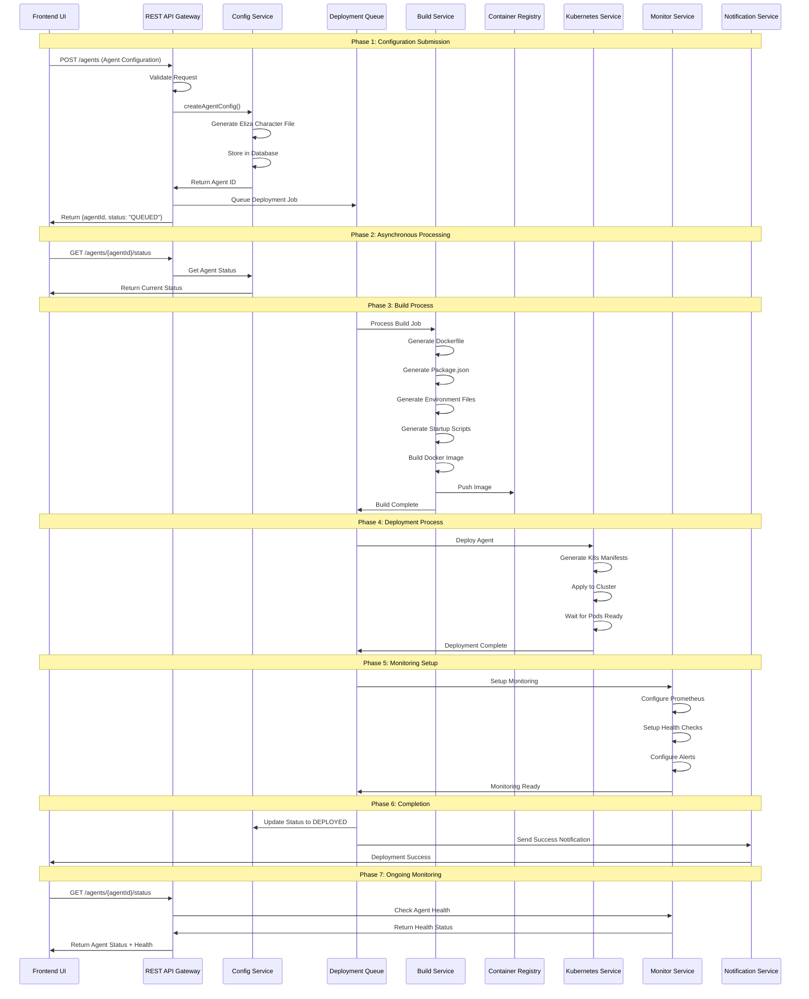
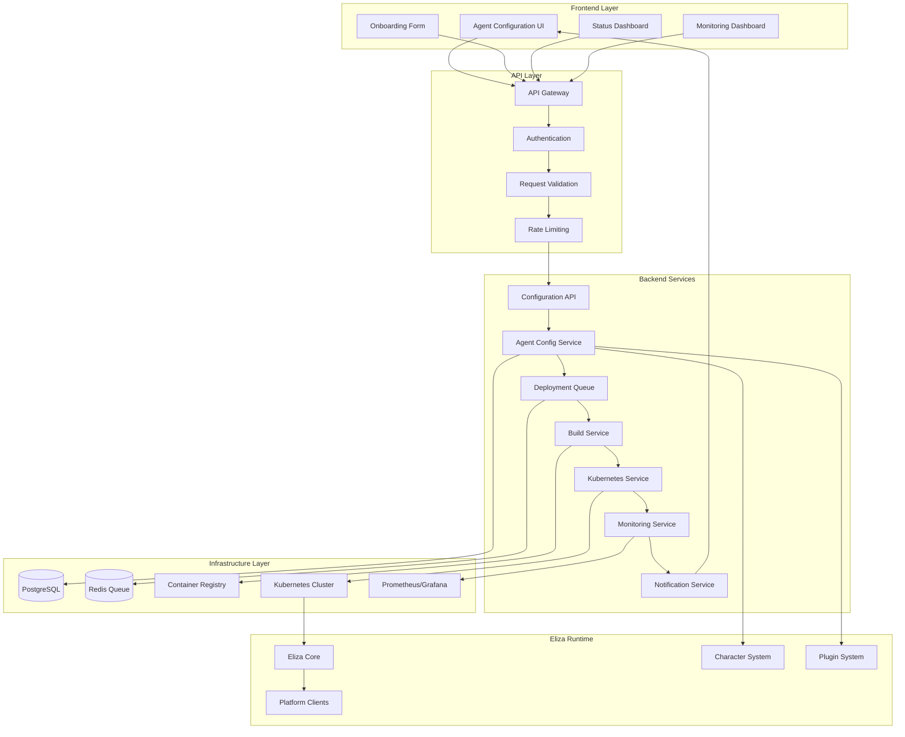
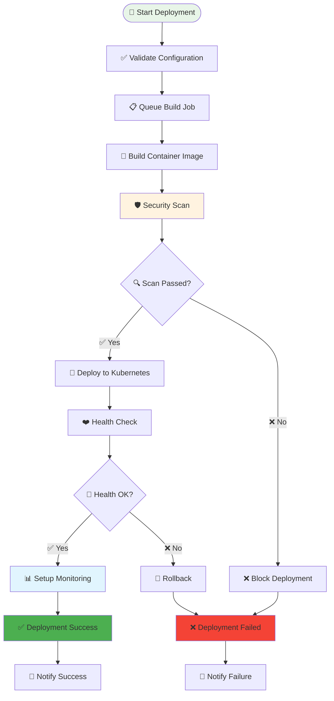
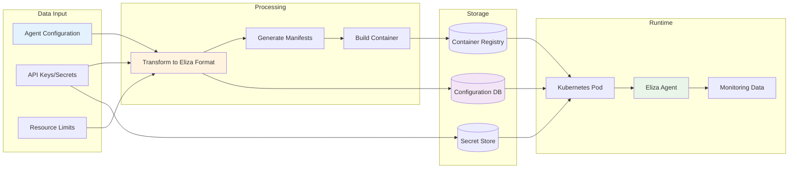
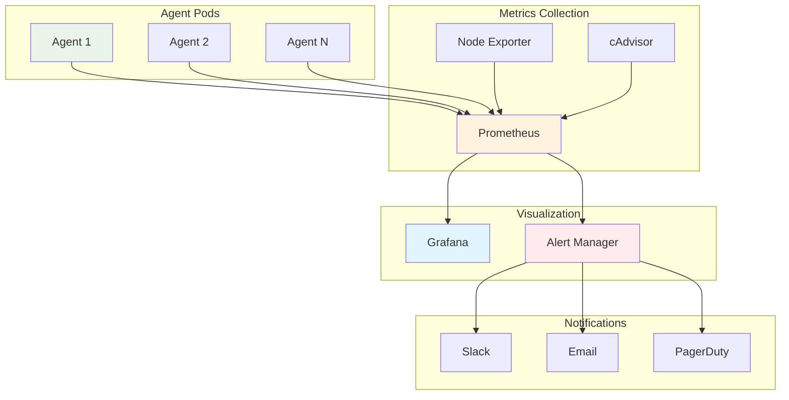

# 🏗️ System Architecture

## 🎯 Overview

The AI Agent Launchpad is designed as a scalable, secure infrastructure backend that automates the deployment and management of Eliza-based AI agents. The system follows a microservices architecture with clear separation of concerns and robust security measures.

## 🧩 Core Components

### 🔵 Eliza Components (Existing Framework)

These are the core components provided by the **official Eliza framework** based on the [elizaOS monorepo structure](https://github.com/elizaOS/eliza):

```typescript
// Official Eliza Framework Structure
eliza/
├── packages/
│   ├── core/                    # @elizaos/core - Core ElizaOS functionality
│   ├── app/                     # @elizaos/app - Tauri-based cross-platform app
│   ├── cli/                     # @elizaos/cli - CLI tool (elizaos command)
│   ├── plugin-bootstrap/        # @elizaos/plugin-bootstrap - Essential communication core
│   ├── plugin-sql/              # @elizaos/plugin-sql - Database integration
│   ├── plugin-*/                # Various plugins (@elizaos/plugin-*)
│   ├── create-eliza/            # Project scaffolding tool
│   └── docs/                    # Official documentation
├── docs/                        # Documentation source files
├── examples/                    # Example projects and templates
└── scripts/                     # Build and utility scripts
```

**Core Eliza Components:**

#### **🤖 Agent Runtime**
- **Agent Runtime**: Orchestrates agent behavior, manages state, and coordinates components
- **Character System**: Personality definitions using character files (`.character.json`)
- **Memory Management**: RAG system for document processing and semantic memory
- **Task Management**: Manages scheduled and deferred operations

#### **📚 Services & Providers**
- **Services**: Multi-platform communication (Discord, Telegram, Twitter, etc.)
- **Providers**: Supply context to inform agent decisions in real-time
- **Evaluators**: Analyze conversations to extract insights and improve responses
- **Actions**: Executable capabilities for agents to respond and interact with systems

#### **🏗️ Structure & Development**
- **Worlds**: Organize environments like servers or projects
- **Rooms**: Spaces for conversation, like channels or DMs
- **Entities**: Represents users, bots, and other participants
- **Plugin System**: Highly extensible action and plugin architecture

#### **🛠️ Development Tools**
- **CLI Tools**: `elizaos` command for project creation and management
- **Project Templates**: Scaffolding for new projects and plugins
- **TypeScript Implementation**: 100% TypeScript with modular architecture

### 🟡 Agent Launchpad Services (New Implementation)

These are the new services built to integrate with the official Eliza framework:

```typescript
// Agent Launchpad Backend Structure
agent-launchpad-backend/
├── src/
│   ├── controllers/
│   │   ├── agent.controller.ts
│   │   ├── deployment.controller.ts
│   │   └── monitoring.controller.ts
│   ├── services/
│   │   ├── agent-config.service.ts
│   │   ├── build.service.ts
│   │   ├── kubernetes.service.ts
│   │   ├── health-monitor.service.ts
│   │   ├── deployment-orchestrator.service.ts
│   │   └── notification.service.ts
│   ├── infrastructure/
│   │   ├── docker/
│   │   └── kubernetes/
│   └── types/
│       └── interfaces.ts
```

**Integration with Eliza:**
- **Compatible Plugin Structure**: Follows `@elizaos/plugin-*` conventions
- **Character System**: Uses official `.character.json` format
- **CLI Integration**: Works with `elizaos` commands for development
- **Modular Architecture**: Aligns with Eliza's TypeScript monorepo structure

## 🔄 Complete System Flow

### End-to-End Process Flow



## 🏗️ Detailed Component Architecture

### Frontend Layer



### Deployment Pipeline Architecture



### Data Flow Architecture



## 🔧 Infrastructure Requirements

### Kubernetes Cluster Specifications

| Component | Minimum | Recommended | Description |
|-----------|---------|-------------|-------------|
| **Nodes** | 3 nodes | 5 nodes | For high availability |
| **CPU** | 8 cores | 16 cores | Per node |
| **Memory** | 32GB | 64GB | Per node |
| **Storage** | 1TB | 2TB+ | For images and logs |
| **Network** | 1Gbps | 10Gbps | Load balancer with SSL |

### Required Components

#### Core Infrastructure
- **Container Runtime**: containerd or Docker with security hardening
- **CNI**: Calico (recommended for network policies) or Flannel
- **Ingress Controller**: NGINX Ingress Controller with security configurations
- **Certificate Management**: cert-manager with Let's Encrypt or enterprise CA
- **Monitoring**: Prometheus, Grafana, AlertManager with security metrics
- **Service Mesh**: Istio (recommended for security) with mTLS enforcement

#### Security Infrastructure
- **Secrets Management**: Kubernetes secrets with proper access controls
- **Container Registry**: Private Docker registry with security scanning
- **Image Scanning**: Trivy for vulnerability scanning
- **API Authentication**: API key-based authentication system
- **Network Security**: Network policies and SSL/TLS termination

## 📊 Component Responsibilities

| Component | Responsibility | Input | Output |
|-----------|----------------|--------|--------|
| **Agent Configuration Service** | Transform UI config to Eliza format | Agent config payload | Character file + metadata |
| **Build Service** | Create Docker images | Agent config + character file | Container image |
| **Kubernetes Service** | Deploy and manage agents | Image tag + config | Running agent pods |
| **Monitoring Service** | Track agent health | Agent metrics | Health status + alerts |
| **Notification Service** | Send status updates | Deployment events | User notifications |

## 🔍 Monitoring Architecture

### Metrics Collection Flow



## 🚀 Next Steps

Ready to dive deeper into the system? Check out these related sections:

<div style="display: grid; grid-template-columns: repeat(auto-fit, minmax(250px, 1fr)); gap: 15px; margin: 20px 0;">

<div style="border: 1px solid #e0e0e0; border-radius: 8px; padding: 15px; border-left: 4px solid #4CAF50;">
<h4><a href="getting-started" style="text-decoration: none; color: #4CAF50;">🚀 Getting Started</a></h4>
<p>Learn how to deploy this architecture</p>
</div>

<div style="border: 1px solid #e0e0e0; border-radius: 8px; padding: 15px; border-left: 4px solid #F44336;">
<h4><a href="security" style="text-decoration: none; color: #F44336;">🔐 Security Details</a></h4>
<p>Understand the security implementation</p>
</div>

<div style="border: 1px solid #e0e0e0; border-radius: 8px; padding: 15px; border-left: 4px solid #9C27B0;">
<h4><a href="deployment" style="text-decoration: none; color: #9C27B0;">⚙️ Deployment Guide</a></h4>
<p>Production deployment strategies</p>
</div>

<div style="border: 1px solid #e0e0e0; border-radius: 8px; padding: 15px; border-left: 4px solid #607D8B;">
<h4><a href="monitoring" style="text-decoration: none; color: #607D8B;">📊 Monitoring Setup</a></h4>
<p>Configure monitoring and alerting</p>
</div>

</div> 