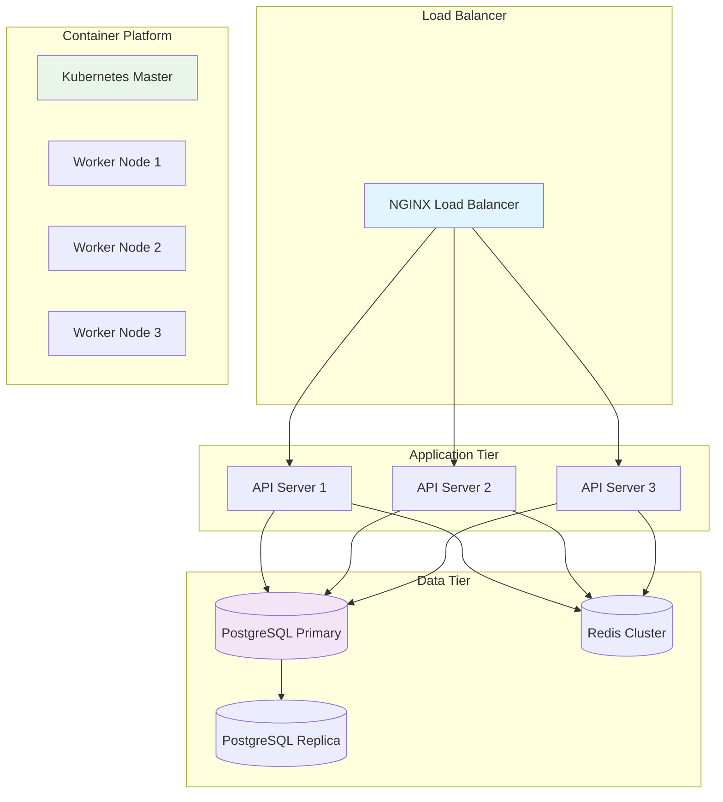

# ⚙️ Deployment Guide

## 🎯 Deployment Overview

This guide covers production deployment strategies, operational procedures, and best practices for running the AI Agent Launchpad in production environments.

## 🏗️ Production Architecture

### High Availability Setup



### Infrastructure Requirements

#### Minimum Production Setup

| Component | Specification | Quantity | Purpose |
|-----------|---------------|----------|---------|
| **Load Balancer** | 2 vCPU, 4GB RAM | 2 | High availability |
| **API Servers** | 4 vCPU, 8GB RAM | 3 | Application layer |
| **Database** | 8 vCPU, 32GB RAM, 500GB SSD | 1 + 1 replica | Data persistence |
| **Kubernetes Masters** | 4 vCPU, 8GB RAM | 3 | Cluster management |
| **Worker Nodes** | 8 vCPU, 32GB RAM | 3+ | Agent workloads |

#### Recommended Production Setup

| Component | Specification | Quantity | Purpose |
|-----------|---------------|----------|---------|
| **Load Balancer** | 4 vCPU, 8GB RAM | 2 | Enhanced performance |
| **API Servers** | 8 vCPU, 16GB RAM | 5 | Scalable API tier |
| **Database** | 16 vCPU, 64GB RAM, 1TB SSD | 1 + 2 replicas | High performance |
| **Kubernetes Masters** | 8 vCPU, 16GB RAM | 3 | Cluster resilience |
| **Worker Nodes** | 16 vCPU, 64GB RAM | 5+ | Agent scalability |

## 🚀 Deployment Strategies

### Blue-Green Deployment

```bash
#!/bin/bash
# Blue-Green Deployment Script

ENVIRONMENT=$1  # blue or green
VERSION=$2

if [ -z "$ENVIRONMENT" ] || [ -z "$VERSION" ]; then
    echo "Usage: $0 <blue|green> <version>"
    exit 1
fi

echo "🚀 Starting Blue-Green Deployment"
echo "Environment: $ENVIRONMENT"
echo "Version: $VERSION"

# Update the inactive environment
echo "📦 Deploying to $ENVIRONMENT environment..."
kubectl set image deployment/api-$ENVIRONMENT \
    api=your-registry/api:$VERSION -n production

# Wait for rollout
echo "⏳ Waiting for rollout to complete..."
kubectl rollout status deployment/api-$ENVIRONMENT -n production

# Run health checks
echo "🔍 Running health checks..."
./scripts/health-check.sh $ENVIRONMENT

if [ $? -eq 0 ]; then
    echo "✅ Health checks passed"
    
    # Switch traffic
    echo "🔄 Switching traffic to $ENVIRONMENT..."
    kubectl patch service api-service \
        -p '{"spec":{"selector":{"version":"'$ENVIRONMENT'"}}}' -n production
    
    echo "✅ Blue-Green deployment completed successfully"
else
    echo "❌ Health checks failed, rolling back..."
    kubectl rollout undo deployment/api-$ENVIRONMENT -n production
    exit 1
fi
```

### Rolling Deployment

```bash
#!/bin/bash
# Rolling Deployment Script

VERSION=$1

if [ -z "$VERSION" ]; then
    echo "Usage: $0 <version>"
    exit 1
fi

echo "🔄 Starting Rolling Deployment"
echo "Version: $VERSION"

# Update deployment
kubectl set image deployment/api \
    api=your-registry/api:$VERSION -n production

# Monitor rollout
kubectl rollout status deployment/api -n production --timeout=600s

if [ $? -eq 0 ]; then
    echo "✅ Rolling deployment completed successfully"
else
    echo "❌ Deployment failed, rolling back..."
    kubectl rollout undo deployment/api -n production
    exit 1
fi
```

### Canary Deployment

```yaml
# Canary Deployment Configuration
apiVersion: apps/v1
kind: Deployment
metadata:
  name: api-canary
  namespace: production
spec:
  replicas: 1  # Start with 1 replica (10% of traffic)
  selector:
    matchLabels:
      app: api
      version: canary
  template:
    metadata:
      labels:
        app: api
        version: canary
    spec:
      containers:
      - name: api
        image: your-registry/api:v2.0.0
        ports:
        - containerPort: 3000
        resources:
          requests:
            memory: "512Mi"
            cpu: "250m"
          limits:
            memory: "1Gi"
            cpu: "500m"
---
apiVersion: v1
kind: Service
metadata:
  name: api-service
  namespace: production
spec:
  selector:
    app: api  # Routes to both stable and canary
  ports:
  - port: 80
    targetPort: 3000
```

## 🛠️ Infrastructure as Code

### Terraform Configuration

```hcl
# terraform/main.tf
provider "aws" {
  region = var.aws_region
}

# VPC and Networking
module "vpc" {
  source = "terraform-aws-modules/vpc/aws"
  
  name = "agent-launchpad-vpc"
  cidr = "10.0.0.0/16"
  
  azs             = ["${var.aws_region}a", "${var.aws_region}b", "${var.aws_region}c"]
  private_subnets = ["10.0.1.0/24", "10.0.2.0/24", "10.0.3.0/24"]
  public_subnets  = ["10.0.101.0/24", "10.0.102.0/24", "10.0.103.0/24"]
  
  enable_nat_gateway = true
  enable_vpn_gateway = true
  
  tags = {
    Environment = var.environment
    Project     = "AI-Agent-Launchpad"
  }
}

# EKS Cluster
module "eks" {
  source = "terraform-aws-modules/eks/aws"
  
  cluster_name    = "agent-launchpad-${var.environment}"
  cluster_version = "1.25"
  
  vpc_id     = module.vpc.vpc_id
  subnet_ids = module.vpc.private_subnets
  
  node_groups = {
    main = {
      desired_capacity = 3
      max_capacity     = 10
      min_capacity     = 3
      
      instance_types = ["t3.large"]
      
      k8s_labels = {
        Environment = var.environment
        NodeGroup   = "main"
      }
    }
  }
  
  tags = {
    Environment = var.environment
    Project     = "AI-Agent-Launchpad"
  }
}

# RDS Database
resource "aws_db_instance" "postgres" {
  identifier     = "agent-launchpad-${var.environment}"
  engine         = "postgres"
  engine_version = "14.9"
  instance_class = "db.t3.medium"
  
  allocated_storage     = 100
  max_allocated_storage = 1000
  storage_encrypted     = true
  
  db_name  = "agent_launchpad"
  username = var.db_username
  password = var.db_password
  
  vpc_security_group_ids = [aws_security_group.rds.id]
  db_subnet_group_name   = aws_db_subnet_group.postgres.name
  
  backup_retention_period = 7
  backup_window          = "03:00-04:00"
  maintenance_window     = "Mon:04:00-Mon:05:00"
  
  skip_final_snapshot = false
  final_snapshot_identifier = "agent-launchpad-${var.environment}-final-snapshot"
  
  tags = {
    Environment = var.environment
    Project     = "AI-Agent-Launchpad"
  }
}
```

### Kubernetes Manifests

```yaml
# k8s/production/namespace.yaml
apiVersion: v1
kind: Namespace
metadata:
  name: production
  labels:
    environment: production
---
# k8s/production/api-deployment.yaml
apiVersion: apps/v1
kind: Deployment
metadata:
  name: api
  namespace: production
  labels:
    app: api
    version: stable
spec:
  replicas: 3
  strategy:
    type: RollingUpdate
    rollingUpdate:
      maxSurge: 1
      maxUnavailable: 0
  selector:
    matchLabels:
      app: api
      version: stable
  template:
    metadata:
      labels:
        app: api
        version: stable
    spec:
      serviceAccountName: api-service-account
      securityContext:
        runAsNonRoot: true
        runAsUser: 1001
        fsGroup: 1001
      containers:
      - name: api
        image: your-registry/api:v1.0.0
        ports:
        - containerPort: 3000
          name: http
        env:
        - name: NODE_ENV
          value: "production"
        - name: DATABASE_URL
          valueFrom:
            secretKeyRef:
              name: database-secret
              key: url
        - name: REDIS_URL
          valueFrom:
            secretKeyRef:
              name: redis-secret
              key: url
        resources:
          requests:
            memory: "1Gi"
            cpu: "500m"
          limits:
            memory: "2Gi"
            cpu: "1000m"
        livenessProbe:
          httpGet:
            path: /health
            port: 3000
          initialDelaySeconds: 30
          periodSeconds: 10
          timeoutSeconds: 5
          failureThreshold: 3
        readinessProbe:
          httpGet:
            path: /ready
            port: 3000
          initialDelaySeconds: 5
          periodSeconds: 5
          timeoutSeconds: 3
          failureThreshold: 3
        securityContext:
          allowPrivilegeEscalation: false
          capabilities:
            drop:
            - ALL
          readOnlyRootFilesystem: true
        volumeMounts:
        - name: tmp
          mountPath: /tmp
        - name: cache
          mountPath: /app/cache
      volumes:
      - name: tmp
        emptyDir: {}
      - name: cache
        emptyDir: {}
      nodeSelector:
        kubernetes.io/arch: amd64
      tolerations:
      - key: "app"
        operator: "Equal"
        value: "api"
        effect: "NoSchedule"
```

## 📊 Monitoring & Observability

### Prometheus Configuration

```yaml
# k8s/monitoring/prometheus-config.yaml
apiVersion: v1
kind: ConfigMap
metadata:
  name: prometheus-config
  namespace: monitoring
data:
  prometheus.yml: |
    global:
      scrape_interval: 15s
      evaluation_interval: 15s
    
    rule_files:
      - "/etc/prometheus/rules/*.yml"
    
    alerting:
      alertmanagers:
        - static_configs:
            - targets:
              - alertmanager:9093
    
    scrape_configs:
      - job_name: 'kubernetes-pods'
        kubernetes_sd_configs:
          - role: pod
        relabel_configs:
          - source_labels: [__meta_kubernetes_pod_annotation_prometheus_io_scrape]
            action: keep
            regex: true
          - source_labels: [__meta_kubernetes_pod_annotation_prometheus_io_path]
            action: replace
            target_label: __metrics_path__
            regex: (.+)
          - source_labels: [__address__, __meta_kubernetes_pod_annotation_prometheus_io_port]
            action: replace
            regex: ([^:]+)(?::\d+)?;(\d+)
            replacement: $1:$2
            target_label: __address__
      
      - job_name: 'api-servers'
        static_configs:
          - targets: ['api-service:80']
        metrics_path: '/metrics'
        scrape_interval: 10s
      
      - job_name: 'agent-pods'
        kubernetes_sd_configs:
          - role: pod
            namespaces:
              names:
                - agents
        relabel_configs:
          - source_labels: [__meta_kubernetes_pod_label_app]
            action: keep
            regex: eliza-agent
```

### Grafana Dashboards

```json
{
  "dashboard": {
    "title": "AI Agent Launchpad - System Overview",
    "panels": [
      {
        "title": "API Request Rate",
        "type": "graph",
        "targets": [
          {
            "expr": "rate(http_requests_total[5m])",
            "legendFormat": "{{method}} {{status}}"
          }
        ]
      },
      {
        "title": "Agent Deployment Success Rate",
        "type": "stat",
        "targets": [
          {
            "expr": "rate(agent_deployments_total{status=\"success\"}[5m]) / rate(agent_deployments_total[5m]) * 100",
            "legendFormat": "Success Rate %"
          }
        ]
      },
      {
        "title": "Active Agents",
        "type": "stat",
        "targets": [
          {
            "expr": "count(up{job=\"agent-pods\"} == 1)",
            "legendFormat": "Active Agents"
          }
        ]
      },
      {
        "title": "System Resource Usage",
        "type": "graph",
        "targets": [
          {
            "expr": "rate(container_cpu_usage_seconds_total[5m]) * 100",
            "legendFormat": "CPU Usage %"
          },
          {
            "expr": "container_memory_usage_bytes / container_spec_memory_limit_bytes * 100",
            "legendFormat": "Memory Usage %"
          }
        ]
      }
    ]
  }
}
```

## 🔒 Security Hardening

### Network Policies

```yaml
# k8s/security/network-policies.yaml
apiVersion: networking.k8s.io/v1
kind: NetworkPolicy
metadata:
  name: api-network-policy
  namespace: production
spec:
  podSelector:
    matchLabels:
      app: api
  policyTypes:
  - Ingress
  - Egress
  ingress:
  - from:
    - namespaceSelector:
        matchLabels:
          name: ingress-nginx
    ports:
    - protocol: TCP
      port: 3000
  - from:
    - namespaceSelector:
        matchLabels:
          name: monitoring
    ports:
    - protocol: TCP
      port: 3000
  egress:
  - to:
    - namespaceSelector:
        matchLabels:
          name: database
    ports:
    - protocol: TCP
      port: 5432
  - to:
    - namespaceSelector:
        matchLabels:
          name: redis
    ports:
    - protocol: TCP
      port: 6379
  - to: []
    ports:
    - protocol: TCP
      port: 443
    - protocol: TCP
      port: 80
    - protocol: TCP
      port: 53
    - protocol: UDP
      port: 53
```

### Pod Security Standards

```yaml
# k8s/security/pod-security-policy.yaml
apiVersion: policy/v1beta1
kind: PodSecurityPolicy
metadata:
  name: restricted
spec:
  privileged: false
  allowPrivilegeEscalation: false
  requiredDropCapabilities:
    - ALL
  volumes:
    - 'configMap'
    - 'emptyDir'
    - 'projected'
    - 'secret'
    - 'downwardAPI'
    - 'persistentVolumeClaim'
  runAsUser:
    rule: 'MustRunAsNonRoot'
  seLinux:
    rule: 'RunAsAny'
  fsGroup:
    rule: 'RunAsAny'
```

## 🚀 CI/CD Pipeline

### GitHub Actions Workflow

```yaml
# .github/workflows/deploy.yml
name: Deploy to Production

on:
  push:
    branches: [main]
  pull_request:
    branches: [main]

jobs:
  test:
    runs-on: ubuntu-latest
    steps:
    - uses: actions/checkout@v3
    
    - name: Setup Node.js
      uses: actions/setup-node@v3
      with:
        node-version: '18'
        cache: 'npm'
    
    - name: Install dependencies
      run: npm ci
    
    - name: Run tests
      run: npm test
    
    - name: Run security audit
      run: npm audit --audit-level moderate

  build:
    needs: test
    runs-on: ubuntu-latest
    if: github.ref == 'refs/heads/main'
    steps:
    - uses: actions/checkout@v3
    
    - name: Configure AWS credentials
      uses: aws-actions/configure-aws-credentials@v2
      with:
        aws-access-key-id: ${{ secrets.AWS_ACCESS_KEY_ID }}
        aws-secret-access-key: ${{ secrets.AWS_SECRET_ACCESS_KEY }}
        aws-region: us-east-1
    
    - name: Login to Amazon ECR
      uses: aws-actions/amazon-ecr-login@v1
    
    - name: Build and push Docker image
      env:
        ECR_REGISTRY: ${{ steps.login-ecr.outputs.registry }}
        ECR_REPOSITORY: agent-launchpad-api
        IMAGE_TAG: ${{ github.sha }}
      run: |
        docker build -t $ECR_REGISTRY/$ECR_REPOSITORY:$IMAGE_TAG .
        docker push $ECR_REGISTRY/$ECR_REPOSITORY:$IMAGE_TAG
        docker tag $ECR_REGISTRY/$ECR_REPOSITORY:$IMAGE_TAG $ECR_REGISTRY/$ECR_REPOSITORY:latest
        docker push $ECR_REGISTRY/$ECR_REPOSITORY:latest

  deploy:
    needs: build
    runs-on: ubuntu-latest
    if: github.ref == 'refs/heads/main'
    steps:
    - uses: actions/checkout@v3
    
    - name: Configure kubectl
      uses: azure/k8s-set-context@v1
      with:
        method: kubeconfig
        kubeconfig: ${{ secrets.KUBE_CONFIG }}
    
    - name: Deploy to Kubernetes
      env:
        IMAGE_TAG: ${{ github.sha }}
      run: |
        envsubst < k8s/production/api-deployment.yaml | kubectl apply -f -
        kubectl rollout status deployment/api -n production --timeout=600s
    
    - name: Run health checks
      run: |
        sleep 30
        kubectl get pods -n production
        ./scripts/health-check.sh production
```

## 📋 Operational Procedures

### Backup and Recovery

```bash
#!/bin/bash
# Backup Script

DATE=$(date +%Y%m%d_%H%M%S)
BACKUP_DIR="/backups"

echo "🗄️ Starting backup process..."

# Database backup
echo "📊 Backing up database..."
pg_dump $DATABASE_URL | gzip > $BACKUP_DIR/database_$DATE.sql.gz

# Configuration backup
echo "⚙️ Backing up configurations..."
kubectl get configmaps -o yaml --all-namespaces > $BACKUP_DIR/configmaps_$DATE.yaml
kubectl get secrets -o yaml --all-namespaces > $BACKUP_DIR/secrets_$DATE.yaml

# Upload to S3
echo "☁️ Uploading to S3..."
aws s3 cp $BACKUP_DIR/ s3://your-backup-bucket/backups/$DATE/ --recursive

echo "✅ Backup completed successfully"
```

### Disaster Recovery

```bash
#!/bin/bash
# Disaster Recovery Script

BACKUP_DATE=$1

if [ -z "$BACKUP_DATE" ]; then
    echo "Usage: $0 <backup-date>"
    exit 1
fi

echo "🚨 Starting disaster recovery process..."
echo "Restoring from backup: $BACKUP_DATE"

# Download backup from S3
echo "⬇️ Downloading backup from S3..."
aws s3 cp s3://your-backup-bucket/backups/$BACKUP_DATE/ /tmp/restore/ --recursive

# Restore database
echo "📊 Restoring database..."
gunzip -c /tmp/restore/database_$BACKUP_DATE.sql.gz | psql $DATABASE_URL

# Restore configurations
echo "⚙️ Restoring configurations..."
kubectl apply -f /tmp/restore/configmaps_$BACKUP_DATE.yaml
kubectl apply -f /tmp/restore/secrets_$BACKUP_DATE.yaml

# Restart services
echo "🔄 Restarting services..."
kubectl rollout restart deployment/api -n production

echo "✅ Disaster recovery completed"
```

## 🎯 Performance Optimization

### Database Optimization

```sql
-- Database performance tuning
-- Create indexes for frequently queried columns
CREATE INDEX CONCURRENTLY idx_agents_status ON agents(status);
CREATE INDEX CONCURRENTLY idx_agents_created_at ON agents(created_at);
CREATE INDEX CONCURRENTLY idx_deployments_agent_id ON deployments(agent_id);

-- Analyze query performance
EXPLAIN (ANALYZE, BUFFERS) 
SELECT * FROM agents WHERE status = 'DEPLOYED' AND created_at > NOW() - INTERVAL '24 hours';

-- Configure PostgreSQL settings
ALTER SYSTEM SET shared_buffers = '4GB';
ALTER SYSTEM SET effective_cache_size = '12GB';
ALTER SYSTEM SET work_mem = '64MB';
ALTER SYSTEM SET maintenance_work_mem = '1GB';
SELECT pg_reload_conf();
```

### Application Scaling

```yaml
# Horizontal Pod Autoscaler
apiVersion: autoscaling/v2
kind: HorizontalPodAutoscaler
metadata:
  name: api-hpa
  namespace: production
spec:
  scaleTargetRef:
    apiVersion: apps/v1
    kind: Deployment
    name: api
  minReplicas: 3
  maxReplicas: 20
  metrics:
  - type: Resource
    resource:
      name: cpu
      target:
        type: Utilization
        averageUtilization: 70
  - type: Resource
    resource:
      name: memory
      target:
        type: Utilization
        averageUtilization: 80
  behavior:
    scaleUp:
      stabilizationWindowSeconds: 60
      policies:
      - type: Percent
        value: 100
        periodSeconds: 15
    scaleDown:
      stabilizationWindowSeconds: 300
      policies:
      - type: Percent
        value: 10
        periodSeconds: 60
```

## 🚀 Next Steps

<div style="display: grid; grid-template-columns: repeat(auto-fit, minmax(250px, 1fr)); gap: 15px; margin: 20px 0;">

<div style="border: 1px solid #e0e0e0; border-radius: 8px; padding: 15px; border-left: 4px solid #4CAF50;">
<h4><a href="/getting-started" style="text-decoration: none; color: #4CAF50;">🚀 Getting Started</a></h4>
<p>Start with development deployment</p>
</div>

<div style="border: 1px solid #e0e0e0; border-radius: 8px; padding: 15px; border-left: 4px solid #F44336;">
<h4><a href="/security" style="text-decoration: none; color: #F44336;">🔐 Security Guide</a></h4>
<p>Implement security best practices</p>
</div>

<div style="border: 1px solid #e0e0e0; border-radius: 8px; padding: 15px; border-left: 4px solid #607D8B;">
<h4><a href="/monitoring" style="text-decoration: none; color: #607D8B;">📊 Monitoring</a></h4>
<p>Set up comprehensive monitoring</p>
</div>

<div style="border: 1px solid #e0e0e0; border-radius: 8px; padding: 15px; border-left: 4px solid #E91E63;">
<h4><a href="/support" style="text-decoration: none; color: #E91E63;">📞 Support</a></h4>
<p>Get help with deployment issues</p>
</div>

</div>

---

Ready to deploy to production? Follow this guide step by step and ensure you have all security and monitoring components in place before going live! 🚀 