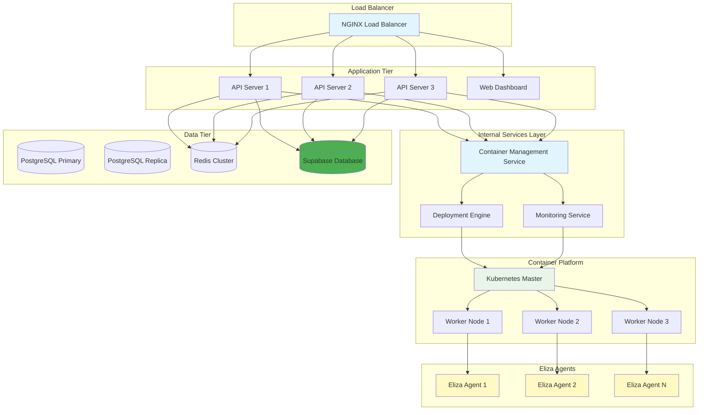

# ⚙️ Deployment Guide

## 🎯 Deployment Overview

This guide covers production deployment strategies, operational procedures, and best practices for running the Multi-Agent Infrastructure at Scale in production environments. Container orchestration is handled internally through an abstracted API layer that provides unified access to deployment and management capabilities.

## 🏗️ Production Architecture

### High Availability Setup



### Infrastructure Requirements

#### Minimum Production Setup

| Component | Specification | Quantity | Purpose |
|-----------|---------------|----------|---------|
| **Load Balancer** | 2 vCPU, 4GB RAM | 2 | High availability |
| **API Servers** | 4 vCPU, 8GB RAM | 3 | Application layer |
| **Internal Services** | 2 vCPU, 4GB RAM | 2 | Container management & monitoring |
| **Database** | 8 vCPU, 32GB RAM, 500GB SSD | 1 + 1 replica | Data persistence |
| **Kubernetes Masters** | 4 vCPU, 8GB RAM | 3 | Cluster management |
| **Worker Nodes** | 8 vCPU, 32GB RAM | 3+ | Agent workloads |

#### Recommended Production Setup

| Component | Specification | Quantity | Purpose |
|-----------|---------------|----------|---------|
| **Load Balancer** | 4 vCPU, 8GB RAM | 2 | Enhanced performance |
| **API Servers** | 8 vCPU, 16GB RAM | 5 | Scalable API tier |
| **Internal Services** | 4 vCPU, 8GB RAM | 3 | HA container management & monitoring |
| **Database** | 16 vCPU, 64GB RAM, 1TB SSD | 1 + 2 replicas | High performance |
| **Kubernetes Masters** | 8 vCPU, 16GB RAM | 3 | Cluster resilience |
| **Worker Nodes** | 16 vCPU, 64GB RAM | 5+ | Agent scalability |

## 🚀 Deployment Strategies

### 1. Blue-Green Deployment

```bash
#!/bin/bash
# Portainer Blue-Green Deployment Script

ENVIRONMENT=$1  # blue or green
VERSION=$2
PORTAINER_URL="https://portainer.yourdomain.com"
PORTAINER_TOKEN="your-portainer-jwt-token"

if [ -z "$ENVIRONMENT" ] || [ -z "$VERSION" ]; then
    echo "Usage: $0 <blue|green> <version>"
    exit 1
fi

echo "🚀 Starting Portainer Blue-Green Deployment"
echo "Environment: $ENVIRONMENT"
echo "Version: $VERSION"

# 1. Get current stack configuration
echo "📋 Getting current stack configuration..."
CURRENT_STACK=$(curl -s -H "Authorization: Bearer $PORTAINER_TOKEN" \
    "$PORTAINER_URL/api/stacks" | jq -r '.[] | select(.Name=="agent-stack-'$ENVIRONMENT'")')

if [ -z "$CURRENT_STACK" ]; then
    echo "❌ Stack agent-stack-$ENVIRONMENT not found"
    exit 1
fi

STACK_ID=$(echo $CURRENT_STACK | jq -r '.Id')
ENDPOINT_ID=$(echo $CURRENT_STACK | jq -r '.EndpointId')

# 2. Update stack with new image version
echo "📦 Updating stack with new image version..."
STACK_FILE=$(cat << EOF
{
  "stackFileContent": "version: '3.8'\nservices:\n  eliza-agent:\n    image: your-registry/eliza-agent:$VERSION\n    environment:\n      - NODE_ENV=production\n      - VERSION=$VERSION\n    deploy:\n      replicas: 3\n      restart_policy:\n        condition: on-failure\n    networks:\n      - agent-network\n    labels:\n      - environment=$ENVIRONMENT\n      - version=$VERSION\n\nnetworks:\n  agent-network:\n    driver: overlay",
  "prune": true
}
EOF
)

# 3. Deploy via Portainer API
echo "🔄 Deploying via Portainer API..."
DEPLOYMENT_RESPONSE=$(curl -s -X PUT \
    -H "Authorization: Bearer $PORTAINER_TOKEN" \
    -H "Content-Type: application/json" \
    -d "$STACK_FILE" \
    "$PORTAINER_URL/api/stacks/$STACK_ID?endpointId=$ENDPOINT_ID")

if echo "$DEPLOYMENT_RESPONSE" | jq -r '.Id' > /dev/null; then
    echo "✅ Deployment initiated successfully"
else
    echo "❌ Deployment failed: $DEPLOYMENT_RESPONSE"
    exit 1
fi

# 4. Wait for deployment to complete
echo "⏳ Waiting for deployment to complete..."
for i in {1..30}; do
    STACK_STATUS=$(curl -s -H "Authorization: Bearer $PORTAINER_TOKEN" \
        "$PORTAINER_URL/api/stacks/$STACK_ID" | jq -r '.Status')
    
    if [ "$STACK_STATUS" == "1" ]; then
        echo "✅ Stack deployed successfully"
        break
    elif [ "$STACK_STATUS" == "2" ]; then
        echo "❌ Stack deployment failed"
        exit 1
    fi
    
    echo "⏳ Deployment in progress... ($i/30)"
    sleep 10
done

# 5. Run health checks
echo "🔍 Running health checks..."
./scripts/health-check-portainer.sh $ENVIRONMENT $STACK_ID

if [ $? -eq 0 ]; then
    echo "✅ Health checks passed"
    
    # 6. Update load balancer to switch traffic
    echo "🔄 Switching traffic to $ENVIRONMENT..."
    ./scripts/switch-traffic.sh $ENVIRONMENT
    
    # 7. Update Supabase with deployment info
    echo "📊 Updating Supabase deployment records..."
    curl -X POST https://your-supabase-url.supabase.co/rest/v1/deployments \
        -H "Authorization: Bearer $SUPABASE_JWT" \
        -H "apikey: $SUPABASE_ANON_KEY" \
        -H "Content-Type: application/json" \
        -d '{
            "environment": "'$ENVIRONMENT'",
            "version": "'$VERSION'",
            "stack_id": "'$STACK_ID'",
            "status": "deployed",
            "deployed_at": "'$(date -u +%Y-%m-%dT%H:%M:%SZ)'"
        }'
    
    echo "✅ Portainer Blue-Green deployment completed successfully"
else
    echo "❌ Health checks failed, rolling back..."
    
    # Rollback via Portainer API
    curl -X POST \
        -H "Authorization: Bearer $PORTAINER_TOKEN" \
        "$PORTAINER_URL/api/stacks/$STACK_ID/rollback?endpointId=$ENDPOINT_ID"
    
    exit 1
fi
```

### 2. Portainer Rolling Deployment

```bash
#!/bin/bash
# Portainer Rolling Deployment Script

VERSION=$1
PORTAINER_URL="https://portainer.yourdomain.com"
PORTAINER_TOKEN="your-portainer-jwt-token"

if [ -z "$VERSION" ]; then
    echo "Usage: $0 <version>"
    exit 1
fi

echo "🔄 Starting Portainer Rolling Deployment"
echo "Version: $VERSION"

# 1. Get all agent stacks
echo "📋 Getting agent stacks..."
AGENT_STACKS=$(curl -s -H "Authorization: Bearer $PORTAINER_TOKEN" \
    "$PORTAINER_URL/api/stacks" | jq -r '.[] | select(.Name | startswith("eliza-agent-")) | .Id')

if [ -z "$AGENT_STACKS" ]; then
    echo "❌ No agent stacks found"
    exit 1
fi

# 2. Update each stack with rolling strategy
for STACK_ID in $AGENT_STACKS; do
    echo "📦 Updating stack $STACK_ID..."
    
    # Get stack details
    STACK_DETAILS=$(curl -s -H "Authorization: Bearer $PORTAINER_TOKEN" \
        "$PORTAINER_URL/api/stacks/$STACK_ID")
    
    STACK_NAME=$(echo $STACK_DETAILS | jq -r '.Name')
    ENDPOINT_ID=$(echo $STACK_DETAILS | jq -r '.EndpointId')
    
    echo "🔄 Rolling update for $STACK_NAME"
    
    # Update stack with rolling deployment configuration
    ROLLING_STACK_FILE=$(cat << EOF
{
  "stackFileContent": "version: '3.8'\nservices:\n  eliza-agent:\n    image: your-registry/eliza-agent:$VERSION\n    environment:\n      - NODE_ENV=production\n      - VERSION=$VERSION\n    deploy:\n      replicas: 3\n      update_config:\n        parallelism: 1\n        delay: 30s\n        failure_action: rollback\n        order: start-first\n      restart_policy:\n        condition: on-failure\n    networks:\n      - agent-network\n    labels:\n      - version=$VERSION\n\nnetworks:\n  agent-network:\n    driver: overlay",
  "prune": false
}
EOF
    )
    
    # Execute rolling update
    UPDATE_RESPONSE=$(curl -s -X PUT \
        -H "Authorization: Bearer $PORTAINER_TOKEN" \
        -H "Content-Type: application/json" \
        -d "$ROLLING_STACK_FILE" \
        "$PORTAINER_URL/api/stacks/$STACK_ID?endpointId=$ENDPOINT_ID")
    
    if echo "$UPDATE_RESPONSE" | jq -r '.Id' > /dev/null; then
        echo "✅ Rolling update initiated for $STACK_NAME"
    else
        echo "❌ Rolling update failed for $STACK_NAME: $UPDATE_RESPONSE"
        continue
    fi
    
    # Wait for this stack to complete before moving to next
    echo "⏳ Waiting for $STACK_NAME to complete..."
    for i in {1..30}; do
        STACK_STATUS=$(curl -s -H "Authorization: Bearer $PORTAINER_TOKEN" \
            "$PORTAINER_URL/api/stacks/$STACK_ID" | jq -r '.Status')
        
        if [ "$STACK_STATUS" == "1" ]; then
            echo "✅ $STACK_NAME updated successfully"
            break
        elif [ "$STACK_STATUS" == "2" ]; then
            echo "❌ $STACK_NAME update failed"
            break
        fi
        
        echo "⏳ Update in progress for $STACK_NAME... ($i/30)"
        sleep 10
    done
done

echo "✅ Portainer Rolling deployment completed successfully"
```

### 3. Portainer Stack Templates

Create reusable templates for different deployment scenarios:

```json
{
  "title": "Eliza Agent Stack",
  "description": "Production-ready Eliza agent deployment with monitoring",
  "categories": ["AI", "Agents", "Eliza"],
  "platform": "linux",
  "logo": "https://your-domain.com/eliza-logo.png",
  "repository": {
    "url": "https://github.com/yourusername/agent-launchpad-infra",
    "stackfile": "portainer/eliza-agent-stack.yml"
  },
  "env": [
    {
      "name": "AGENT_NAME",
      "label": "Agent Name",
      "description": "Unique name for the agent",
      "default": "eliza-agent"
    },
    {
      "name": "DISCORD_TOKEN",
      "label": "Discord Bot Token",
      "description": "Discord bot token for the agent"
    },
    {
      "name": "SUPABASE_URL",
      "label": "Supabase URL",
      "description": "Supabase project URL"
    },
    {
      "name": "SUPABASE_ANON_KEY",
      "label": "Supabase Anon Key",
      "description": "Supabase anonymous key"
    },
    {
      "name": "REPLICAS",
      "label": "Number of Replicas",
      "description": "Number of agent replicas to run",
      "default": "3"
    },
    {
      "name": "CPU_LIMIT",
      "label": "CPU Limit",
      "description": "CPU limit per container",
      "default": "500m"
    },
    {
      "name": "MEMORY_LIMIT",
      "label": "Memory Limit",
      "description": "Memory limit per container",
      "default": "1Gi"
    }
  ]
}
```

### 4. Portainer Deployment Workflow

```yaml
# portainer/eliza-agent-stack.yml
version: '3.8'

services:
  eliza-agent:
    image: your-registry/eliza-agent:${VERSION:-latest}
    environment:
      - NODE_ENV=production
      - AGENT_NAME=${AGENT_NAME}
      - DISCORD_TOKEN=${DISCORD_TOKEN}
      - SUPABASE_URL=${SUPABASE_URL}
      - SUPABASE_ANON_KEY=${SUPABASE_ANON_KEY}
      - PROMETHEUS_ENDPOINT=http://prometheus:9090
    deploy:
      replicas: ${REPLICAS:-3}
      resources:
        limits:
          cpus: '${CPU_LIMIT:-0.5}'
          memory: ${MEMORY_LIMIT:-1G}
        reservations:
          cpus: '0.25'
          memory: 512M
      restart_policy:
        condition: on-failure
        delay: 30s
        max_attempts: 3
      update_config:
        parallelism: 1
        delay: 30s
        failure_action: rollback
        order: start-first
      rollback_config:
        parallelism: 1
        delay: 30s
        failure_action: pause
        order: stop-first
    networks:
      - agent-network
      - monitoring-network
    labels:
      - "traefik.enable=true"
      - "traefik.http.routers.agent-${AGENT_NAME}.rule=Host(`${AGENT_NAME}.yourdomain.com`)"
      - "traefik.http.services.agent-${AGENT_NAME}.loadbalancer.server.port=3000"
      - "prometheus.io/scrape=true"
      - "prometheus.io/port=3000"
      - "prometheus.io/path=/metrics"
    healthcheck:
      test: ["CMD", "curl", "-f", "http://localhost:3000/health"]
      interval: 30s
      timeout: 10s
      retries: 3
      start_period: 60s

  agent-monitor:
    image: your-registry/agent-monitor:${VERSION:-latest}
    environment:
      - AGENT_NAME=${AGENT_NAME}
      - SUPABASE_URL=${SUPABASE_URL}
      - SUPABASE_SERVICE_ROLE_KEY=${SUPABASE_SERVICE_ROLE_KEY}
    deploy:
      replicas: 1
      resources:
        limits:
          cpus: '0.25'
          memory: 256M
    networks:
      - agent-network
      - monitoring-network
    depends_on:
      - eliza-agent

networks:
  agent-network:
    driver: overlay
    encrypted: true
  monitoring-network:
    external: true

volumes:
  agent-data:
    driver: local
```

## 🔧 Portainer Setup and Configuration

### 1. Deploy Portainer on Kubernetes

```bash
#!/bin/bash
# Deploy Portainer to Kubernetes

echo "🚀 Deploying Portainer to Kubernetes..."

# Create namespace
kubectl create namespace portainer

# Deploy Portainer
kubectl apply -n portainer -f https://downloads.portainer.io/ce2-19/portainer.yaml

# Create service account for Portainer
kubectl apply -f - <<EOF
apiVersion: v1
kind: ServiceAccount
metadata:
  name: portainer-sa-clusteradmin
  namespace: portainer
---
apiVersion: rbac.authorization.k8s.io/v1
kind: ClusterRoleBinding
metadata:
  name: portainer-crb-clusteradmin
roleRef:
  apiGroup: rbac.authorization.k8s.io
  kind: ClusterRole
  name: cluster-admin
subjects:
- kind: ServiceAccount
  name: portainer-sa-clusteradmin
  namespace: portainer
EOF

# Create ingress for Portainer
kubectl apply -f - <<EOF
apiVersion: networking.k8s.io/v1
kind: Ingress
metadata:
  name: portainer-ingress
  namespace: portainer
  annotations:
    nginx.ingress.kubernetes.io/ssl-redirect: "true"
    nginx.ingress.kubernetes.io/backend-protocol: "HTTPS"
    cert-manager.io/cluster-issuer: "letsencrypt-prod"
spec:
  tls:
  - hosts:
    - portainer.yourdomain.com
    secretName: portainer-tls
  rules:
  - host: portainer.yourdomain.com
    http:
      paths:
      - path: /
        pathType: Prefix
        backend:
          service:
            name: portainer
            port:
              number: 9443
EOF

echo "✅ Portainer deployed successfully"
echo "🌐 Access Portainer at: https://portainer.yourdomain.com"
echo "🔑 Default admin user will be created on first login"
```

### 2. Configure Portainer for Agent Deployment

```bash
#!/bin/bash
# Configure Portainer for Agent Deployment

PORTAINER_URL="https://portainer.yourdomain.com"
ADMIN_USER="admin"
ADMIN_PASSWORD="your-secure-password"

echo "🔧 Configuring Portainer for Agent Deployment..."

# 1. Create admin user (first time only)
echo "👤 Creating admin user..."
curl -X POST "$PORTAINER_URL/api/users/admin/init" \
  -H "Content-Type: application/json" \
  -d "{\"Username\":\"$ADMIN_USER\",\"Password\":\"$ADMIN_PASSWORD\"}"

# 2. Get authentication token
echo "🔑 Getting authentication token..."
TOKEN_RESPONSE=$(curl -X POST "$PORTAINER_URL/api/auth" \
  -H "Content-Type: application/json" \
  -d "{\"Username\":\"$ADMIN_USER\",\"Password\":\"$ADMIN_PASSWORD\"}")

JWT_TOKEN=$(echo $TOKEN_RESPONSE | jq -r '.jwt')

if [ "$JWT_TOKEN" == "null" ]; then
    echo "❌ Failed to get authentication token"
    exit 1
fi

# 3. Create custom template for Eliza agents
echo "📝 Creating Eliza agent template..."
TEMPLATE_PAYLOAD=$(cat << EOF
{
  "title": "Eliza Agent Stack",
  "description": "Production-ready Eliza agent deployment with monitoring and auto-scaling",
  "categories": ["AI", "Agents", "Eliza"],
  "platform": "linux",
  "logo": "https://your-domain.com/eliza-logo.png",
  "repository": {
    "url": "https://github.com/yourusername/agent-launchpad-infra",
    "stackfile": "portainer/eliza-agent-stack.yml"
  },
  "env": [
    {
      "name": "AGENT_NAME",
      "label": "Agent Name",
      "description": "Unique name for the agent"
    },
    {
      "name": "DISCORD_TOKEN",
      "label": "Discord Bot Token",
      "description": "Discord bot token for the agent"
    },
    {
      "name": "SUPABASE_URL",
      "label": "Supabase URL",
      "description": "Supabase project URL"
    },
    {
      "name": "SUPABASE_ANON_KEY",
      "label": "Supabase Anon Key",
      "description": "Supabase anonymous key"
    }
  ]
}
EOF
)

curl -X POST "$PORTAINER_URL/api/templates" \
  -H "Authorization: Bearer $JWT_TOKEN" \
  -H "Content-Type: application/json" \
  -d "$TEMPLATE_PAYLOAD"

# 4. Create webhook for automated deployments
echo "🔗 Creating deployment webhook..."
WEBHOOK_RESPONSE=$(curl -X POST "$PORTAINER_URL/api/webhooks" \
  -H "Authorization: Bearer $JWT_TOKEN" \
  -H "Content-Type: application/json" \
  -d '{
    "ResourceID": "eliza-agent-stack",
    "EndpointID": 1,
    "WebhookType": 1
  }')

WEBHOOK_ID=$(echo $WEBHOOK_RESPONSE | jq -r '.Id')
WEBHOOK_TOKEN=$(echo $WEBHOOK_RESPONSE | jq -r '.Token')

echo "✅ Portainer configuration completed"
echo "🔗 Webhook URL: $PORTAINER_URL/api/webhooks/$WEBHOOK_TOKEN"
echo "💾 Save this webhook URL for CI/CD integration"
```

### 3. Integration with Supabase

```typescript
// portainer/portainer-supabase-integration.ts
import { createClient } from '@supabase/supabase-js';

export class PortainerSupabaseIntegration {
  private supabase;
  private portainerUrl;
  private portainerToken;

  constructor() {
    this.supabase = createClient(
      process.env.SUPABASE_URL!,
      process.env.SUPABASE_SERVICE_ROLE_KEY!
    );
    this.portainerUrl = process.env.PORTAINER_URL!;
    this.portainerToken = process.env.PORTAINER_TOKEN!;
  }

  async deployAgentFromSupabase(agentId: string) {
    try {
      // 1. Get agent configuration from Supabase
      const { data: agent, error } = await this.supabase
        .from('agents')
        .select('*')
        .eq('id', agentId)
        .single();

      if (error) throw error;

      // 2. Create Portainer stack from agent config
      const stackConfig = this.createStackConfig(agent);

      // 3. Deploy via Portainer API
      const deploymentResponse = await fetch(
        `${this.portainerUrl}/api/stacks`,
        {
          method: 'POST',
          headers: {
            'Authorization': `Bearer ${this.portainerToken}`,
            'Content-Type': 'application/json',
          },
          body: JSON.stringify({
            name: `eliza-agent-${agent.name}`,
            stackFileContent: stackConfig,
            endpointId: 1,
            env: [
              { name: 'AGENT_NAME', value: agent.name },
              { name: 'DISCORD_TOKEN', value: agent.discord_token },
              { name: 'SUPABASE_URL', value: process.env.SUPABASE_URL },
              { name: 'SUPABASE_ANON_KEY', value: process.env.SUPABASE_ANON_KEY },
            ],
          }),
        }
      );

      const deployment = await deploymentResponse.json();

      // 4. Update agent status in Supabase
      await this.supabase
        .from('agents')
        .update({
          status: 'deploying',
          portainer_stack_id: deployment.Id,
          updated_at: new Date().toISOString(),
        })
        .eq('id', agentId);

      // 5. Monitor deployment progress
      await this.monitorDeployment(deployment.Id, agentId);

      return deployment;
    } catch (error) {
      console.error('Deployment error:', error);
      
      // Update agent status to failed
      await this.supabase
        .from('agents')
        .update({
          status: 'failed',
          error_message: error.message,
          updated_at: new Date().toISOString(),
        })
        .eq('id', agentId);

      throw error;
    }
  }

  private createStackConfig(agent: any): string {
    return `
version: '3.8'

services:
  eliza-agent:
    image: your-registry/eliza-agent:latest
    environment:
      - NODE_ENV=production
      - AGENT_NAME=\${AGENT_NAME}
      - DISCORD_TOKEN=\${DISCORD_TOKEN}
      - SUPABASE_URL=\${SUPABASE_URL}
      - SUPABASE_ANON_KEY=\${SUPABASE_ANON_KEY}
      - CHARACTER_CONFIG=${JSON.stringify(agent.character_config)}
    deploy:
      replicas: ${agent.replicas || 3}
      resources:
        limits:
          cpus: '${agent.cpu_limit || 0.5}'
          memory: ${agent.memory_limit || '1G'}
      restart_policy:
        condition: on-failure
        delay: 30s
        max_attempts: 3
      update_config:
        parallelism: 1
        delay: 30s
        failure_action: rollback
    networks:
      - agent-network
    labels:
      - "traefik.enable=true"
      - "traefik.http.routers.agent-\${AGENT_NAME}.rule=Host(\`\${AGENT_NAME}.yourdomain.com\`)"
      - "prometheus.io/scrape=true"
      - "prometheus.io/port=3000"
    healthcheck:
      test: ["CMD", "curl", "-f", "http://localhost:3000/health"]
      interval: 30s
      timeout: 10s
      retries: 3

networks:
  agent-network:
    driver: overlay
    encrypted: true
    `;
  }

  private async monitorDeployment(stackId: string, agentId: string) {
    const maxAttempts = 30;
    let attempts = 0;

    while (attempts < maxAttempts) {
      try {
        const response = await fetch(
          `${this.portainerUrl}/api/stacks/${stackId}`,
          {
            headers: {
              'Authorization': `Bearer ${this.portainerToken}`,
            },
          }
        );

        const stack = await response.json();

        if (stack.Status === 1) {
          // Deployment successful
          await this.supabase
            .from('agents')
            .update({
              status: 'running',
              deployed_at: new Date().toISOString(),
              updated_at: new Date().toISOString(),
            })
            .eq('id', agentId);

          // Send real-time update
          await this.supabase
            .channel('agent-updates')
            .send({
              type: 'broadcast',
              event: 'agent-deployed',
              payload: { agentId, status: 'running' },
            });

          break;
        } else if (stack.Status === 2) {
          // Deployment failed
          throw new Error('Stack deployment failed');
        }

        attempts++;
        await new Promise(resolve => setTimeout(resolve, 10000)); // Wait 10 seconds
      } catch (error) {
        console.error('Monitoring error:', error);
        attempts++;
      }
    }

    if (attempts >= maxAttempts) {
      throw new Error('Deployment monitoring timeout');
    }
  }
}
```

## 🔍 Monitoring and Maintenance

### Portainer Health Checks

```bash
#!/bin/bash
# Health check script for Portainer-managed agents

ENVIRONMENT=$1
STACK_ID=$2
PORTAINER_URL="https://portainer.yourdomain.com"
PORTAINER_TOKEN="your-portainer-jwt-token"

echo "🔍 Running health checks for environment: $ENVIRONMENT"

# 1. Check stack status
STACK_STATUS=$(curl -s -H "Authorization: Bearer $PORTAINER_TOKEN" \
    "$PORTAINER_URL/api/stacks/$STACK_ID" | jq -r '.Status')

if [ "$STACK_STATUS" != "1" ]; then
    echo "❌ Stack is not running (Status: $STACK_STATUS)"
    exit 1
fi

# 2. Check service health
SERVICES=$(curl -s -H "Authorization: Bearer $PORTAINER_TOKEN" \
    "$PORTAINER_URL/api/endpoints/1/docker/services" | \
    jq -r '.[] | select(.Spec.Labels."com.docker.stack.namespace" == "eliza-agent-'$ENVIRONMENT'") | .ID')

for SERVICE_ID in $SERVICES; do
    SERVICE_STATUS=$(curl -s -H "Authorization: Bearer $PORTAINER_TOKEN" \
        "$PORTAINER_URL/api/endpoints/1/docker/services/$SERVICE_ID" | \
        jq -r '.ServiceStatus.RunningTasks')
    
    DESIRED_TASKS=$(curl -s -H "Authorization: Bearer $PORTAINER_TOKEN" \
        "$PORTAINER_URL/api/endpoints/1/docker/services/$SERVICE_ID" | \
        jq -r '.Spec.Mode.Replicated.Replicas')
    
    if [ "$SERVICE_STATUS" != "$DESIRED_TASKS" ]; then
        echo "❌ Service $SERVICE_ID: $SERVICE_STATUS/$DESIRED_TASKS tasks running"
        exit 1
    fi
    
    echo "✅ Service $SERVICE_ID: $SERVICE_STATUS/$DESIRED_TASKS tasks running"
done

# 3. Check agent health endpoints
AGENT_ENDPOINTS=$(curl -s -H "Authorization: Bearer $PORTAINER_TOKEN" \
    "$PORTAINER_URL/api/endpoints/1/docker/services" | \
    jq -r '.[] | select(.Spec.Labels."com.docker.stack.namespace" == "eliza-agent-'$ENVIRONMENT'") | .Spec.Labels."traefik.http.routers.agent-'$ENVIRONMENT'.rule"' | \
    sed 's/Host(`//g' | sed 's/`)//g')

for ENDPOINT in $AGENT_ENDPOINTS; do
    HEALTH_STATUS=$(curl -s -o /dev/null -w "%{http_code}" "https://$ENDPOINT/health")
    
    if [ "$HEALTH_STATUS" != "200" ]; then
        echo "❌ Agent health check failed for $ENDPOINT (Status: $HEALTH_STATUS)"
        exit 1
    fi
    
    echo "✅ Agent health check passed for $ENDPOINT"
done

echo "✅ All health checks passed for environment: $ENVIRONMENT"
```

This enhanced deployment guide now provides comprehensive Portainer integration with your existing Supabase + Eliza + Kubernetes stack, offering unified container orchestration and management capabilities. 