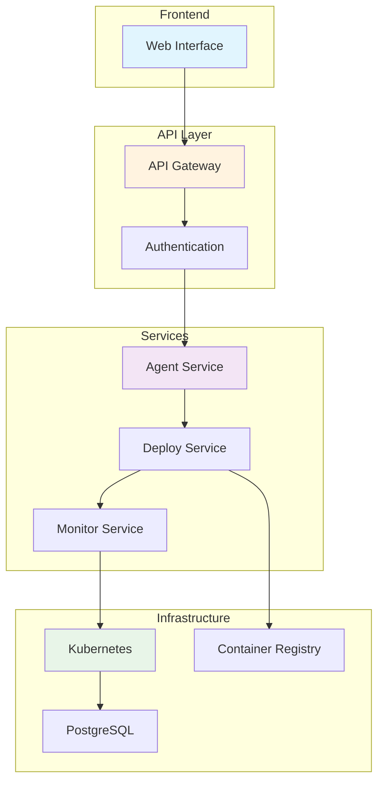

<div align="center">

# 🚀 AI Agent Launchpad

**Infrastructure Backend for Automated AI Agent Deployment**

[](LICENSE)
[](https://yourusername.github.io/agent-launchpad-infra)

</div>

---

## 🌟 What is AI Agent Launchpad?

The **AI Agent Launchpad** is a robust infrastructure backend that automates the deployment and management of [Eliza-based AI agents](https://github.com/elizaos/eliza) through a streamlined interface with Docker and Kubernetes orchestration.

### ✨ Key Features

<div style="display: grid; grid-template-columns: repeat(auto-fit, minmax(300px, 1fr)); gap: 20px; margin: 20px 0;">

<div style="border: 1px solid #e0e0e0; border-radius: 8px; padding: 20px;">
<h4>🤖 Automated Deployment</h4>
<p>Deploy Eliza agents with simple configuration - from code to production in minutes</p>
</div>

<div style="border: 1px solid #e0e0e0; border-radius: 8px; padding: 20px;">
<h4>🔒 Security First</h4>
<p>Container scanning, API authentication, and encrypted storage built-in</p>
</div>

<div style="border: 1px solid #e0e0e0; border-radius: 8px; padding: 20px;">
<h4>📊 Real-time Monitoring</h4>
<p>Health checks, metrics, and alerting with Prometheus and Grafana</p>
</div>

<div style="border: 1px solid #e0e0e0; border-radius: 8px; padding: 20px;">
<h4>⚡ Auto-scaling</h4>
<p>Dynamic resource management based on load and performance</p>
</div>

<div style="border: 1px solid #e0e0e0; border-radius: 8px; padding: 20px;">
<h4>🛡️ Container Security</h4>
<p>Vulnerability scanning with Trivy blocks insecure deployments</p>
</div>

<div style="border: 1px solid #e0e0e0; border-radius: 8px; padding: 20px;">
<h4>🔧 Simple Management</h4>
<p>Easy agent lifecycle operations through RESTful APIs</p>
</div>

</div>

---

## 🏗️ Architecture Overview



<div align="center">
<a href="architecture" style="display: inline-block; padding: 10px 20px; background-color: #007bff; color: white; text-decoration: none; border-radius: 5px; margin: 10px;">
📋 Detailed Architecture →
</a>
</div>

---

## 🚀 Quick Start

Ready to deploy your first AI agent? Get started in minutes:

<div class="alert alert-info">
<strong>💡 Prerequisites:</strong> You'll need a Kubernetes cluster, Docker, PostgreSQL database, and container registry access.
</div>

### 1. Installation

```bash
# Clone the repository
git clone https://github.com/yourusername/agent-launchpad-infra.git
cd agent-launchpad-infra

# Install dependencies
npm install

# Configure environment
cp .env.example .env
# Edit .env with your configuration

# Deploy to Kubernetes
kubectl apply -f k8s/
```

### 2. Create Your First Agent

```bash
# Using the API
curl -X POST https://your-domain.com/api/agents \
  -H "X-API-Key: your-api-key" \
  -H "Content-Type: application/json" \
  -d '{
    "agentName": "my-trading-bot",
    "description": "AI trading assistant",
    "plugins": ["@elizaos/plugin-discord", "@elizaos/plugin-web3"],
    "resources": {
      "memory": "1Gi",
      "cpu": "500m"
    }
  }'
```

<div align="center">
<a href="getting-started" style="display: inline-block; padding: 10px 20px; background-color: #28a745; color: white; text-decoration: none; border-radius: 5px; margin: 10px;">
🚀 Complete Setup Guide →
</a>
</div>

---

## 📚 Documentation Hub

<div style="display: grid; grid-template-columns: repeat(auto-fit, minmax(280px, 1fr)); gap: 20px; margin: 30px 0;">

<div style="border: 1px solid #e0e0e0; border-radius: 8px; padding: 20px; border-left: 4px solid #2196F3;">
<h4><a href="architecture" style="text-decoration: none; color: #2196F3;">🏗️ System Architecture</a></h4>
<p>Detailed system architecture with flow charts and component documentation</p>
<small>Components • Flow Charts • Infrastructure</small>
</div>

<div style="border: 1px solid #e0e0e0; border-radius: 8px; padding: 20px; border-left: 4px solid #4CAF50;">
<h4><a href="getting-started" style="text-decoration: none; color: #4CAF50;">🚀 Getting Started</a></h4>
<p>Step-by-step guide to set up and deploy your first agent</p>
<small>Installation • Configuration • First Deployment</small>
</div>

<div style="border: 1px solid #e0e0e0; border-radius: 8px; padding: 20px; border-left: 4px solid #FF9800;">
<h4><a href="api-reference" style="text-decoration: none; color: #FF9800;">📡 API Reference</a></h4>
<p>Complete REST API documentation with examples</p>
<small>Endpoints • Authentication • Examples</small>
</div>

<div style="border: 1px solid #e0e0e0; border-radius: 8px; padding: 20px; border-left: 4px solid #F44336;">
<h4><a href="security" style="text-decoration: none; color: #F44336;">🔐 Security Guide</a></h4>
<p>Security architecture, best practices, and compliance</p>
<small>Authentication • Encryption • Monitoring</small>
</div>

<div style="border: 1px solid #e0e0e0; border-radius: 8px; padding: 20px; border-left: 4px solid #9C27B0;">
<h4><a href="deployment" style="text-decoration: none; color: #9C27B0;">⚙️ Deployment Guide</a></h4>
<p>Production deployment strategies and operations</p>
<small>Kubernetes • Docker • CI/CD</small>
</div>

<div style="border: 1px solid #e0e0e0; border-radius: 8px; padding: 20px; border-left: 4px solid #607D8B;">
<h4><a href="monitoring" style="text-decoration: none; color: #607D8B;">📊 Monitoring</a></h4>
<p>Observability, metrics, and alerting configuration</p>
<small>Prometheus • Grafana • Alerts</small>
</div>

<div style="border: 1px solid #e0e0e0; border-radius: 8px; padding: 20px; border-left: 4px solid #795548;">
<h4><a href="use-cases" style="text-decoration: none; color: #795548;">💡 Use Cases</a></h4>
<p>Real-world examples and implementation patterns</p>
<small>Examples • Templates • Best Practices</small>
</div>

<div style="border: 1px solid #e0e0e0; border-radius: 8px; padding: 20px; border-left: 4px solid #009688;">
<h4><a href="contributing" style="text-decoration: none; color: #009688;">🤝 Contributing</a></h4>
<p>How to contribute to the project</p>
<small>Guidelines • Development • Pull Requests</small>
</div>

<div style="border: 1px solid #e0e0e0; border-radius: 8px; padding: 20px; border-left: 4px solid #E91E63;">
<h4><a href="support" style="text-decoration: none; color: #E91E63;">📞 Support</a></h4>
<p>Get help and troubleshooting</p>
<small>Community • Issues • Documentation</small>
</div>

</div>

---

## 🎯 Popular Use Cases

<div style="display: grid; grid-template-columns: repeat(auto-fit, minmax(250px, 1fr)); gap: 20px; margin: 20px 0;">

<div style="text-align: center; padding: 20px; border: 1px solid #e0e0e0; border-radius: 8px;">
<h3>🤖 Discord Trading Bots</h3>
<p>Deploy AI agents that provide real-time market analysis and trading signals to Discord communities.</p>
<a href="use-cases#discord-trading" style="color: #007bff; text-decoration: none;">Learn more →</a>
</div>

<div style="text-align: center; padding: 20px; border: 1px solid #e0e0e0; border-radius: 8px;">
<h3>💬 Telegram Support</h3>
<p>Create customer support bots that can handle inquiries and provide automated assistance.</p>
<a href="use-cases#telegram-support" style="color: #007bff; text-decoration: none;">Learn more →</a>
</div>

<div style="text-align: center; padding: 20px; border: 1px solid #e0e0e0; border-radius: 8px;">
<h3>🌐 Web3 Integration</h3>
<p>Deploy agents that can interact with blockchain networks and provide DeFi services.</p>
<a href="use-cases#web3-integration" style="color: #007bff; text-decoration: none;">Learn more →</a>
</div>

<div style="text-align: center; padding: 20px; border: 1px solid #e0e0e0; border-radius: 8px;">
<h3>📊 Analytics & Reporting</h3>
<p>Set up agents that generate automated reports and data analysis for your organization.</p>
<a href="use-cases#analytics" style="color: #007bff; text-decoration: none;">Learn more →</a>
</div>

</div>

---

## 🛣️ Roadmap

<div style="display: grid; grid-template-columns: repeat(auto-fit, minmax(200px, 1fr)); gap: 15px; margin: 20px 0;">

<div style="padding: 15px; border: 1px solid #27ae60; border-radius: 8px; background-color: #d4edda;">
<h4 style="color: #155724; margin-top: 0;">✅ Completed</h4>
<ul style="margin-bottom: 0;">
<li>Basic Agent Deployment</li>
<li>Container Security</li>
<li>API Authentication</li>
<li>Health Monitoring</li>
</ul>
</div>

<div style="padding: 15px; border: 1px solid #ffc107; border-radius: 8px; background-color: #fff3cd;">
<h4 style="color: #856404; margin-top: 0;">🔄 In Progress</h4>
<ul style="margin-bottom: 0;">
<li>Multi-cloud Support</li>
<li>Advanced Scaling</li>
<li>Plugin Marketplace</li>
</ul>
</div>

<div style="padding: 15px; border: 1px solid #007bff; border-radius: 8px; background-color: #e7f3ff;">
<h4 style="color: #004085; margin-top: 0;">🔮 Planned</h4>
<ul style="margin-bottom: 0;">
<li>Visual Builder</li>
<li>Advanced Analytics</li>
<li>Enterprise Features</li>
</ul>
</div>

</div>

---

## 🚀 Ready to Get Started?

<div style="text-align: center; padding: 30px; background-color: #f8f9fa; border-radius: 10px; margin: 20px 0;">

<h3>Deploy Your First AI Agent Today!</h3>

<div style="display: flex; justify-content: center; gap: 15px; margin-top: 20px; flex-wrap: wrap;">

<a href="getting-started" style="display: inline-block; padding: 12px 24px; background-color: #28a745; color: white; text-decoration: none; border-radius: 6px; font-weight: bold;">
🚀 Get Started
</a>

<a href="architecture" style="display: inline-block; padding: 12px 24px; background-color: #007bff; color: white; text-decoration: none; border-radius: 6px; font-weight: bold;">
🏗️ View Architecture
</a>

<a href="api-reference" style="display: inline-block; padding: 12px 24px; background-color: #6c757d; color: white; text-decoration: none; border-radius: 6px; font-weight: bold;">
📡 API Docs
</a>

<a href="support" style="display: inline-block; padding: 12px 24px; background-color: #ffc107; color: #212529; text-decoration: none; border-radius: 6px; font-weight: bold;">
💬 Get Support
</a>

</div>

</div>

---

## 📄 License

This project is licensed under the MIT License - see the [LICENSE](LICENSE) file for details.

Made with ❤️ by the AI Agent Launchpad Team 