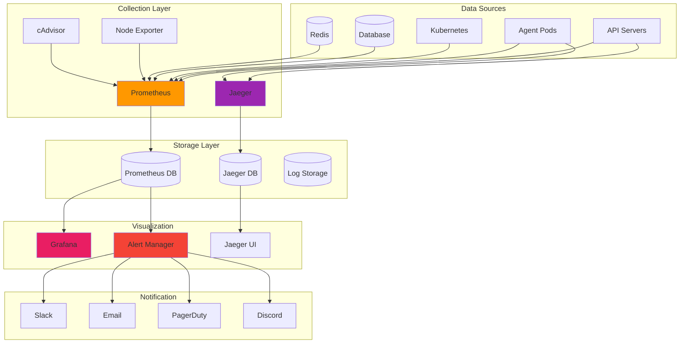

# 📊 Monitoring & Observability

## 🎯 Monitoring Overview

Comprehensive monitoring is essential for running AI agents in production. This guide covers setting up observability, metrics collection, alerting, and performance monitoring for the AI Agent Launchpad.

## 🏗️ Monitoring Architecture



## 📈 Metrics Collection

### Prometheus Setup

```yaml
# k8s/monitoring/prometheus-deployment.yaml
apiVersion: apps/v1
kind: Deployment
metadata:
  name: prometheus
  namespace: monitoring
spec:
  replicas: 1
  selector:
    matchLabels:
      app: prometheus
  template:
    metadata:
      labels:
        app: prometheus
    spec:
      serviceAccountName: prometheus
      containers:
      - name: prometheus
        image: prom/prometheus:v2.40.0
        args:
          - '--config.file=/etc/prometheus/prometheus.yml'
          - '--storage.tsdb.path=/prometheus/'
          - '--web.console.libraries=/etc/prometheus/console_libraries'
          - '--web.console.templates=/etc/prometheus/consoles'
          - '--storage.tsdb.retention.time=15d'
          - '--web.enable-lifecycle'
          - '--web.enable-admin-api'
        ports:
        - containerPort: 9090
          name: prometheus
        resources:
          requests:
            memory: "2Gi"
            cpu: "1000m"
          limits:
            memory: "4Gi"
            cpu: "2000m"
        volumeMounts:
        - name: prometheus-config
          mountPath: /etc/prometheus
        - name: prometheus-storage
          mountPath: /prometheus
        livenessProbe:
          httpGet:
            path: /-/healthy
            port: 9090
          initialDelaySeconds: 30
          periodSeconds: 15
        readinessProbe:
          httpGet:
            path: /-/ready
            port: 9090
          initialDelaySeconds: 5
          periodSeconds: 5
      volumes:
      - name: prometheus-config
        configMap:
          name: prometheus-config
      - name: prometheus-storage
        persistentVolumeClaim:
          claimName: prometheus-storage
```

### Prometheus Configuration

```yaml
# k8s/monitoring/prometheus-config.yaml
apiVersion: v1
kind: ConfigMap
metadata:
  name: prometheus-config
  namespace: monitoring
data:
  prometheus.yml: |
    global:
      scrape_interval: 15s
      evaluation_interval: 15s
      external_labels:
        cluster: 'agent-launchpad'
        environment: 'production'
    
    rule_files:
      - "/etc/prometheus/rules/*.yml"
    
    alerting:
      alertmanagers:
        - static_configs:
            - targets:
              - alertmanager:9093
    
    scrape_configs:
      # API Server Metrics
      - job_name: 'api-servers'
        kubernetes_sd_configs:
          - role: pod
            namespaces:
              names:
                - production
        relabel_configs:
          - source_labels: [__meta_kubernetes_pod_label_app]
            action: keep
            regex: api
          - source_labels: [__meta_kubernetes_pod_annotation_prometheus_io_scrape]
            action: keep
            regex: true
          - source_labels: [__meta_kubernetes_pod_annotation_prometheus_io_path]
            action: replace
            target_label: __metrics_path__
            regex: (.+)
          - source_labels: [__address__, __meta_kubernetes_pod_annotation_prometheus_io_port]
            action: replace
            regex: ([^:]+)(?::\d+)?;(\d+)
            replacement: $1:$2
            target_label: __address__
        scrape_interval: 10s
        metrics_path: '/metrics'
      
      # Agent Metrics
      - job_name: 'agent-pods'
        kubernetes_sd_configs:
          - role: pod
            namespaces:
              names:
                - agents
        relabel_configs:
          - source_labels: [__meta_kubernetes_pod_label_app]
            action: keep
            regex: eliza-agent
          - source_labels: [__meta_kubernetes_pod_label_agent_id]
            target_label: agent_id
          - source_labels: [__meta_kubernetes_pod_name]
            target_label: pod_name
        scrape_interval: 30s
        metrics_path: '/metrics'
      
      # Kubernetes Metrics
      - job_name: 'kubernetes-nodes'
        kubernetes_sd_configs:
          - role: node
        relabel_configs:
          - action: labelmap
            regex: __meta_kubernetes_node_label_(.+)
        scrape_interval: 30s
        metrics_path: '/metrics'
      
      # Database Metrics
      - job_name: 'postgres-exporter'
        static_configs:
          - targets: ['postgres-exporter:9187']
        scrape_interval: 30s
      
      # Redis Metrics
      - job_name: 'redis-exporter'
        static_configs:
          - targets: ['redis-exporter:9121']
        scrape_interval: 30s
      
      # Node Exporter
      - job_name: 'node-exporter'
        kubernetes_sd_configs:
          - role: pod
        relabel_configs:
          - source_labels: [__meta_kubernetes_pod_label_app]
            action: keep
            regex: node-exporter
        scrape_interval: 30s
```

### Application Metrics

```typescript
// src/monitoring/metrics.ts
import { register, Counter, Histogram, Gauge } from 'prom-client';

// HTTP Request Metrics
export const httpRequestsTotal = new Counter({
  name: 'http_requests_total',
  help: 'Total HTTP requests',
  labelNames: ['method', 'route', 'status_code'],
  registers: [register]
});

export const httpRequestDuration = new Histogram({
  name: 'http_request_duration_seconds',
  help: 'HTTP request duration in seconds',
  labelNames: ['method', 'route', 'status_code'],
  buckets: [0.1, 0.3, 0.5, 0.7, 1, 3, 5, 7, 10],
  registers: [register]
});

// Agent Deployment Metrics
export const agentDeploymentsTotal = new Counter({
  name: 'agent_deployments_total',
  help: 'Total agent deployments',
  labelNames: ['status', 'agent_type'],
  registers: [register]
});

export const agentDeploymentDuration = new Histogram({
  name: 'agent_deployment_duration_seconds',
  help: 'Agent deployment duration in seconds',
  labelNames: ['agent_type', 'status'],
  buckets: [30, 60, 120, 300, 600, 1200],
  registers: [register]
});

// Active Agent Metrics
export const activeAgents = new Gauge({
  name: 'active_agents_total',
  help: 'Number of active agents',
  labelNames: ['agent_type', 'status'],
  registers: [register]
});

// Database Metrics
export const databaseConnections = new Gauge({
  name: 'database_connections_active',
  help: 'Active database connections',
  registers: [register]
});

export const databaseQueryDuration = new Histogram({
  name: 'database_query_duration_seconds',
  help: 'Database query duration in seconds',
  labelNames: ['operation', 'table'],
  buckets: [0.001, 0.005, 0.01, 0.05, 0.1, 0.5, 1, 5],
  registers: [register]
});

// Security Metrics
export const securityEvents = new Counter({
  name: 'security_events_total',
  help: 'Total security events',
  labelNames: ['event_type', 'severity'],
  registers: [register]
});

export const rateLimitExceeded = new Counter({
  name: 'rate_limit_exceeded_total',
  help: 'Rate limit exceeded events',
  labelNames: ['api_key_id', 'endpoint'],
  registers: [register]
});

// Container Security Metrics
export const containerScans = new Counter({
  name: 'container_scans_total',
  help: 'Container security scans performed',
  labelNames: ['status', 'severity'],
  registers: [register]
});

export const vulnerabilities = new Gauge({
  name: 'container_vulnerabilities_total',
  help: 'Number of vulnerabilities found',
  labelNames: ['severity', 'agent_id'],
  registers: [register]
});
```

### Metrics Middleware

```typescript
// src/middleware/metrics.ts
import { Request, Response, NextFunction } from 'express';
import { httpRequestsTotal, httpRequestDuration } from '../monitoring/metrics';

export function metricsMiddleware(req: Request, res: Response, next: NextFunction) {
  const start = Date.now();
  
  res.on('finish', () => {
    const duration = (Date.now() - start) / 1000;
    const route = req.route?.path || req.url;
    const method = req.method;
    const statusCode = res.statusCode.toString();
    
    // Increment request counter
    httpRequestsTotal.inc({
      method,
      route,
      status_code: statusCode
    });
    
    // Record request duration
    httpRequestDuration.observe({
      method,
      route,
      status_code: statusCode
    }, duration);
  });
  
  next();
}
```

## 📊 Grafana Dashboards

### System Overview Dashboard

```json
{
  "dashboard": {
    "id": null,
    "title": "AI Agent Launchpad - System Overview",
    "tags": ["agent-launchpad", "overview"],
    "timezone": "browser",
    "panels": [
      {
        "id": 1,
        "title": "System Health",
        "type": "stat",
        "targets": [
          {
            "expr": "up{job=\"api-servers\"}",
            "legendFormat": "API Servers",
            "refId": "A"
          },
          {
            "expr": "up{job=\"agent-pods\"}",
            "legendFormat": "Agent Pods",
            "refId": "B"
          }
        ],
        "fieldConfig": {
          "defaults": {
            "color": {
              "mode": "thresholds"
            },
            "thresholds": {
              "steps": [
                {"color": "red", "value": 0},
                {"color": "green", "value": 1}
              ]
            }
          }
        },
        "gridPos": {"h": 8, "w": 12, "x": 0, "y": 0}
      },
      {
        "id": 2,
        "title": "API Request Rate",
        "type": "graph",
        "targets": [
          {
            "expr": "rate(http_requests_total[5m])",
            "legendFormat": "{{method}} {{status_code}}",
            "refId": "A"
          }
        ],
        "yAxes": [
          {
            "label": "Requests/sec",
            "min": 0
          }
        ],
        "gridPos": {"h": 8, "w": 12, "x": 12, "y": 0}
      },
      {
        "id": 3,
        "title": "Agent Deployment Success Rate",
        "type": "stat",
        "targets": [
          {
            "expr": "rate(agent_deployments_total{status=\"success\"}[5m]) / rate(agent_deployments_total[5m]) * 100",
            "legendFormat": "Success Rate",
            "refId": "A"
          }
        ],
        "fieldConfig": {
          "defaults": {
            "unit": "percent",
            "min": 0,
            "max": 100,
            "thresholds": {
              "steps": [
                {"color": "red", "value": 0},
                {"color": "yellow", "value": 80},
                {"color": "green", "value": 95}
              ]
            }
          }
        },
        "gridPos": {"h": 8, "w": 6, "x": 0, "y": 8}
      },
      {
        "id": 4,
        "title": "Active Agents",
        "type": "stat",
        "targets": [
          {
            "expr": "sum(active_agents_total)",
            "legendFormat": "Total Active",
            "refId": "A"
          }
        ],
        "fieldConfig": {
          "defaults": {
            "color": {"mode": "continuous-GrYlRd"},
            "min": 0
          }
        },
        "gridPos": {"h": 8, "w": 6, "x": 6, "y": 8}
      },
      {
        "id": 5,
        "title": "Resource Usage",
        "type": "graph",
        "targets": [
          {
            "expr": "rate(container_cpu_usage_seconds_total{pod=~\"api-.*\"}[5m]) * 100",
            "legendFormat": "CPU Usage %",
            "refId": "A"
          },
          {
            "expr": "container_memory_usage_bytes{pod=~\"api-.*\"} / container_spec_memory_limit_bytes * 100",
            "legendFormat": "Memory Usage %",
            "refId": "B"
          }
        ],
        "yAxes": [
          {
            "label": "Percentage",
            "min": 0,
            "max": 100
          }
        ],
        "gridPos": {"h": 8, "w": 12, "x": 12, "y": 8}
      }
    ],
    "time": {
      "from": "now-1h",
      "to": "now"
    },
    "refresh": "30s"
  }
}
```

### Agent Performance Dashboard

```json
{
  "dashboard": {
    "title": "AI Agent Performance",
    "panels": [
      {
        "title": "Agent Response Time",
        "type": "graph",
        "targets": [
          {
            "expr": "histogram_quantile(0.95, rate(agent_response_duration_seconds_bucket[5m]))",
            "legendFormat": "95th percentile"
          },
          {
            "expr": "histogram_quantile(0.50, rate(agent_response_duration_seconds_bucket[5m]))",
            "legendFormat": "50th percentile"
          }
        ]
      },
      {
        "title": "Messages Processed",
        "type": "graph",
        "targets": [
          {
            "expr": "rate(agent_messages_processed_total[5m])",
            "legendFormat": "{{agent_id}}"
          }
        ]
      },
      {
        "title": "Error Rate",
        "type": "graph",
        "targets": [
          {
            "expr": "rate(agent_errors_total[5m]) / rate(agent_messages_processed_total[5m]) * 100",
            "legendFormat": "Error Rate %"
          }
        ]
      }
    ]
  }
}
```

## 🚨 Alerting Rules

### Prometheus Alert Rules

```yaml
# k8s/monitoring/alert-rules.yaml
apiVersion: v1
kind: ConfigMap
metadata:
  name: prometheus-alert-rules
  namespace: monitoring
data:
  alert-rules.yml: |
    groups:
    - name: system-alerts
      rules:
      - alert: APIServerDown
        expr: up{job="api-servers"} == 0
        for: 1m
        labels:
          severity: critical
        annotations:
          summary: "API Server is down"
          description: "API Server {{ $labels.instance }} has been down for more than 1 minute"
      
      - alert: HighErrorRate
        expr: rate(http_requests_total{status_code=~"5.."}[5m]) / rate(http_requests_total[5m]) > 0.05
        for: 5m
        labels:
          severity: warning
        annotations:
          summary: "High error rate detected"
          description: "Error rate is {{ $value | humanizePercentage }} for the last 5 minutes"
      
      - alert: HighResponseTime
        expr: histogram_quantile(0.95, rate(http_request_duration_seconds_bucket[5m])) > 1
        for: 5m
        labels:
          severity: warning
        annotations:
          summary: "High response time"
          description: "95th percentile response time is {{ $value }}s"
      
      - alert: DatabaseConnectionHigh
        expr: database_connections_active > 80
        for: 2m
        labels:
          severity: warning
        annotations:
          summary: "High database connections"
          description: "Database connections are at {{ $value }}"
      
      - alert: HighCPUUsage
        expr: rate(container_cpu_usage_seconds_total[5m]) * 100 > 80
        for: 10m
        labels:
          severity: warning
        annotations:
          summary: "High CPU usage"
          description: "CPU usage is {{ $value }}% for {{ $labels.pod }}"
      
      - alert: HighMemoryUsage
        expr: container_memory_usage_bytes / container_spec_memory_limit_bytes * 100 > 85
        for: 5m
        labels:
          severity: warning
        annotations:
          summary: "High memory usage"
          description: "Memory usage is {{ $value }}% for {{ $labels.pod }}"
    
    - name: agent-alerts
      rules:
      - alert: AgentDeploymentFailed
        expr: increase(agent_deployments_total{status="failed"}[5m]) > 0
        for: 1m
        labels:
          severity: warning
        annotations:
          summary: "Agent deployment failed"
          description: "{{ $value }} agent deployments have failed in the last 5 minutes"
      
      - alert: AgentNotResponding
        expr: up{job="agent-pods"} == 0
        for: 2m
        labels:
          severity: critical
        annotations:
          summary: "Agent not responding"
          description: "Agent {{ $labels.agent_id }} is not responding"
      
      - alert: LowAgentDeploymentSuccessRate
        expr: rate(agent_deployments_total{status="success"}[10m]) / rate(agent_deployments_total[10m]) < 0.9
        for: 5m
        labels:
          severity: warning
        annotations:
          summary: "Low agent deployment success rate"
          description: "Agent deployment success rate is {{ $value | humanizePercentage }}"
    
    - name: security-alerts
      rules:
      - alert: CriticalVulnerabilityDetected
        expr: container_vulnerabilities_total{severity="critical"} > 0
        for: 1m
        labels:
          severity: critical
        annotations:
          summary: "Critical vulnerability detected"
          description: "{{ $value }} critical vulnerabilities found in {{ $labels.agent_id }}"
      
      - alert: HighRateLimitExceeded
        expr: rate(rate_limit_exceeded_total[5m]) > 10
        for: 2m
        labels:
          severity: warning
        annotations:
          summary: "High rate limit exceeded"
          description: "Rate limit exceeded {{ $value }} times per second"
      
      - alert: SuspiciousSecurityActivity
        expr: increase(security_events_total{severity="high"}[10m]) > 5
        for: 1m
        labels:
          severity: warning
        annotations:
          summary: "Suspicious security activity"
          description: "{{ $value }} high-severity security events in the last 10 minutes"
```

### AlertManager Configuration

```yaml
# k8s/monitoring/alertmanager-config.yaml
apiVersion: v1
kind: ConfigMap
metadata:
  name: alertmanager-config
  namespace: monitoring
data:
  alertmanager.yml: |
    global:
      smtp_smarthost: 'localhost:587'
      smtp_from: 'alerts@yourdomain.com'
      slack_api_url: 'https://hooks.slack.com/services/YOUR/SLACK/WEBHOOK'
    
    route:
      group_by: ['alertname']
      group_wait: 10s
      group_interval: 10s
      repeat_interval: 1h
      receiver: 'web.hook'
      routes:
      - match:
          severity: critical
        receiver: critical-alerts
      - match:
          severity: warning
        receiver: warning-alerts
    
    receivers:
    - name: 'web.hook'
      webhook_configs:
      - url: 'http://webhook-service:5000/alerts'
    
    - name: 'critical-alerts'
      slack_configs:
      - channel: '#alerts-critical'
        title: '🚨 Critical Alert'
        text: '{{ range .Alerts }}{{ .Annotations.summary }}: {{ .Annotations.description }}{{ end }}'
        send_resolved: true
      email_configs:
      - to: 'oncall@yourdomain.com'
        subject: '🚨 Critical Alert: {{ .GroupLabels.alertname }}'
        body: |
          {{ range .Alerts }}
          Alert: {{ .Annotations.summary }}
          Description: {{ .Annotations.description }}
          Labels: {{ range .Labels.SortedPairs }}{{ .Name }}={{ .Value }} {{ end }}
          {{ end }}
      pagerduty_configs:
      - routing_key: 'YOUR_PAGERDUTY_KEY'
        description: '{{ .GroupLabels.alertname }}: {{ .Alerts | len }} alerts'
    
    - name: 'warning-alerts'
      slack_configs:
      - channel: '#alerts-warning'
        title: '⚠️ Warning Alert'
        text: '{{ range .Alerts }}{{ .Annotations.summary }}: {{ .Annotations.description }}{{ end }}'
        send_resolved: true
      email_configs:
      - to: 'team@yourdomain.com'
        subject: '⚠️ Warning: {{ .GroupLabels.alertname }}'
        body: |
          {{ range .Alerts }}
          Alert: {{ .Annotations.summary }}
          Description: {{ .Annotations.description }}
          {{ end }}
```

## 🔍 Distributed Tracing

### Jaeger Setup

```yaml
# k8s/monitoring/jaeger-deployment.yaml
apiVersion: apps/v1
kind: Deployment
metadata:
  name: jaeger
  namespace: monitoring
spec:
  replicas: 1
  selector:
    matchLabels:
      app: jaeger
  template:
    metadata:
      labels:
        app: jaeger
    spec:
      containers:
      - name: jaeger
        image: jaegertracing/all-in-one:1.40
        ports:
        - containerPort: 16686
          name: ui
        - containerPort: 14268
          name: collector
        - containerPort: 6831
          name: agent-compact
        - containerPort: 6832
          name: agent-binary
        env:
        - name: COLLECTOR_ZIPKIN_HTTP_PORT
          value: "9411"
        - name: SPAN_STORAGE_TYPE
          value: "elasticsearch"
        - name: ES_SERVER_URLS
          value: "http://elasticsearch:9200"
        resources:
          requests:
            memory: "512Mi"
            cpu: "500m"
          limits:
            memory: "1Gi"
            cpu: "1000m"
```

### Application Tracing

```typescript
// src/tracing/tracer.ts
import { NodeSDK } from '@opentelemetry/sdk-node';
import { getNodeAutoInstrumentations } from '@opentelemetry/auto-instrumentations-node';
import { JaegerExporter } from '@opentelemetry/exporter-jaeger';
import { Resource } from '@opentelemetry/resources';
import { SemanticResourceAttributes } from '@opentelemetry/semantic-conventions';

const jaegerExporter = new JaegerExporter({
  endpoint: process.env.JAEGER_ENDPOINT || 'http://jaeger-collector:14268/api/traces',
});

const sdk = new NodeSDK({
  resource: new Resource({
    [SemanticResourceAttributes.SERVICE_NAME]: 'agent-launchpad-api',
    [SemanticResourceAttributes.SERVICE_VERSION]: process.env.APP_VERSION || '1.0.0',
    [SemanticResourceAttributes.DEPLOYMENT_ENVIRONMENT]: process.env.NODE_ENV || 'development',
  }),
  traceExporter: jaegerExporter,
  instrumentations: [getNodeAutoInstrumentations()],
});

sdk.start();

export default sdk;
```

## 📝 Logging

### Centralized Logging Setup

```yaml
# k8s/monitoring/fluent-bit-config.yaml
apiVersion: v1
kind: ConfigMap
metadata:
  name: fluent-bit-config
  namespace: monitoring
data:
  fluent-bit.conf: |
    [SERVICE]
        Daemon Off
        Flush 1
        Log_Level info
        Parsers_File parsers.conf
        HTTP_Server On
        HTTP_Listen 0.0.0.0
        HTTP_Port 2020
    
    [INPUT]
        Name tail
        Path /var/log/containers/*agent*.log
        Parser docker
        Tag kube.*
        Refresh_Interval 5
        Mem_Buf_Limit 50MB
        Skip_Long_Lines On
    
    [INPUT]
        Name tail
        Path /var/log/containers/*api*.log
        Parser docker
        Tag kube.*
        Refresh_Interval 5
        Mem_Buf_Limit 50MB
        Skip_Long_Lines On
    
    [FILTER]
        Name kubernetes
        Match kube.*
        Kube_URL https://kubernetes.default.svc:443
        Kube_CA_File /var/run/secrets/kubernetes.io/serviceaccount/ca.crt
        Kube_Token_File /var/run/secrets/kubernetes.io/serviceaccount/token
        Kube_Tag_Prefix kube.var.log.containers.
        Merge_Log On
        Keep_Log Off
    
    [OUTPUT]
        Name es
        Match kube.*
        Host elasticsearch
        Port 9200
        Index kubernetes
        Type _doc
        Retry_Limit 5
  
  parsers.conf: |
    [PARSER]
        Name docker
        Format json
        Time_Key time
        Time_Format %Y-%m-%dT%H:%M:%S.%L
        Time_Keep On
```

### Application Logging

```typescript
// src/logging/logger.ts
import winston from 'winston';
import { ElasticsearchTransport } from 'winston-elasticsearch';

const esTransportOpts = {
  level: 'info',
  clientOpts: {
    node: process.env.ELASTICSEARCH_URL || 'http://elasticsearch:9200'
  },
  index: 'agent-launchpad-logs'
};

export const logger = winston.createLogger({
  level: process.env.LOG_LEVEL || 'info',
  format: winston.format.combine(
    winston.format.timestamp(),
    winston.format.errors({ stack: true }),
    winston.format.json(),
    winston.format.metadata({ fillExcept: ['message', 'level', 'timestamp'] })
  ),
  defaultMeta: {
    service: 'agent-launchpad-api',
    version: process.env.APP_VERSION || '1.0.0',
    environment: process.env.NODE_ENV || 'development'
  },
  transports: [
    new winston.transports.Console({
      format: winston.format.combine(
        winston.format.colorize(),
        winston.format.simple()
      )
    }),
    new ElasticsearchTransport(esTransportOpts)
  ]
});

// Security event logging
export function logSecurityEvent(event: {
  type: string;
  severity: 'low' | 'medium' | 'high' | 'critical';
  userId?: string;
  sourceIp?: string;
  details: any;
}) {
  logger.warn('Security event detected', {
    event_type: 'security',
    security_event_type: event.type,
    severity: event.severity,
    user_id: event.userId,
    source_ip: event.sourceIp,
    details: event.details
  });
}

// Performance logging
export function logPerformance(operation: string, duration: number, metadata?: any) {
  logger.info('Performance metric', {
    event_type: 'performance',
    operation,
    duration_ms: duration,
    ...metadata
  });
}
```

## 📱 Monitoring Automation

### Health Check Scripts

```bash
#!/bin/bash
# scripts/health-check.sh

ENVIRONMENT=${1:-production}
NAMESPACE="production"

echo "🔍 Running health checks for $ENVIRONMENT environment"

# Check API health
echo "1. Checking API health..."
API_HEALTH=$(kubectl exec -n $NAMESPACE deployment/api -- curl -s http://localhost:3000/health)
if echo "$API_HEALTH" | grep -q "HEALTHY"; then
    echo "✅ API is healthy"
else
    echo "❌ API health check failed"
    echo "$API_HEALTH"
    exit 1
fi

# Check database connectivity
echo "2. Checking database connectivity..."
DB_CHECK=$(kubectl exec -n $NAMESPACE deployment/api -- node -e "
const { Pool } = require('pg');
const pool = new Pool({ connectionString: process.env.DATABASE_URL });
pool.query('SELECT 1')
  .then(() => { console.log('OK'); process.exit(0); })
  .catch(err => { console.error(err.message); process.exit(1); });
")
if [ "$DB_CHECK" = "OK" ]; then
    echo "✅ Database is accessible"
else
    echo "❌ Database connection failed"
    exit 1
fi

# Check Redis connectivity
echo "3. Checking Redis connectivity..."
REDIS_CHECK=$(kubectl exec -n $NAMESPACE deployment/api -- node -e "
const redis = require('redis');
const client = redis.createClient({ url: process.env.REDIS_URL });
client.connect()
  .then(() => client.ping())
  .then(() => { console.log('OK'); process.exit(0); })
  .catch(err => { console.error(err.message); process.exit(1); });
")
if [ "$REDIS_CHECK" = "OK" ]; then
    echo "✅ Redis is accessible"
else
    echo "❌ Redis connection failed"
    exit 1
fi

# Check active agents
echo "4. Checking active agents..."
ACTIVE_AGENTS=$(kubectl get pods -n agents --field-selector=status.phase=Running | grep -c "Running")
echo "📊 Active agents: $ACTIVE_AGENTS"

echo "✅ All health checks passed"
```

### Monitoring Dashboard URLs

```bash
#!/bin/bash
# scripts/monitoring-urls.sh

NAMESPACE="monitoring"
DOMAIN="yourdomain.com"

echo "📊 Monitoring Dashboard URLs"
echo "==========================="

# Get service URLs
GRAFANA_URL="https://grafana.$DOMAIN"
PROMETHEUS_URL="https://prometheus.$DOMAIN"
JAEGER_URL="https://jaeger.$DOMAIN"
ALERTMANAGER_URL="https://alertmanager.$DOMAIN"

echo "📈 Grafana: $GRAFANA_URL"
echo "📊 Prometheus: $PROMETHEUS_URL"
echo "🔍 Jaeger: $JAEGER_URL"
echo "🚨 AlertManager: $ALERTMANAGER_URL"

# Get credentials
echo ""
echo "🔑 Credentials"
echo "=============="
GRAFANA_PASSWORD=$(kubectl get secret grafana-admin-secret -n $NAMESPACE -o jsonpath="{.data.password}" | base64 -d)
echo "Grafana Admin Password: $GRAFANA_PASSWORD"

echo ""
echo "🚀 Quick Links"
echo "=============="
echo "System Overview: $GRAFANA_URL/d/system-overview"
echo "Agent Performance: $GRAFANA_URL/d/agent-performance"
echo "Security Dashboard: $GRAFANA_URL/d/security"
echo "Alert Rules: $PROMETHEUS_URL/alerts"
echo "Service Map: $JAEGER_URL/search"
```

## 🚀 Next Steps

<div style="display: grid; grid-template-columns: repeat(auto-fit, minmax(250px, 1fr)); gap: 15px; margin: 20px 0;">

<div style="border: 1px solid #e0e0e0; border-radius: 8px; padding: 15px; border-left: 4px solid #4CAF50;">
<h4><a href="/getting-started" style="text-decoration: none; color: #4CAF50;">🚀 Getting Started</a></h4>
<p>Set up basic monitoring during initial deployment</p>
</div>

<div style="border: 1px solid #e0e0e0; border-radius: 8px; padding: 15px; border-left: 4px solid #9C27B0;">
<h4><a href="/deployment" style="text-decoration: none; color: #9C27B0;">⚙️ Deployment</a></h4>
<p>Integrate monitoring into your deployment pipeline</p>
</div>

<div style="border: 1px solid #e0e0e0; border-radius: 8px; padding: 15px; border-left: 4px solid #F44336;">
<h4><a href="/security" style="text-decoration: none; color: #F44336;">🔐 Security</a></h4>
<p>Configure security monitoring and alerting</p>
</div>

<div style="border: 1px solid #e0e0e0; border-radius: 8px; padding: 15px; border-left: 4px solid #E91E63;">
<h4><a href="/support" style="text-decoration: none; color: #E91E63;">📞 Support</a></h4>
<p>Get help with monitoring setup and troubleshooting</p>
</div>

</div>

---

## 📋 Monitoring Checklist

### Essential Monitoring Setup

- [ ] **Prometheus** - Metrics collection and storage
- [ ] **Grafana** - Visualization dashboards
- [ ] **AlertManager** - Alert routing and notifications
- [ ] **Jaeger** - Distributed tracing
- [ ] **Centralized Logging** - Log aggregation and search
- [ ] **Health Checks** - Automated system verification
- [ ] **Security Monitoring** - Security event tracking
- [ ] **Performance Monitoring** - Application performance metrics

Ready to monitor your AI agents like a pro? Follow this comprehensive guide to set up world-class observability! 🚀 