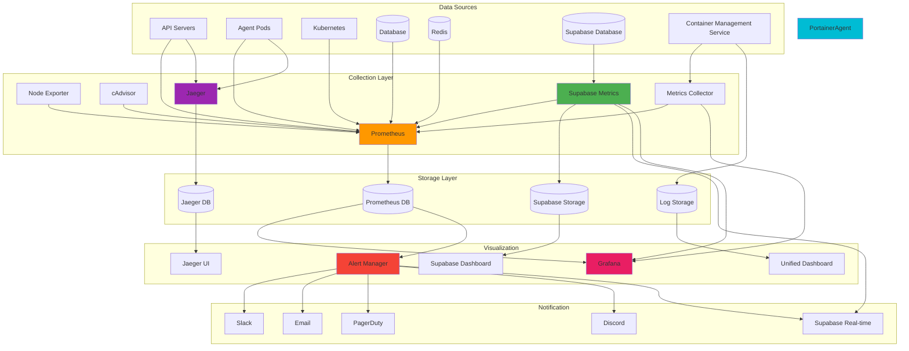

# 📊 Monitoring & Observability

## 🎯 Monitoring Overview

Comprehensive monitoring is essential for running AI agents in production. This guide covers setting up observability, metrics collection, alerting, and performance monitoring for the Multi-Agent Infrastructure at Scale. Container monitoring and metrics are integrated through our unified API layer, providing a single interface for all observability needs.

## 🏗️ Monitoring Architecture



## 📈 Enhanced Metrics Collection

### Prometheus with Portainer Integration

```yaml
# k8s/monitoring/prometheus-deployment.yaml
apiVersion: apps/v1
kind: Deployment
metadata:
  name: prometheus
  namespace: monitoring
spec:
  replicas: 1
  selector:
    matchLabels:
      app: prometheus
  template:
    metadata:
      labels:
        app: prometheus
    spec:
      containers:
      - name: prometheus
        image: prom/prometheus:latest
        ports:
        - containerPort: 9090
        volumeMounts:
        - name: prometheus-config
          mountPath: /etc/prometheus
        - name: prometheus-storage
          mountPath: /prometheus
        args:
          - '--config.file=/etc/prometheus/prometheus.yml'
          - '--storage.tsdb.path=/prometheus'
          - '--web.console.libraries=/etc/prometheus/console_libraries'
          - '--web.console.templates=/etc/prometheus/consoles'
          - '--storage.tsdb.retention.time=200h'
          - '--web.enable-lifecycle'
      volumes:
      - name: prometheus-config
        configMap:
          name: prometheus-config
      - name: prometheus-storage
        persistentVolumeClaim:
          claimName: prometheus-pvc
```

### Enhanced Prometheus Configuration

```yaml
# k8s/monitoring/prometheus-config.yaml
apiVersion: v1
kind: ConfigMap
metadata:
  name: prometheus-config
  namespace: monitoring
data:
  prometheus.yml: |
    global:
      scrape_interval: 15s
      evaluation_interval: 15s
    
    rule_files:
      - "/etc/prometheus/rules/*.yml"
    
    alerting:
      alertmanagers:
        - static_configs:
            - targets:
              - alertmanager:9093
    
    scrape_configs:
      # Existing configurations
      - job_name: 'kubernetes-pods'
        kubernetes_sd_configs:
          - role: pod
        relabel_configs:
          - source_labels: [__meta_kubernetes_pod_annotation_prometheus_io_scrape]
            action: keep
            regex: true
          - source_labels: [__meta_kubernetes_pod_annotation_prometheus_io_path]
            action: replace
            target_label: __metrics_path__
            regex: (.+)
          - source_labels: [__address__, __meta_kubernetes_pod_annotation_prometheus_io_port]
            action: replace
            regex: ([^:]+)(?::\d+)?;(\d+)
            replacement: $1:$2
            target_label: __address__
      
      - job_name: 'api-servers'
        static_configs:
          - targets: ['api-service:80']
        metrics_path: '/metrics'
        scrape_interval: 10s
      
      - job_name: 'eliza-agents'
        kubernetes_sd_configs:
          - role: pod
            namespaces:
              names:
                - agents
        relabel_configs:
          - source_labels: [__meta_kubernetes_pod_label_app]
            action: keep
            regex: eliza-agent
          - source_labels: [__meta_kubernetes_pod_name]
            target_label: agent_name
          - source_labels: [__meta_kubernetes_pod_label_agent_id]
            target_label: agent_id
      
      # NEW: Portainer integration
      - job_name: 'portainer-api'
        static_configs:
          - targets: ['portainer.portainer.svc.cluster.local:9443']
        metrics_path: '/api/system/status'
        scheme: https
        tls_config:
          insecure_skip_verify: true
        bearer_token_file: /var/run/secrets/portainer/token
        scrape_interval: 30s
      
      - job_name: 'portainer-agent'
        static_configs:
          - targets: ['portainer-agent.portainer.svc.cluster.local:9001']
        metrics_path: '/metrics'
        scrape_interval: 15s
      
      - job_name: 'docker-containers'
        kubernetes_sd_configs:
          - role: pod
        relabel_configs:
          - source_labels: [__meta_kubernetes_pod_annotation_portainer_io_scrape]
            action: keep
            regex: true
          - source_labels: [__meta_kubernetes_pod_annotation_portainer_io_stack]
            target_label: portainer_stack
          - source_labels: [__meta_kubernetes_pod_annotation_portainer_io_service]
            target_label: portainer_service
      
      # NEW: Supabase integration
      - job_name: 'supabase-metrics'
        static_configs:
          - targets: ['supabase-metrics.default.svc.cluster.local:3000']
        metrics_path: '/metrics'
        scrape_interval: 30s
        bearer_token_file: /var/run/secrets/supabase/service_role_key
      
      - job_name: 'supabase-realtime'
        static_configs:
          - targets: ['supabase-realtime.default.svc.cluster.local:4000']
        metrics_path: '/metrics'
        scrape_interval: 30s
      
      # Container-level metrics from Portainer
      - job_name: 'portainer-container-metrics'
        http_sd_configs:
          - url: 'http://portainer-metrics-discovery:8080/discovery'
        scrape_interval: 30s
        metrics_path: '/metrics'
        relabel_configs:
          - source_labels: [__meta_portainer_stack_name]
            target_label: stack_name
          - source_labels: [__meta_portainer_service_name]
            target_label: service_name
          - source_labels: [__meta_portainer_container_id]
            target_label: container_id
```

### Portainer Metrics Discovery Service

```typescript
// portainer-metrics-discovery/src/app.ts
import express from 'express';
import axios from 'axios';
import { createClient } from '@supabase/supabase-js';

const app = express();
const port = 8080;

interface PortainerTarget {
  targets: string[];
  labels: {
    __meta_portainer_stack_name: string;
    __meta_portainer_service_name: string;
    __meta_portainer_container_id: string;
    __meta_portainer_endpoint_id: string;
  };
}

class PortainerMetricsDiscovery {
  private portainerUrl: string;
  private portainerToken: string;
  private supabase: any;

  constructor() {
    this.portainerUrl = process.env.PORTAINER_URL || 'http://portainer:9443';
    this.portainerToken = process.env.PORTAINER_TOKEN || '';
    this.supabase = createClient(
      process.env.SUPABASE_URL || '',
      process.env.SUPABASE_SERVICE_ROLE_KEY || ''
    );
  }

  async getPortainerTargets(): Promise<PortainerTarget[]> {
    try {
      const response = await axios.get(`${this.portainerUrl}/api/endpoints/1/docker/containers/json`, {
        headers: {
          'Authorization': `Bearer ${this.portainerToken}`,
          'Content-Type': 'application/json'
        }
      });

      const containers = response.data;
      const targets: PortainerTarget[] = [];

      for (const container of containers) {
        // Only include containers with metrics enabled
        if (container.Labels && container.Labels['prometheus.io/scrape'] === 'true') {
          const port = container.Labels['prometheus.io/port'] || '9090';
          const path = container.Labels['prometheus.io/path'] || '/metrics';
          
          // Get container network info
          const networkMode = container.HostConfig?.NetworkMode || 'bridge';
          const containerIP = this.getContainerIP(container);
          
          if (containerIP) {
            targets.push({
              targets: [`${containerIP}:${port}`],
              labels: {
                __meta_portainer_stack_name: container.Labels['com.docker.stack.namespace'] || 'unknown',
                __meta_portainer_service_name: container.Labels['com.docker.swarm.service.name'] || container.Names[0],
                __meta_portainer_container_id: container.Id,
                __meta_portainer_endpoint_id: '1'
              }
            });
          }
        }
      }

      // Store targets in Supabase for persistence
      await this.storeTargetsInSupabase(targets);

      return targets;
    } catch (error) {
      console.error('Error fetching Portainer targets:', error);
      return [];
    }
  }

  private getContainerIP(container: any): string | null {
    if (container.NetworkSettings?.Networks) {
      const networks = Object.values(container.NetworkSettings.Networks);
      for (const network of networks as any[]) {
        if (network.IPAddress) {
          return network.IPAddress;
        }
      }
    }
    return null;
  }

  private async storeTargetsInSupabase(targets: PortainerTarget[]) {
    try {
      const { error } = await this.supabase
        .from('prometheus_targets')
        .upsert(
          targets.map(target => ({
            target_url: target.targets[0],
            stack_name: target.labels.__meta_portainer_stack_name,
            service_name: target.labels.__meta_portainer_service_name,
            container_id: target.labels.__meta_portainer_container_id,
            endpoint_id: target.labels.__meta_portainer_endpoint_id,
            discovered_at: new Date().toISOString()
          })),
          { onConflict: 'target_url' }
        );

      if (error) {
        console.error('Error storing targets in Supabase:', error);
      }
    } catch (error) {
      console.error('Supabase storage error:', error);
    }
  }
}

const discovery = new PortainerMetricsDiscovery();

app.get('/discovery', async (req, res) => {
  const targets = await discovery.getPortainerTargets();
  res.json(targets);
});

app.get('/health', (req, res) => {
  res.json({ status: 'healthy', timestamp: new Date().toISOString() });
});

app.listen(port, () => {
  console.log(`Portainer metrics discovery service running on port ${port}`);
});
```

### Supabase Metrics Integration

```typescript
// supabase-metrics/src/metrics-collector.ts
import { createClient } from '@supabase/supabase-js';
import { register, Counter, Histogram, Gauge } from 'prom-client';

export class SupabaseMetricsCollector {
  private supabase: any;
  private dbConnectionsGauge: Gauge<string>;
  private realtimeConnectionsGauge: Gauge<string>;
  private authRequestsCounter: Counter<string>;
  private queryDurationHistogram: Histogram<string>;

  constructor() {
    this.supabase = createClient(
      process.env.SUPABASE_URL || '',
      process.env.SUPABASE_SERVICE_ROLE_KEY || ''
    );

    this.initializeMetrics();
    this.startCollection();
  }

  private initializeMetrics() {
    this.dbConnectionsGauge = new Gauge({
      name: 'supabase_db_connections_total',
      help: 'Total number of database connections',
      labelNames: ['database', 'state']
    });

    this.realtimeConnectionsGauge = new Gauge({
      name: 'supabase_realtime_connections_total',
      help: 'Total number of real-time connections',
      labelNames: ['channel']
    });

    this.authRequestsCounter = new Counter({
      name: 'supabase_auth_requests_total',
      help: 'Total number of authentication requests',
      labelNames: ['method', 'status']
    });

    this.queryDurationHistogram = new Histogram({
      name: 'supabase_query_duration_seconds',
      help: 'Duration of Supabase queries',
      labelNames: ['table', 'operation'],
      buckets: [0.1, 0.5, 1, 2, 5, 10]
    });
  }

  private async startCollection() {
    setInterval(async () => {
      await this.collectDatabaseMetrics();
      await this.collectRealtimeMetrics();
      await this.collectAuthMetrics();
    }, 30000); // Collect every 30 seconds
  }

  private async collectDatabaseMetrics() {
    try {
      // Get database connection stats
      const { data: connections } = await this.supabase
        .from('pg_stat_activity')
        .select('state, count(*)')
        .group('state');

      if (connections) {
        connections.forEach((conn: any) => {
          this.dbConnectionsGauge.set(
            { database: 'main', state: conn.state },
            parseInt(conn.count)
          );
        });
      }

      // Get table-specific metrics
      const { data: tableStats } = await this.supabase
        .from('pg_stat_user_tables')
        .select('relname, n_tup_ins, n_tup_upd, n_tup_del, seq_scan, seq_tup_read');

      if (tableStats) {
        tableStats.forEach((table: any) => {
          // Track query performance by table
          this.queryDurationHistogram.observe(
            { table: table.relname, operation: 'select' },
            table.seq_tup_read / 1000 // Rough estimate
          );
        });
      }
    } catch (error) {
      console.error('Error collecting database metrics:', error);
    }
  }

  private async collectRealtimeMetrics() {
    try {
      // Get real-time connection stats
      const { data: realtimeStats } = await this.supabase
        .from('realtime_channels')
        .select('channel, connection_count');

      if (realtimeStats) {
        realtimeStats.forEach((channel: any) => {
          this.realtimeConnectionsGauge.set(
            { channel: channel.channel },
            channel.connection_count
          );
        });
      }
    } catch (error) {
      console.error('Error collecting real-time metrics:', error);
    }
  }

  private async collectAuthMetrics() {
    try {
      // Get authentication stats from the last hour
      const oneHourAgo = new Date(Date.now() - 60 * 60 * 1000).toISOString();
      
      const { data: authStats } = await this.supabase
        .from('auth_audit_log_entries')
        .select('event_type, count(*)')
        .gte('created_at', oneHourAgo)
        .group('event_type');

      if (authStats) {
        authStats.forEach((stat: any) => {
          this.authRequestsCounter.inc(
            { method: stat.event_type, status: 'success' },
            parseInt(stat.count)
          );
        });
      }
    } catch (error) {
      console.error('Error collecting auth metrics:', error);
    }
  }

  getMetrics() {
    return register.metrics();
  }
}
```

## 📊 Enhanced Grafana Dashboards

### Unified Infrastructure Dashboard

```json
{
  "dashboard": {
    "title": "Multi-Agent Infrastructure - Unified Overview",
    "panels": [
      {
        "title": "System Health Overview",
        "type": "stat",
        "targets": [
          {
            "expr": "up{job=\"api-servers\"}",
            "legendFormat": "API Servers"
          },
          {
            "expr": "up{job=\"portainer-api\"}",
            "legendFormat": "Portainer"
          },
          {
            "expr": "up{job=\"supabase-metrics\"}",
            "legendFormat": "Supabase"
          }
        ],
        "fieldConfig": {
          "defaults": {
            "color": {
              "mode": "thresholds"
            },
            "thresholds": {
              "steps": [
                {"color": "red", "value": 0},
                {"color": "green", "value": 1}
              ]
            }
          }
        }
      },
      {
        "title": "Container Status (Portainer)",
        "type": "piechart",
        "targets": [
          {
            "expr": "count by (status) (container_status{job=\"portainer-container-metrics\"})",
            "legendFormat": "{{status}}"
          }
        ]
      },
      {
        "title": "Agent Performance Metrics",
        "type": "graph",
        "targets": [
          {
            "expr": "rate(container_cpu_usage_seconds_total{job=\"portainer-container-metrics\", container_label_app=\"eliza-agent\"}[5m]) * 100",
            "legendFormat": "CPU Usage - {{container_label_agent_name}}"
          },
          {
            "expr": "container_memory_usage_bytes{job=\"portainer-container-metrics\", container_label_app=\"eliza-agent\"} / 1024 / 1024",
            "legendFormat": "Memory Usage (MB) - {{container_label_agent_name}}"
          }
        ]
      },
      {
        "title": "Supabase Database Connections",
        "type": "graph",
        "targets": [
          {
            "expr": "supabase_db_connections_total",
            "legendFormat": "{{state}} connections"
          }
        ]
      },
      {
        "title": "Real-time Subscriptions",
        "type": "graph",
        "targets": [
          {
            "expr": "supabase_realtime_connections_total",
            "legendFormat": "{{channel}}"
          }
        ]
      },
      {
        "title": "Portainer Stack Status",
        "type": "table",
        "targets": [
          {
            "expr": "portainer_stack_status",
            "format": "table",
            "instant": true
          }
        ],
        "transformations": [
          {
            "id": "organize",
            "options": {
              "excludeByName": {
                "__name__": true,
                "job": true,
                "instance": true
              },
              "renameByName": {
                "stack_name": "Stack Name",
                "status": "Status",
                "services": "Services",
                "containers": "Containers"
              }
            }
          }
        ]
      },
      {
        "title": "API Request Rate",
        "type": "graph",
        "targets": [
          {
            "expr": "rate(http_requests_total[5m])",
            "legendFormat": "{{method}} {{status}}"
          }
        ]
      },
      {
        "title": "Database Query Performance",
        "type": "graph",
        "targets": [
          {
            "expr": "histogram_quantile(0.95, rate(supabase_query_duration_seconds_bucket[5m]))",
            "legendFormat": "95th percentile"
          },
          {
            "expr": "histogram_quantile(0.50, rate(supabase_query_duration_seconds_bucket[5m]))",
            "legendFormat": "50th percentile"
          }
        ]
      }
    ]
  }
}
```

### Portainer-Specific Dashboard

```json
{
  "dashboard": {
    "title": "Portainer Container Management",
    "panels": [
      {
        "title": "Container Health Status",
        "type": "stat",
        "targets": [
          {
            "expr": "count(container_status{job=\"portainer-container-metrics\", status=\"healthy\"})",
            "legendFormat": "Healthy"
          },
          {
            "expr": "count(container_status{job=\"portainer-container-metrics\", status=\"unhealthy\"})",
            "legendFormat": "Unhealthy"
          }
        ]
      },
      {
        "title": "Stack Deployment Status",
        "type": "table",
        "targets": [
          {
            "expr": "portainer_stack_info",
            "format": "table",
            "instant": true
          }
        ]
      },
      {
        "title": "Container Resource Usage",
        "type": "graph",
        "targets": [
          {
            "expr": "rate(container_cpu_usage_seconds_total{job=\"portainer-container-metrics\"}[5m]) * 100",
            "legendFormat": "CPU - {{container_name}}"
          },
          {
            "expr": "container_memory_usage_bytes{job=\"portainer-container-metrics\"} / 1024 / 1024",
            "legendFormat": "Memory (MB) - {{container_name}}"
          }
        ]
      },
      {
        "title": "Network I/O",
        "type": "graph",
        "targets": [
          {
            "expr": "rate(container_network_receive_bytes_total{job=\"portainer-container-metrics\"}[5m])",
            "legendFormat": "RX - {{container_name}}"
          },
          {
            "expr": "rate(container_network_transmit_bytes_total{job=\"portainer-container-metrics\"}[5m])",
            "legendFormat": "TX - {{container_name}}"
          }
        ]
      },
      {
        "title": "Container Restart Count",
        "type": "graph",
        "targets": [
          {
            "expr": "container_restart_count{job=\"portainer-container-metrics\"}",
            "legendFormat": "{{container_name}}"
          }
        ]
      },
      {
        "title": "Stack Service Replicas",
        "type": "graph",
        "targets": [
          {
            "expr": "portainer_service_replicas_running",
            "legendFormat": "Running - {{service_name}}"
          },
          {
            "expr": "portainer_service_replicas_desired",
            "legendFormat": "Desired - {{service_name}}"
          }
        ]
      }
    ]
  }
}
```

## 🚨 Enhanced Alert Rules

### Prometheus Alert Rules with Portainer Integration

```yaml
# k8s/monitoring/alert-rules.yaml
apiVersion: v1
kind: ConfigMap
metadata:
  name: prometheus-alert-rules
  namespace: monitoring
data:
  alerts.yml: |
    groups:
      - name: infrastructure.rules
        rules:
          # Existing rules...
          - alert: HighCPUUsage
            expr: (rate(container_cpu_usage_seconds_total[5m]) * 100) > 80
            for: 5m
            labels:
              severity: warning
            annotations:
              summary: "High CPU usage detected"
              description: "Container {{ $labels.container_name }} has high CPU usage: {{ $value }}%"
          
          - alert: HighMemoryUsage
            expr: (container_memory_usage_bytes / container_spec_memory_limit_bytes * 100) > 90
            for: 5m
            labels:
              severity: critical
            annotations:
              summary: "High memory usage detected"
              description: "Container {{ $labels.container_name }} has high memory usage: {{ $value }}%"
          
          # NEW: Portainer-specific alerts
          - alert: PortainerStackDown
            expr: portainer_stack_status == 0
            for: 1m
            labels:
              severity: critical
            annotations:
              summary: "Portainer stack is down"
              description: "Stack {{ $labels.stack_name }} is not running"
          
          - alert: ContainerRestartLoop
            expr: increase(container_restart_count[10m]) > 3
            for: 1m
            labels:
              severity: warning
            annotations:
              summary: "Container restart loop detected"
              description: "Container {{ $labels.container_name }} has restarted {{ $value }} times in the last 10 minutes"
          
          - alert: PortainerServiceReplicaMismatch
            expr: portainer_service_replicas_running != portainer_service_replicas_desired
            for: 5m
            labels:
              severity: warning
            annotations:
              summary: "Service replica mismatch"
              description: "Service {{ $labels.service_name }} has {{ $labels.running }} running replicas but {{ $labels.desired }} desired"
          
          - alert: PortainerAPIDown
            expr: up{job="portainer-api"} == 0
            for: 2m
            labels:
              severity: critical
            annotations:
              summary: "Portainer API is down"
              description: "Portainer API is not responding"
          
          # NEW: Supabase-specific alerts
          - alert: SupabaseHighDBConnections
            expr: supabase_db_connections_total > 80
            for: 5m
            labels:
              severity: warning
            annotations:
              summary: "High database connections"
              description: "Supabase has {{ $value }} database connections"
          
          - alert: SupabaseSlowQueries
            expr: histogram_quantile(0.95, rate(supabase_query_duration_seconds_bucket[5m])) > 2
            for: 5m
            labels:
              severity: warning
            annotations:
              summary: "Slow database queries"
              description: "95th percentile query duration is {{ $value }}s"
          
          - alert: SupabaseRealtimeConnectionDrop
            expr: increase(supabase_realtime_connections_total[5m]) < -10
            for: 1m
            labels:
              severity: warning
            annotations:
              summary: "Real-time connection drop"
              description: "Real-time connections dropped by {{ $value }}"
          
          # Agent-specific alerts
          - alert: AgentDeploymentFailed
            expr: agent_deployment_status{status="failed"} == 1
            for: 1m
            labels:
              severity: critical
            annotations:
              summary: "Agent deployment failed"
              description: "Agent {{ $labels.agent_name }} deployment failed"
          
          - alert: AgentUnhealthy
            expr: agent_health_status == 0
            for: 5m
            labels:
              severity: warning
            annotations:
              summary: "Agent is unhealthy"
              description: "Agent {{ $labels.agent_name }} health check is failing"
```

### Alert Manager Configuration

```yaml
# k8s/monitoring/alertmanager-config.yaml
apiVersion: v1
kind: ConfigMap
metadata:
  name: alertmanager-config
  namespace: monitoring
data:
  alertmanager.yml: |
    global:
      slack_api_url: 'https://hooks.slack.com/services/YOUR/SLACK/WEBHOOK'
      smtp_smarthost: 'smtp.gmail.com:587'
      smtp_from: 'alerts@yourdomain.com'
      smtp_auth_username: 'alerts@yourdomain.com'
      smtp_auth_password: 'your-email-password'
    
    route:
      group_by: ['alertname', 'cluster', 'service']
      group_wait: 10s
      group_interval: 10s
      repeat_interval: 1h
      receiver: 'default'
      routes:
        - match:
            severity: critical
          receiver: 'critical-alerts'
        - match:
            alertname: PortainerStackDown
          receiver: 'portainer-alerts'
        - match:
            alertname: SupabaseHighDBConnections
          receiver: 'supabase-alerts'
        - match:
            alertname: AgentDeploymentFailed
          receiver: 'agent-alerts'
    
    receivers:
      - name: 'default'
        slack_configs:
          - channel: '#monitoring'
            username: 'Prometheus'
            title: 'Alert: {{ range .Alerts }}{{ .Annotations.summary }}{{ end }}'
            text: '{{ range .Alerts }}{{ .Annotations.description }}{{ end }}'
      
      - name: 'critical-alerts'
        slack_configs:
          - channel: '#alerts-critical'
            username: 'Prometheus'
            title: '🚨 CRITICAL: {{ range .Alerts }}{{ .Annotations.summary }}{{ end }}'
            text: '{{ range .Alerts }}{{ .Annotations.description }}{{ end }}'
        email_configs:
          - to: 'oncall@yourdomain.com'
            subject: 'CRITICAL ALERT: {{ range .Alerts }}{{ .Annotations.summary }}{{ end }}'
            body: '{{ range .Alerts }}{{ .Annotations.description }}{{ end }}'
      
      - name: 'portainer-alerts'
        slack_configs:
          - channel: '#portainer-alerts'
            username: 'Portainer Monitor'
            title: '🐳 Portainer Alert: {{ range .Alerts }}{{ .Annotations.summary }}{{ end }}'
            text: '{{ range .Alerts }}{{ .Annotations.description }}{{ end }}'
        webhook_configs:
          - url: 'https://your-domain.com/api/webhooks/portainer-alert'
            http_config:
              bearer_token: 'your-webhook-token'
      
      - name: 'supabase-alerts'
        slack_configs:
          - channel: '#supabase-alerts'
            username: 'Supabase Monitor'
            title: '🗄️ Supabase Alert: {{ range .Alerts }}{{ .Annotations.summary }}{{ end }}'
            text: '{{ range .Alerts }}{{ .Annotations.description }}{{ end }}'
        webhook_configs:
          - url: 'https://your-supabase-url.supabase.co/rest/v1/alert_notifications'
            http_config:
              bearer_token: 'your-supabase-service-role-key'
      
      - name: 'agent-alerts'
        slack_configs:
          - channel: '#agent-alerts'
            username: 'Agent Monitor'
            title: '🤖 Agent Alert: {{ range .Alerts }}{{ .Annotations.summary }}{{ end }}'
            text: '{{ range .Alerts }}{{ .Annotations.description }}{{ end }}'
        webhook_configs:
          - url: 'https://your-domain.com/api/webhooks/agent-alert'
            http_config:
              bearer_token: 'your-webhook-token'
```

## 🔗 Real-time Integration

### Supabase Real-time Monitoring

```typescript
// real-time-monitoring/src/supabase-monitor.ts
import { createClient } from '@supabase/supabase-js';
import WebSocket from 'ws';

export class SupabaseRealTimeMonitor {
  private supabase: any;
  private wsConnections: Map<string, WebSocket> = new Map();

  constructor() {
    this.supabase = createClient(
      process.env.SUPABASE_URL || '',
      process.env.SUPABASE_SERVICE_ROLE_KEY || ''
    );
    
    this.setupRealTimeSubscriptions();
  }

  private setupRealTimeSubscriptions() {
    // Monitor agent status changes
    this.supabase
      .channel('agent-monitoring')
      .on('postgres_changes', {
        event: '*',
        schema: 'public',
        table: 'agents'
      }, (payload: any) => {
        this.handleAgentStatusChange(payload);
      })
      .subscribe();

    // Monitor container events
    this.supabase
      .channel('container-events')
      .on('postgres_changes', {
        event: 'INSERT',
        schema: 'public',
        table: 'container_events'
      }, (payload: any) => {
        this.handleContainerEvent(payload);
      })
      .subscribe();

    // Monitor metrics
    this.supabase
      .channel('metrics-stream')
      .on('postgres_changes', {
        event: 'INSERT',
        schema: 'public',
        table: 'agent_metrics'
      }, (payload: any) => {
        this.handleMetricsUpdate(payload);
      })
      .subscribe();
  }

  private handleAgentStatusChange(payload: any) {
    const { eventType, new: newData, old: oldData } = payload;
    
    console.log(`Agent status changed: ${eventType}`, newData);
    
    // Forward to monitoring systems
    this.forwardToPrometheus({
      type: 'agent_status_change',
      agent_id: newData.id,
      status: newData.status,
      timestamp: new Date().toISOString()
    });
    
    // Send to connected WebSocket clients
    this.broadcastToClients({
      type: 'agent_status_update',
      data: newData
    });
  }

  private handleContainerEvent(payload: any) {
    const event = payload.new;
    
    console.log('Container event:', event);
    
    // Forward to Portainer webhook if needed
    if (event.event_type === 'container_stop' || event.event_type === 'container_start') {
      this.notifyPortainer(event);
    }
    
    // Update metrics
    this.updateContainerMetrics(event);
  }

  private handleMetricsUpdate(payload: any) {
    const metrics = payload.new;
    
    // Forward to Prometheus
    this.forwardToPrometheus({
      type: 'metrics_update',
      agent_id: metrics.agent_id,
      metrics: metrics,
      timestamp: metrics.timestamp
    });
  }

  private forwardToPrometheus(data: any) {
    // Push metrics to Prometheus pushgateway
    // Implementation depends on your Prometheus setup
  }

  private broadcastToClients(message: any) {
    this.wsConnections.forEach((ws, clientId) => {
      if (ws.readyState === WebSocket.OPEN) {
        ws.send(JSON.stringify(message));
      }
    });
  }

  private notifyPortainer(event: any) {
    // Send webhook to Portainer for container events
    // Implementation depends on your Portainer webhook setup
  }

  private updateContainerMetrics(event: any) {
    // Update container metrics in Prometheus
    // Implementation depends on your metrics collection setup
  }
}
```

### WebSocket Server for Real-time Updates

```typescript
// real-time-monitoring/src/websocket-server.ts
import WebSocket from 'ws';
import { IncomingMessage } from 'http';
import jwt from 'jsonwebtoken';

export class MonitoringWebSocketServer {
  private wss: WebSocket.Server;
  private clients: Map<string, WebSocket> = new Map();

  constructor(port: number) {
    this.wss = new WebSocket.Server({ 
      port,
      verifyClient: this.verifyClient.bind(this)
    });
    
    this.setupWebSocketHandlers();
  }

  private verifyClient(info: { req: IncomingMessage }): boolean {
    const token = this.extractTokenFromRequest(info.req);
    
    if (!token) {
      return false;
    }
    
    try {
      jwt.verify(token, process.env.JWT_SECRET || 'secret');
      return true;
    } catch (error) {
      return false;
    }
  }

  private extractTokenFromRequest(req: IncomingMessage): string | null {
    const auth = req.headers.authorization;
    if (auth && auth.startsWith('Bearer ')) {
      return auth.substring(7);
    }
    return null;
  }

  private setupWebSocketHandlers() {
    this.wss.on('connection', (ws: WebSocket, req: IncomingMessage) => {
      const clientId = this.generateClientId();
      this.clients.set(clientId, ws);
      
      console.log(`Client connected: ${clientId}`);
      
      ws.on('message', (message: string) => {
        try {
          const data = JSON.parse(message);
          this.handleClientMessage(clientId, data);
        } catch (error) {
          console.error('Error parsing message:', error);
        }
      });
      
      ws.on('close', () => {
        this.clients.delete(clientId);
        console.log(`Client disconnected: ${clientId}`);
      });
      
      // Send initial connection confirmation
      ws.send(JSON.stringify({
        type: 'connection_confirmed',
        client_id: clientId,
        timestamp: new Date().toISOString()
      }));
    });
  }

  private handleClientMessage(clientId: string, data: any) {
    switch (data.type) {
      case 'subscribe_agent':
        this.subscribeToAgent(clientId, data.agent_id);
        break;
      case 'subscribe_metrics':
        this.subscribeToMetrics(clientId, data.metric_type);
        break;
      case 'unsubscribe':
        this.unsubscribeClient(clientId, data.subscription_id);
        break;
      default:
        console.log(`Unknown message type: ${data.type}`);
    }
  }

  private subscribeToAgent(clientId: string, agentId: string) {
    // Store subscription information
    // Implementation depends on your subscription management
  }

  private subscribeToMetrics(clientId: string, metricType: string) {
    // Store metrics subscription
    // Implementation depends on your metrics streaming setup
  }

  private unsubscribeClient(clientId: string, subscriptionId: string) {
    // Remove subscription
    // Implementation depends on your subscription management
  }

  private generateClientId(): string {
    return `client_${Date.now()}_${Math.random().toString(36).substr(2, 9)}`;
  }

  broadcast(message: any) {
    this.clients.forEach((ws, clientId) => {
      if (ws.readyState === WebSocket.OPEN) {
        ws.send(JSON.stringify(message));
      }
    });
  }

  sendToClient(clientId: string, message: any) {
    const ws = this.clients.get(clientId);
    if (ws && ws.readyState === WebSocket.OPEN) {
      ws.send(JSON.stringify(message));
    }
  }
}
```

## 📋 Complete Monitoring Setup Script

```bash
#!/bin/bash
# Complete monitoring setup with Portainer and Supabase integration

echo "🚀 Setting up enhanced monitoring stack..."

# 1. Create monitoring namespace
kubectl create namespace monitoring

# 2. Deploy Prometheus with enhanced configuration
echo "📊 Deploying Prometheus..."
kubectl apply -f k8s/monitoring/prometheus-config.yaml
kubectl apply -f k8s/monitoring/prometheus-deployment.yaml
kubectl apply -f k8s/monitoring/prometheus-service.yaml

# 3. Deploy Grafana
echo "📈 Deploying Grafana..."
kubectl apply -f k8s/monitoring/grafana-deployment.yaml
kubectl apply -f k8s/monitoring/grafana-service.yaml

# 4. Deploy AlertManager
echo "🚨 Deploying AlertManager..."
kubectl apply -f k8s/monitoring/alertmanager-config.yaml
kubectl apply -f k8s/monitoring/alertmanager-deployment.yaml
kubectl apply -f k8s/monitoring/alertmanager-service.yaml

# 5. Deploy Portainer metrics discovery
echo "🐳 Deploying Portainer metrics discovery..."
kubectl apply -f k8s/monitoring/portainer-metrics-discovery.yaml

# 6. Deploy Supabase metrics collector
echo "🗄️ Deploying Supabase metrics collector..."
kubectl apply -f k8s/monitoring/supabase-metrics-collector.yaml

# 7. Deploy real-time monitoring services
echo "⚡ Deploying real-time monitoring..."
kubectl apply -f k8s/monitoring/realtime-monitor.yaml
kubectl apply -f k8s/monitoring/websocket-server.yaml

# 8. Configure Grafana dashboards
echo "📊 Configuring Grafana dashboards..."
kubectl apply -f k8s/monitoring/grafana-dashboards.yaml

# 9. Setup ingress for monitoring services
echo "🌐 Setting up ingress..."
kubectl apply -f k8s/monitoring/monitoring-ingress.yaml

# 10. Verify deployment
echo "✅ Verifying deployment..."
kubectl get pods -n monitoring
kubectl get services -n monitoring

echo "🎉 Enhanced monitoring stack deployed successfully!"
echo "📊 Grafana: https://grafana.yourdomain.com"
echo "🚨 AlertManager: https://alertmanager.yourdomain.com"
echo "📈 Prometheus: https://prometheus.yourdomain.com"
echo "🐳 Portainer: https://portainer.yourdomain.com"
echo "🗄️ Supabase: https://your-project.supabase.co"
```

This enhanced monitoring setup provides comprehensive observability across your entire multi-agent infrastructure, integrating Portainer container management, Supabase database monitoring, and real-time agent performance tracking in a unified dashboard and alerting system. 