# 🔐 Security Guide

## 🛡️ Security Overview

The AI Agent Launchpad implements a **simple but solid security approach** focused on essential security controls for infrastructure management. Our security model prioritizes practical protection without overwhelming complexity.

## 🔑 Authentication & Authorization

### API Key Authentication

The system uses API key-based authentication for simplicity and reliability:

```typescript
// Generate API Key
const apiKey = 'alk_' + crypto.randomBytes(32).toString('hex');
const hashedKey = crypto.createHash('sha256').update(apiKey).digest('hex');
```

#### Best Practices for API Keys

<div class="alert alert-warning">
<strong>⚠️ Important:</strong> Treat API keys like passwords. Never commit them to version control or expose them in client-side code.
</div>

```bash
# ✅ Good: Use environment variables
export API_KEY=alk_your_secure_api_key_here

# ❌ Bad: Hardcoded in scripts
curl -H "X-API-Key: alk_hardcoded_key" https://api.example.com

# ✅ Good: Reference environment variable
curl -H "X-API-Key: $API_KEY" https://api.example.com
```

### Role-Based Access Control

Simple role system with clear permissions:

| Role | Permissions | Description |
|------|-------------|-------------|
| **USER** | `agents:create`, `agents:read`, `agents:update`, `deployments:read` | Standard user permissions |
| **ADMIN** | `agents:*`, `deployments:*`, `system:*` | Full system access |

```typescript
// Permission Check Example
const permissions = {
  ADMIN: ['agents:*', 'deployments:*', 'system:*'],
  USER: ['agents:create', 'agents:read', 'agents:update', 'deployments:read']
};

function hasPermission(userRole: string, action: string): boolean {
  const userPermissions = permissions[userRole] || [];
  const wildcardPermission = `${action.split(':')[0]}:*`;
  
  return userPermissions.includes(action) || 
         userPermissions.includes(wildcardPermission);
}
```

### Rate Limiting

Protection against abuse and DoS attacks:

```typescript
// Rate Limiting Configuration
const rateLimiter = {
  windowMs: 15 * 60 * 1000, // 15 minutes
  max: 100, // 100 requests per window
  message: 'Too many requests from this API key',
  standardHeaders: true
};
```

## 🔒 Container Security

### Image Scanning with Trivy

Every container image is scanned for vulnerabilities before deployment:

```bash
# Trivy Security Scan
trivy image --format json --exit-code 1 your-image:tag

# Scan Results Processing
{
  "critical": 0,    # ❌ Blocks deployment
  "high": 2,        # ⚠️ Warning logged
  "medium": 5,      # ✅ Allowed
  "low": 12         # ✅ Allowed
}
```

#### Security Scanning Flow

```mermaid
flowchart TD
    Build[🔨 Build Image] --> Scan[🛡️ Trivy Scan]
    Scan --> Critical{🔍 Critical Vulnerabilities?}
    
    Critical -->|❌ Yes| Block[🚫 Block Deployment]
    Critical -->|✅ No| High{⚠️ High Vulnerabilities?}
    
    High -->|⚠️ Yes| Warn[⚠️ Log Warning]
    High -->|✅ No| Allow[✅ Allow Deployment]
    
    Warn --> Allow
    Block --> Notify[📢 Notify Team]
    Allow --> Deploy[🚀 Deploy to Kubernetes]
    
    style Critical fill:#ffebee
    style Block fill:#f44336
    style Allow fill:#4caf50
    style Deploy fill:#2196f3
```



### Container Hardening

Basic container security best practices:

```dockerfile
# Use minimal base image
FROM node:18-alpine

# Create non-root user
RUN addgroup -g 1001 -S elizauser && \
    adduser -S elizauser -u 1001

# Set working directory
WORKDIR /app

# Install dependencies as root
COPY package*.json ./
RUN npm ci --only=production

# Copy application code
COPY . .

# Switch to non-root user
USER elizauser

# Health check
HEALTHCHECK --interval=30s --timeout=10s --start-period=30s --retries=3 \
  CMD curl -f http://localhost:3000/health || exit 1

# Expose port
EXPOSE 3000

# Start application
CMD ["node", "index.js"]
```

## 🔐 Data Protection

### Database Security

PostgreSQL with encryption at rest:

```sql
-- Database encryption setup
CREATE DATABASE agent_launchpad WITH ENCODING 'UTF8';

-- Enable SSL connections
ALTER SYSTEM SET ssl = on;
ALTER SYSTEM SET ssl_cert_file = 'server.crt';
ALTER SYSTEM SET ssl_key_file = 'server.key';

-- Row Level Security example
CREATE POLICY agent_owner_policy ON agent_configurations
  FOR ALL TO authenticated_users
  USING (owner_id = current_user_id());
```

### Secret Management

Kubernetes secrets for sensitive data:

```yaml
# Agent Secret Configuration
apiVersion: v1
kind: Secret
metadata:
  name: agent-secrets
  namespace: agents
type: Opaque
stringData:
  DISCORD_TOKEN: "your-discord-token"
  TELEGRAM_TOKEN: "your-telegram-token"
  OPENAI_API_KEY: "your-openai-key"
```

```typescript
// Secret Management Service
export class SecretManager {
  async createAgentSecrets(agentId: string, secrets: AgentSecrets): Promise<void> {
    const secretName = `agent-${agentId}-secrets`;
    
    const secretManifest = {
      apiVersion: 'v1',
      kind: 'Secret',
      metadata: {
        name: secretName,
        namespace: 'agents',
        labels: {
          'app': 'eliza-agent',
          'agent-id': agentId
        }
      },
      type: 'Opaque',
      stringData: {
        'DISCORD_TOKEN': secrets.discordToken || '',
        'TELEGRAM_TOKEN': secrets.telegramToken || '',
        'OPENAI_API_KEY': secrets.openaiApiKey || ''
      }
    };

    await this.k8sClient.createSecret(secretManifest);
  }
}
```

## 🌐 Network Security

### SSL/TLS Encryption

All communications encrypted in transit:

```yaml
# NGINX Ingress with SSL
apiVersion: networking.k8s.io/v1
kind: Ingress
metadata:
  name: agent-ingress
  annotations:
    nginx.ingress.kubernetes.io/ssl-redirect: "true"
    nginx.ingress.kubernetes.io/force-ssl-redirect: "true"
    cert-manager.io/cluster-issuer: "letsencrypt-prod"
spec:
  tls:
  - hosts:
    - api.yourdomain.com
    secretName: api-tls
  rules:
  - host: api.yourdomain.com
    http:
      paths:
      - path: /
        pathType: Prefix
        backend:
          service:
            name: api-service
            port:
              number: 80
```

### Network Policies

Kubernetes network policies for isolation:

```yaml
# Network Policy for Agent Isolation
apiVersion: networking.k8s.io/v1
kind: NetworkPolicy
metadata:
  name: agent-network-policy
  namespace: agents
spec:
  podSelector:
    matchLabels:
      app: eliza-agent
  policyTypes:
  - Ingress
  - Egress
  ingress:
  - from:
    - namespaceSelector:
        matchLabels:
          name: ingress-nginx
    ports:
    - protocol: TCP
      port: 3000
  egress:
  - to: []
    ports:
    - protocol: TCP
      port: 443    # HTTPS
    - protocol: TCP
      port: 80     # HTTP
    - protocol: TCP
      port: 53     # DNS
    - protocol: UDP
      port: 53     # DNS
```

## 📊 Security Monitoring

### Activity Logging

Comprehensive audit trail:

```typescript
// Security Event Logging
export class SecurityLogger {
  async logSecurityEvent(eventType: string, details: any, context?: any): Promise<void> {
    const securityEvent = {
      id: uuidv4(),
      timestamp: new Date().toISOString(),
      eventType,
      userId: context?.userId,
      sourceIp: context?.sourceIp,
      userAgent: context?.userAgent,
      details: this.sanitizeDetails(details),
      severity: this.calculateSeverity(eventType)
    };

    await this.logStorage.store(securityEvent);
    
    // Alert on critical events
    if (securityEvent.severity === 'CRITICAL') {
      await this.alertManager.sendAlert(securityEvent);
    }
  }

  private sanitizeDetails(details: any): any {
    const sanitized = { ...details };
    const sensitiveFields = ['password', 'token', 'secret', 'apiKey'];
    
    sensitiveFields.forEach(field => {
      if (sanitized[field]) {
        sanitized[field] = '[REDACTED]';
      }
    });
    
    return sanitized;
  }
}
```

### Security Metrics

Key security indicators to monitor:

```typescript
// Security Metrics Collection
const securityMetrics = {
  // Authentication
  'auth_attempts_total': 'Counter of authentication attempts',
  'auth_failures_total': 'Counter of failed authentication attempts',
  'api_key_usage_total': 'Counter of API key usage',
  
  // Container Security
  'container_scans_total': 'Counter of container security scans',
  'container_vulnerabilities_total': 'Counter of vulnerabilities found',
  'deployment_blocks_total': 'Counter of blocked deployments',
  
  // Network Security
  'tls_connections_total': 'Counter of TLS connections',
  'network_policy_violations_total': 'Counter of network policy violations',
  
  // System Security
  'rate_limit_exceeded_total': 'Counter of rate limit violations',
  'security_events_total': 'Counter of security events by type'
};
```

## 🚨 Incident Response

### Automated Response

```typescript
// Automated Security Response
export class SecurityResponseSystem {
  async handleSecurityEvent(event: SecurityEvent): Promise<void> {
    switch (event.type) {
      case 'BRUTE_FORCE_ATTACK':
        await this.blockIpAddress(event.sourceIp);
        await this.notifySecurityTeam(event);
        break;
        
      case 'CRITICAL_VULNERABILITY':
        await this.quarantineAgent(event.agentId);
        await this.escalateToAdmin(event);
        break;
        
      case 'UNAUTHORIZED_ACCESS':
        await this.suspendApiKey(event.apiKey);
        await this.auditUserActivity(event.userId);
        break;
    }
  }
}
```

### Security Alerts

```yaml
# Prometheus Alert Rules
groups:
- name: security-alerts
  rules:
  - alert: HighFailureRate
    expr: rate(auth_failures_total[5m]) > 0.1
    for: 2m
    labels:
      severity: warning
    annotations:
      summary: "High authentication failure rate"
      description: "Authentication failure rate is {{ $value }} per second"

  - alert: CriticalVulnerability
    expr: container_vulnerabilities_total{severity="critical"} > 0
    for: 1m
    labels:
      severity: critical
    annotations:
      summary: "Critical vulnerability detected"
      description: "Agent {{ $labels.agent_id }} has critical vulnerabilities"

  - alert: SecurityScanFailed
    expr: increase(container_scans_total{status="failed"}[5m]) > 0
    for: 1m
    labels:
      severity: warning
    annotations:
      summary: "Container security scan failed"
      description: "Security scan failed for agent {{ $labels.agent_id }}"
```

## 🔍 Security Best Practices

### Development Security

```bash
# Secure Development Practices

# 1. Use secrets management
kubectl create secret generic api-secrets \
  --from-literal=api-key="your-secure-key"

# 2. Enable resource limits
kubectl patch deployment agent-deployment \
  --patch='{"spec":{"template":{"spec":{"containers":[{"name":"agent","resources":{"limits":{"cpu":"500m","memory":"1Gi"}}}]}}}}'

# 3. Use non-root containers
docker run --user 1001:1001 your-agent-image

# 4. Enable security contexts
kubectl patch deployment agent-deployment \
  --patch='{"spec":{"template":{"spec":{"securityContext":{"runAsNonRoot":true,"runAsUser":1001}}}}}'
```

### Production Security Checklist

#### Pre-Deployment Security

- [ ] **API Keys**: Rotate all default API keys
- [ ] **SSL/TLS**: Enable HTTPS for all endpoints
- [ ] **Database**: Enable encryption at rest
- [ ] **Network**: Configure network policies
- [ ] **Secrets**: Use Kubernetes secrets for sensitive data
- [ ] **Images**: Scan all container images
- [ ] **Access**: Implement proper RBAC
- [ ] **Monitoring**: Enable security logging

#### Runtime Security

- [ ] **Rate Limiting**: Configure appropriate limits
- [ ] **Health Checks**: Enable liveness/readiness probes
- [ ] **Resource Limits**: Set CPU/memory limits
- [ ] **Updates**: Regular security updates
- [ ] **Backups**: Secure backup procedures
- [ ] **Monitoring**: Real-time security alerts
- [ ] **Incident Response**: Documented procedures

### Security Configuration

```yaml
# Security-hardened Deployment
apiVersion: apps/v1
kind: Deployment
metadata:
  name: agent-deployment
spec:
  replicas: 1
  selector:
    matchLabels:
      app: eliza-agent
  template:
    metadata:
      labels:
        app: eliza-agent
    spec:
      serviceAccountName: agent-service-account
      securityContext:
        runAsNonRoot: true
        runAsUser: 1001
        fsGroup: 1001
      containers:
      - name: agent
        image: your-registry/agent:latest
        ports:
        - containerPort: 3000
        env:
        - name: API_KEY
          valueFrom:
            secretKeyRef:
              name: agent-secrets
              key: api-key
        resources:
          requests:
            memory: "256Mi"
            cpu: "250m"
          limits:
            memory: "512Mi"
            cpu: "500m"
        securityContext:
          allowPrivilegeEscalation: false
          capabilities:
            drop:
            - ALL
          readOnlyRootFilesystem: true
        livenessProbe:
          httpGet:
            path: /health
            port: 3000
          initialDelaySeconds: 30
          periodSeconds: 10
        readinessProbe:
          httpGet:
            path: /ready
            port: 3000
          initialDelaySeconds: 5
          periodSeconds: 5
```

## 🛡️ Security Validation

### Security Testing

```bash
# Security Testing Commands

# 1. Test API authentication
curl -X GET https://api.yourdomain.com/api/agents
# Expected: 401 Unauthorized

curl -H "X-API-Key: invalid-key" https://api.yourdomain.com/api/agents
# Expected: 401 Unauthorized

# 2. Test rate limiting
for i in {1..110}; do
  curl -H "X-API-Key: $API_KEY" https://api.yourdomain.com/api/health
done
# Expected: 429 Too Many Requests after 100 requests

# 3. Test container security
docker run --security-opt=no-new-privileges:true \
  --cap-drop=ALL \
  --read-only \
  your-agent-image

# 4. Test network policies
kubectl exec -it test-pod -- nc -zv blocked-service 80
# Expected: Connection refused
```

### Security Monitoring

```bash
# Security Monitoring Commands

# Check security events
curl -H "X-API-Key: $API_KEY" \
  "https://api.yourdomain.com/api/security/events?severity=HIGH"

# Monitor authentication failures
kubectl logs -n agents -l app=api-gateway | grep "AUTH_FAILED"

# Check container scan results
curl -H "X-API-Key: $API_KEY" \
  "https://api.yourdomain.com/api/security/scan/agent-123"

# Monitor rate limiting
kubectl top pods -n agents --sort-by=cpu
```

## 🔐 Compliance & Auditing

### Audit Trail

All security-relevant events are logged:

```json
{
  "timestamp": "2024-01-15T14:30:00Z",
  "eventType": "AGENT_CREATED",
  "userId": "user-123",
  "sourceIp": "192.168.1.100",
  "agentId": "agent-456",
  "details": {
    "agentName": "my-bot",
    "plugins": ["@elizaos/plugin-discord"],
    "resources": {"memory": "512Mi", "cpu": "250m"}
  },
  "severity": "INFO"
}
```

### Security Reports

Generate regular security reports:

```bash
# Monthly Security Report
curl -H "X-API-Key: $API_KEY" \
  "https://api.yourdomain.com/api/security/report?period=monthly" > security-report.json

# Vulnerability Summary
curl -H "X-API-Key: $API_KEY" \
  "https://api.yourdomain.com/api/security/vulnerabilities/summary"
```

## 🚀 Next Steps

<div style="display: grid; grid-template-columns: repeat(auto-fit, minmax(250px, 1fr)); gap: 15px; margin: 20px 0;">

<div style="border: 1px solid #e0e0e0; border-radius: 8px; padding: 15px; border-left: 4px solid #4CAF50;">
<h4><a href="/getting-started" style="text-decoration: none; color: #4CAF50;">🚀 Getting Started</a></h4>
<p>Implement these security measures in your deployment</p>
</div>

<div style="border: 1px solid #e0e0e0; border-radius: 8px; padding: 15px; border-left: 4px solid #FF9800;">
<h4><a href="/api-reference" style="text-decoration: none; color: #FF9800;">📡 API Security</a></h4>
<p>Learn about API authentication and authorization</p>
</div>

<div style="border: 1px solid #e0e0e0; border-radius: 8px; padding: 15px; border-left: 4px solid #9C27B0;">
<h4><a href="/deployment" style="text-decoration: none; color: #9C27B0;">⚙️ Secure Deployment</a></h4>
<p>Deploy with security best practices</p>
</div>

<div style="border: 1px solid #e0e0e0; border-radius: 8px; padding: 15px; border-left: 4px solid #607D8B;">
<h4><a href="/monitoring" style="text-decoration: none; color: #607D8B;">📊 Security Monitoring</a></h4>
<p>Set up security monitoring and alerting</p>
</div>

</div>

---

## 📋 Security Summary

The AI Agent Launchpad security implementation provides:

- **🔑 Simple Authentication**: API key-based with proper hashing
- **🛡️ Container Security**: Vulnerability scanning blocks critical issues
- **🔒 Data Protection**: Encryption at rest and in transit
- **🌐 Network Security**: SSL/TLS and network policies
- **📊 Security Monitoring**: Comprehensive logging and alerting
- **🚨 Incident Response**: Automated threat detection and response

This approach ensures **solid, practical security** without overwhelming complexity, making it perfect for infrastructure management and agent deployment systems. 