# 🔐 Security Guide

## 🛡️ Security Overview

The Multi-Agent Infrastructure at Scale implements a **simple but solid security approach** focused on essential security controls for infrastructure management. Our security model prioritizes practical protection without overwhelming complexity.

## 🔑 Authentication & Authorization

### Supabase Authentication

The system uses **Supabase Auth** for enterprise-grade authentication with multiple security layers:

```typescript
import { createClient } from '@supabase/supabase-js'

// Initialize Supabase client with security configuration
const supabase = createClient(
  process.env.SUPABASE_URL,
  process.env.SUPABASE_ANON_KEY,
  {
    auth: {
      autoRefreshToken: true,
      persistSession: true,
      detectSessionInUrl: true
    },
    realtime: {
      params: {
        eventsPerSecond: 10
      }
    }
  }
)
```

#### Multi-Provider Authentication

Supabase Auth supports multiple authentication methods:

```typescript
// Email/Password Authentication
const { data, error } = await supabase.auth.signInWithPassword({
  email: 'user@example.com',
  password: 'secure-password'
})

// OAuth Authentication (Google, GitHub, Discord, etc.)
const { data, error } = await supabase.auth.signInWithOAuth({
  provider: 'google',
  options: {
    redirectTo: 'https://your-domain.com/auth/callback',
    scopes: 'email profile'
  }
})

// Magic Link Authentication
const { data, error } = await supabase.auth.signInWithOtp({
  email: 'user@example.com',
  options: {
    emailRedirectTo: 'https://your-domain.com/auth/callback'
  }
})
```

#### JWT Token Security

<div class="alert alert-info">
<strong>🔒 Secure by Default:</strong> Supabase JWT tokens are automatically managed with secure defaults including rotation, expiration, and proper claims.
</div>

```bash
# ✅ Good: Use Supabase JWT tokens
curl -H "Authorization: Bearer supabase-jwt-token" \
     -H "apikey: your-supabase-anon-key" \
     https://your-project.supabase.co/rest/v1/agents

# ✅ Good: Environment variables for Supabase config
export SUPABASE_URL=https://your-project.supabase.co
export SUPABASE_ANON_KEY=your-anon-key
export SUPABASE_SERVICE_ROLE_KEY=your-service-role-key

# ❌ Bad: Hardcoded credentials
curl -H "Authorization: Bearer hardcoded-token" https://api.example.com
```

### Row-Level Security (RLS) with Supabase

Supabase provides database-level security through Row-Level Security policies:

| Role | Access Level | Description |
|------|-------------|-------------|
| **authenticated** | Own resources only | Users can only access their own agents and data |
| **service_role** | Full access | Backend services have full database access |
| **anon** | Public resources only | Unauthenticated access to public data |

```sql
-- Enable RLS on all user data tables
ALTER TABLE public.agents ENABLE ROW LEVEL SECURITY;
ALTER TABLE public.agent_metrics ENABLE ROW LEVEL SECURITY;
ALTER TABLE public.agent_logs ENABLE ROW LEVEL SECURITY;

-- Users can only access their own agents
CREATE POLICY "Users can manage their own agents" ON public.agents
  FOR ALL USING (auth.uid() = user_id);

-- Users can only see metrics for their agents
CREATE POLICY "Users can view their agent metrics" ON public.agent_metrics
  FOR SELECT USING (auth.uid() = user_id);

-- Users can only see logs from their agents
CREATE POLICY "Users can view their agent logs" ON public.agent_logs
  FOR SELECT USING (auth.uid() = user_id);

-- Service role bypass (for backend operations)
CREATE POLICY "Service role full access" ON public.agents
  FOR ALL USING (auth.jwt() ->> 'role' = 'service_role');
```

```typescript
// Permission Check with Supabase
export class SupabasePermissionManager {
  constructor(private supabase: SupabaseClient) {}

  async checkAgentAccess(agentId: string, operation: 'read' | 'write' | 'delete'): Promise<boolean> {
    const { data: agent, error } = await this.supabase
      .from('agents')
      .select('user_id')
      .eq('id', agentId)
      .single();

    if (error || !agent) return false;

    const { data: { user } } = await this.supabase.auth.getUser();
    return user?.id === agent.user_id;
  }

  async getUserPermissions(userId: string): Promise<string[]> {
    const { data: profile } = await this.supabase
      .from('user_profiles')
      .select('permissions')
      .eq('id', userId)
      .single();

    return profile?.permissions || ['agents:read', 'agents:write'];
  }
}
```

### Rate Limiting & Security Policies

Supabase provides built-in rate limiting and security policies:

```sql
-- Database-level rate limiting
CREATE OR REPLACE FUNCTION public.rate_limit_check(
  user_id UUID,
  action_type TEXT,
  max_requests INTEGER DEFAULT 100,
  window_minutes INTEGER DEFAULT 15
) RETURNS BOOLEAN AS $$
DECLARE
  request_count INTEGER;
  window_start TIMESTAMP;
BEGIN
  window_start := NOW() - INTERVAL '1 minute' * window_minutes;
  
  SELECT COUNT(*) INTO request_count
  FROM public.rate_limit_log
  WHERE user_id = user_id
    AND action_type = action_type
    AND created_at > window_start;
    
  IF request_count >= max_requests THEN
    RETURN FALSE;
  END IF;
  
  INSERT INTO public.rate_limit_log (user_id, action_type, created_at)
  VALUES (user_id, action_type, NOW());
  
  RETURN TRUE;
END;
$$ LANGUAGE plpgsql SECURITY DEFINER;
```

```typescript
// Application-level rate limiting with Supabase
export class SupabaseRateLimiter {
  constructor(private supabase: SupabaseClient) {}

  async checkRateLimit(action: string, maxRequests = 100): Promise<boolean> {
    const { data: { user } } = await this.supabase.auth.getUser();
    if (!user) return false;

    const { data, error } = await this.supabase
      .rpc('rate_limit_check', {
        user_id: user.id,
        action_type: action,
        max_requests: maxRequests,
        window_minutes: 15
      });

    return data === true;
  }

  async logRequest(action: string, metadata?: any): Promise<void> {
    const { data: { user } } = await this.supabase.auth.getUser();
    if (!user) return;

    await this.supabase
      .from('api_request_log')
      .insert({
        user_id: user.id,
        action,
        metadata,
        timestamp: new Date().toISOString()
      });
  }
}
```

## 🔒 Container Security

### Image Scanning with Trivy

Every container image is scanned for vulnerabilities before deployment:

```bash
# Trivy Security Scan
trivy image --format json --exit-code 1 your-image:tag

# Scan Results Processing
{
  "critical": 0,    # ❌ Blocks deployment
  "high": 2,        # ⚠️ Warning logged
  "medium": 5,      # ✅ Allowed
  "low": 12         # ✅ Allowed
}
```

#### Security Scanning Flow

```mermaid
flowchart TD
    Build[🔨 Build Image] --> Scan[🛡️ Trivy Scan]
    Scan --> Critical{🔍 Critical Vulnerabilities?}
    
    Critical -->|❌ Yes| Block[🚫 Block Deployment]
    Critical -->|✅ No| High{⚠️ High Vulnerabilities?}
    
    High -->|⚠️ Yes| Warn[⚠️ Log Warning]
    High -->|✅ No| Allow[✅ Allow Deployment]
    
    Warn --> Allow
    Block --> Notify[📢 Notify Team]
    Allow --> Deploy[🚀 Deploy to Kubernetes]
    
    style Critical fill:#ffebee
    style Block fill:#f44336
    style Allow fill:#4caf50
    style Deploy fill:#2196f3
```



### Container Hardening

Basic container security best practices:

```dockerfile
# Use minimal base image
FROM node:18-alpine

# Create non-root user
RUN addgroup -g 1001 -S elizauser && \
    adduser -S elizauser -u 1001

# Set working directory
WORKDIR /app

# Install dependencies as root
COPY package*.json ./
RUN npm ci --only=production

# Copy application code
COPY . .

# Switch to non-root user
USER elizauser

# Health check
HEALTHCHECK --interval=30s --timeout=10s --start-period=30s --retries=3 \
  CMD curl -f http://localhost:3000/health || exit 1

# Expose port
EXPOSE 3000

# Start application
CMD ["node", "index.js"]
```

## 🔐 Data Protection

### Database Security

PostgreSQL with encryption at rest:

```sql
-- Database encryption setup
CREATE DATABASE agent_launchpad WITH ENCODING 'UTF8';

-- Enable SSL connections
ALTER SYSTEM SET ssl = on;
ALTER SYSTEM SET ssl_cert_file = 'server.crt';
ALTER SYSTEM SET ssl_key_file = 'server.key';

-- Row Level Security example
CREATE POLICY agent_owner_policy ON agent_configurations
  FOR ALL TO authenticated_users
  USING (owner_id = current_user_id());
```

### Secret Management with Supabase

Supabase provides secure secret management through environment variables and encrypted storage:

```typescript
// Secure secret storage in Supabase
export class SupabaseSecretManager {
  constructor(private supabase: SupabaseClient) {}

  async storeAgentSecrets(agentId: string, secrets: AgentSecrets): Promise<void> {
    // Encrypt sensitive data before storing
    const encryptedSecrets = await this.encryptSecrets(secrets);
    
    const { error } = await this.supabase
      .from('agent_secrets')
      .insert({
        agent_id: agentId,
        encrypted_data: encryptedSecrets,
        created_at: new Date().toISOString(),
        updated_at: new Date().toISOString()
      });

    if (error) throw new Error(`Failed to store secrets: ${error.message}`);
  }

  async getAgentSecrets(agentId: string): Promise<AgentSecrets> {
    const { data, error } = await this.supabase
      .from('agent_secrets')
      .select('encrypted_data')
      .eq('agent_id', agentId)
      .single();

    if (error) throw new Error(`Failed to retrieve secrets: ${error.message}`);
    
    return this.decryptSecrets(data.encrypted_data);
  }

  private async encryptSecrets(secrets: AgentSecrets): Promise<string> {
    // Use Supabase's encryption key or custom encryption
    const crypto = require('crypto');
    const algorithm = 'aes-256-gcm';
    const key = process.env.SUPABASE_SECRET_KEY;
    
    const iv = crypto.randomBytes(16);
    const cipher = crypto.createCipher(algorithm, key);
    
    let encrypted = cipher.update(JSON.stringify(secrets), 'utf8', 'hex');
    encrypted += cipher.final('hex');
    
    return `${iv.toString('hex')}:${encrypted}`;
  }
}
```

```yaml
# Kubernetes integration with Supabase secrets
apiVersion: v1
kind: Secret
metadata:
  name: supabase-config
  namespace: agents
type: Opaque
stringData:
  SUPABASE_URL: "https://your-project.supabase.co"
  SUPABASE_ANON_KEY: "your-anon-key"
  SUPABASE_SERVICE_ROLE_KEY: "your-service-role-key"
  SUPABASE_SECRET_KEY: "your-encryption-key"
---
apiVersion: apps/v1
kind: Deployment
metadata:
  name: agent-deployment
spec:
  template:
    spec:
      containers:
      - name: agent
        image: your-agent:latest
        env:
        - name: SUPABASE_URL
          valueFrom:
            secretKeyRef:
              name: supabase-config
              key: SUPABASE_URL
        - name: SUPABASE_ANON_KEY
          valueFrom:
            secretKeyRef:
              name: supabase-config
              key: SUPABASE_ANON_KEY
```

## 🌐 Network Security

### SSL/TLS Encryption

All communications encrypted in transit:

```yaml
# NGINX Ingress with SSL
apiVersion: networking.k8s.io/v1
kind: Ingress
metadata:
  name: agent-ingress
  annotations:
    nginx.ingress.kubernetes.io/ssl-redirect: "true"
    nginx.ingress.kubernetes.io/force-ssl-redirect: "true"
    cert-manager.io/cluster-issuer: "letsencrypt-prod"
spec:
  tls:
  - hosts:
    - api.yourdomain.com
    secretName: api-tls
  rules:
  - host: api.yourdomain.com
    http:
      paths:
      - path: /
        pathType: Prefix
        backend:
          service:
            name: api-service
            port:
              number: 80
```

### Network Policies

Kubernetes network policies for isolation:

```yaml
# Network Policy for Agent Isolation
apiVersion: networking.k8s.io/v1
kind: NetworkPolicy
metadata:
  name: agent-network-policy
  namespace: agents
spec:
  podSelector:
    matchLabels:
      app: eliza-agent
  policyTypes:
  - Ingress
  - Egress
  ingress:
  - from:
    - namespaceSelector:
        matchLabels:
          name: ingress-nginx
    ports:
    - protocol: TCP
      port: 3000
  egress:
  - to: []
    ports:
    - protocol: TCP
      port: 443    # HTTPS
    - protocol: TCP
      port: 80     # HTTP
    - protocol: TCP
      port: 53     # DNS
    - protocol: UDP
      port: 53     # DNS
```

## 📊 Security Monitoring with Supabase

### Real-time Security Monitoring

Supabase provides real-time security monitoring and audit logging:

```typescript
// Supabase Security Event Logging
export class SupabaseSecurityLogger {
  constructor(private supabase: SupabaseClient) {
    this.setupRealTimeMonitoring();
  }

  async logSecurityEvent(eventType: string, details: any, context?: any): Promise<void> {
    const { data: { user } } = await this.supabase.auth.getUser();
    
    const securityEvent = {
      id: crypto.randomUUID(),
      timestamp: new Date().toISOString(),
      event_type: eventType,
      user_id: user?.id,
      session_id: context?.sessionId,
      ip_address: context?.sourceIp,
      user_agent: context?.userAgent,
      details: this.sanitizeDetails(details),
      severity: this.calculateSeverity(eventType),
      metadata: {
        app_version: process.env.APP_VERSION,
        environment: process.env.NODE_ENV
      }
    };

    const { error } = await this.supabase
      .from('security_events')
      .insert(securityEvent);

    if (error) {
      console.error('Failed to log security event:', error);
      return;
    }

    // Real-time alert for critical events
    if (securityEvent.severity === 'CRITICAL') {
      await this.sendRealTimeAlert(securityEvent);
    }
  }

  private setupRealTimeMonitoring(): void {
    // Subscribe to real-time security events
    this.supabase
      .channel('security-events')
      .on('postgres_changes', {
        event: 'INSERT',
        schema: 'public',
        table: 'security_events',
        filter: 'severity=eq.CRITICAL'
      }, (payload) => {
        this.handleCriticalEvent(payload.new);
      })
      .subscribe();

    // Monitor authentication events
    this.supabase.auth.onAuthStateChange((event, session) => {
      this.logAuthEvent(event, session);
    });
  }

  private async sendRealTimeAlert(event: any): Promise<void> {
    // Send real-time alert via Supabase channels
    await this.supabase
      .channel('security-alerts')
      .send({
        type: 'broadcast',
        event: 'critical_security_event',
        payload: {
          id: event.id,
          type: event.event_type,
          severity: event.severity,
          timestamp: event.timestamp,
          user_id: event.user_id
        }
      });
  }

  private async logAuthEvent(event: string, session: any): Promise<void> {
    await this.logSecurityEvent(`AUTH_${event.toUpperCase()}`, {
      user_id: session?.user?.id,
      email: session?.user?.email,
      provider: session?.user?.app_metadata?.provider
    });
  }
}
```

```sql
-- Security events table for comprehensive monitoring
CREATE TABLE public.security_events (
  id UUID PRIMARY KEY DEFAULT gen_random_uuid(),
  timestamp TIMESTAMP WITH TIME ZONE DEFAULT NOW(),
  event_type TEXT NOT NULL,
  user_id UUID REFERENCES auth.users(id),
  session_id TEXT,
  ip_address INET,
  user_agent TEXT,
  details JSONB,
  severity TEXT CHECK (severity IN ('LOW', 'MEDIUM', 'HIGH', 'CRITICAL')),
  metadata JSONB,
  resolved BOOLEAN DEFAULT FALSE,
  resolved_at TIMESTAMP WITH TIME ZONE,
  resolved_by UUID REFERENCES auth.users(id)
);

-- Index for efficient querying
CREATE INDEX idx_security_events_timestamp ON public.security_events(timestamp DESC);
CREATE INDEX idx_security_events_severity ON public.security_events(severity);
CREATE INDEX idx_security_events_user ON public.security_events(user_id);

-- Real-time publication for security events
ALTER PUBLICATION supabase_realtime ADD TABLE public.security_events;
```

### Security Metrics Dashboard

Supabase-powered security metrics with real-time updates:

```typescript
// Supabase Security Metrics Collection
export class SupabaseSecurityMetrics {
  constructor(private supabase: SupabaseClient) {}

  async getSecurityDashboard(timeframe: string = '24h'): Promise<SecurityDashboard> {
    const now = new Date();
    const timeframeHours = this.parseTimeframe(timeframe);
    const startTime = new Date(now.getTime() - (timeframeHours * 60 * 60 * 1000));

    // Authentication metrics
    const authMetrics = await this.getAuthenticationMetrics(startTime);
    
    // Database security metrics
    const dbMetrics = await this.getDatabaseSecurityMetrics(startTime);
    
    // Container security metrics
    const containerMetrics = await this.getContainerSecurityMetrics(startTime);
    
    // Real-time threat detection
    const threatMetrics = await this.getThreatDetectionMetrics(startTime);

    return {
      authentication: authMetrics,
      database: dbMetrics,
      containers: containerMetrics,
      threats: threatMetrics,
      lastUpdated: now.toISOString()
    };
  }

  private async getAuthenticationMetrics(startTime: Date) {
    const { data: authEvents } = await this.supabase
      .from('security_events')
      .select('event_type, severity, timestamp')
      .gte('timestamp', startTime.toISOString())
      .like('event_type', 'AUTH_%');

    return {
      total_attempts: authEvents?.length || 0,
      successful_logins: authEvents?.filter(e => e.event_type === 'AUTH_SIGNED_IN').length || 0,
      failed_attempts: authEvents?.filter(e => e.event_type === 'AUTH_SIGN_IN_ERROR').length || 0,
      oauth_logins: authEvents?.filter(e => e.event_type === 'AUTH_OAUTH').length || 0,
      security_violations: authEvents?.filter(e => e.severity === 'HIGH' || e.severity === 'CRITICAL').length || 0
    };
  }

  private async getDatabaseSecurityMetrics(startTime: Date) {
    // Query RLS policy violations
    const { data: rlsViolations } = await this.supabase
      .from('security_events')
      .select('*')
      .gte('timestamp', startTime.toISOString())
      .eq('event_type', 'RLS_VIOLATION');

    // Query data access patterns
    const { data: dataAccess } = await this.supabase
      .from('security_audit_log')
      .select('action, resource_type')
      .gte('created_at', startTime.toISOString());

    return {
      rls_violations: rlsViolations?.length || 0,
      data_access_attempts: dataAccess?.length || 0,
      unauthorized_access: rlsViolations?.filter(v => v.severity === 'HIGH').length || 0,
      encryption_status: 'AES-256', // Supabase default
      backup_encryption: 'enabled'
    };
  }
}

// Real-time security metrics
const securityMetrics = {
  // Supabase Authentication
  'supabase_auth_attempts_total': 'Total authentication attempts',
  'supabase_auth_success_total': 'Successful authentications',
  'supabase_oauth_logins_total': 'OAuth provider logins',
  'supabase_magic_link_usage_total': 'Magic link authentications',
  
  // Database Security
  'supabase_rls_violations_total': 'Row-level security violations',
  'supabase_unauthorized_queries_total': 'Unauthorized database queries',
  'supabase_data_access_total': 'Database access attempts',
  
  // Real-time Security
  'supabase_realtime_connections_total': 'Real-time connections',
  'supabase_subscription_violations_total': 'Subscription security violations',
  
  // Container & Deployment Security
  'container_scans_total': 'Container security scans',
  'container_vulnerabilities_total': 'Vulnerabilities found',
  'deployment_blocks_total': 'Blocked deployments',
  
  // Threat Detection
  'rate_limit_exceeded_total': 'Rate limit violations',
  'security_events_total': 'Security events by type',
  'threat_detection_alerts_total': 'Automated threat alerts'
};
```

## 🚨 Incident Response with Supabase

### Automated Security Response

```typescript
// Supabase-powered Security Response System
export class SupabaseSecurityResponse {
  constructor(private supabase: SupabaseClient) {
    this.setupRealTimeResponseTriggers();
  }

  private setupRealTimeResponseTriggers(): void {
    // Real-time security event monitoring
    this.supabase
      .channel('security-response')
      .on('postgres_changes', {
        event: 'INSERT',
        schema: 'public',
        table: 'security_events',
        filter: 'severity=eq.CRITICAL'
      }, (payload) => {
        this.handleCriticalSecurityEvent(payload.new);
      })
      .subscribe();
  }

  async handleCriticalSecurityEvent(event: any): Promise<void> {
    switch (event.event_type) {
      case 'AUTH_BRUTE_FORCE':
        await this.handleBruteForceAttack(event);
        break;
        
      case 'RLS_VIOLATION':
        await this.handleUnauthorizedAccess(event);
        break;
        
      case 'CONTAINER_VULNERABILITY':
        await this.handleContainerThreat(event);
        break;
        
      case 'RATE_LIMIT_ABUSE':
        await this.handleRateLimitAbuse(event);
        break;
    }
  }

  private async handleBruteForceAttack(event: any): Promise<void> {
    // Temporarily disable user account
    const { error } = await this.supabase.auth.admin.updateUserById(
      event.user_id,
      { ban_duration: '1h' }
    );

    // Log the security action
    await this.logSecurityAction('USER_TEMPORARILY_BANNED', {
      user_id: event.user_id,
      reason: 'Brute force attack detected',
      ban_duration: '1h'
    });

    // Send real-time alert to security team
    await this.sendSecurityAlert('BRUTE_FORCE_DETECTED', event);
  }

  private async handleUnauthorizedAccess(event: any): Promise<void> {
    // Revoke current session
    await this.supabase.auth.admin.signOut(event.user_id, 'global');

    // Flag for security review
    await this.supabase
      .from('user_security_flags')
      .insert({
        user_id: event.user_id,
        flag_type: 'UNAUTHORIZED_ACCESS',
        severity: 'HIGH',
        details: event.details
      });

    await this.sendSecurityAlert('UNAUTHORIZED_ACCESS_BLOCKED', event);
  }

  private async handleContainerThreat(event: any): Promise<void> {
    // Quarantine affected agent
    const { error } = await this.supabase
      .from('agents')
      .update({ 
        status: 'quarantined',
        quarantine_reason: 'Critical security vulnerability detected'
      })
      .eq('id', event.details.agent_id);

    // Stop agent deployment
    await this.stopAgentDeployment(event.details.agent_id);

    await this.sendSecurityAlert('AGENT_QUARANTINED', event);
  }

  private async sendSecurityAlert(alertType: string, event: any): Promise<void> {
    // Send real-time alert via Supabase channels
    await this.supabase
      .channel('security-alerts')
      .send({
        type: 'broadcast',
        event: 'security_incident',
        payload: {
          alert_type: alertType,
          severity: 'CRITICAL',
          timestamp: new Date().toISOString(),
          details: event,
          requires_action: true
        }
      });

    // Log to security incidents table
    await this.supabase
      .from('security_incidents')
      .insert({
        alert_type: alertType,
        event_id: event.id,
        severity: 'CRITICAL',
        status: 'open',
        auto_response_taken: true
      });
  }
}
```

### Real-time Security Alerts

```sql
-- Security alert functions with Supabase
CREATE OR REPLACE FUNCTION public.check_auth_failure_rate()
RETURNS TRIGGER AS $$
DECLARE
  failure_count INTEGER;
  time_window TIMESTAMP;
BEGIN
  -- Check failures in last 5 minutes
  time_window := NOW() - INTERVAL '5 minutes';
  
  SELECT COUNT(*) INTO failure_count
  FROM public.security_events
  WHERE event_type = 'AUTH_SIGN_IN_ERROR'
    AND timestamp > time_window;
    
  -- Alert if more than 10 failures in 5 minutes
  IF failure_count > 10 THEN
    INSERT INTO public.security_alerts (
      alert_type,
      severity,
      message,
      metadata
    ) VALUES (
      'HIGH_AUTH_FAILURE_RATE',
      'WARNING',
      'High authentication failure rate detected',
      jsonb_build_object('failure_count', failure_count, 'time_window', '5 minutes')
    );
  END IF;
  
  RETURN NEW;
END;
$$ LANGUAGE plpgsql;

-- Trigger for real-time monitoring
CREATE TRIGGER auth_failure_monitor
  AFTER INSERT ON public.security_events
  FOR EACH ROW
  WHEN (NEW.event_type = 'AUTH_SIGN_IN_ERROR')
  EXECUTE FUNCTION public.check_auth_failure_rate();
```

```typescript
// Real-time security alerts with Supabase
export class SupabaseSecurityAlerts {
  constructor(private supabase: SupabaseClient) {
    this.setupAlertSubscriptions();
  }

  private setupAlertSubscriptions(): void {
    // Subscribe to security alerts
    this.supabase
      .channel('security-alerts-monitor')
      .on('postgres_changes', {
        event: 'INSERT',
        schema: 'public',
        table: 'security_alerts'
      }, (payload) => {
        this.processSecurityAlert(payload.new);
      })
      .subscribe();
  }

  private async processSecurityAlert(alert: any): Promise<void> {
    switch (alert.alert_type) {
      case 'HIGH_AUTH_FAILURE_RATE':
        await this.handleHighFailureRate(alert);
        break;
        
      case 'CRITICAL_VULNERABILITY':
        await this.handleCriticalVulnerability(alert);
        break;
        
      case 'CONTAINER_SCAN_FAILED':
        await this.handleScanFailure(alert);
        break;
        
      case 'RLS_POLICY_VIOLATION':
        await this.handleRLSViolation(alert);
        break;
    }
  }

  private async handleHighFailureRate(alert: any): Promise<void> {
    // Send notification to security team
    await this.supabase
      .channel('security-team')
      .send({
        type: 'broadcast',
        event: 'alert_notification',
        payload: {
          type: 'authentication_threat',
          severity: alert.severity,
          message: alert.message,
          timestamp: new Date().toISOString(),
          action_required: 'Review authentication logs and consider IP blocking'
        }
      });
  }

  private async handleCriticalVulnerability(alert: any): Promise<void> {
    // Automatic quarantine if critical
    if (alert.severity === 'CRITICAL') {
      await this.supabase
        .from('agents')
        .update({ status: 'quarantined' })
        .eq('id', alert.metadata.agent_id);
    }

    // Escalate to admin
    await this.escalateToAdmin(alert);
  }
}

// Security monitoring configuration
const alertConfiguration = {
  authentication: {
    failure_rate_threshold: 10,    // failures per 5 minutes
    brute_force_threshold: 5,      // failures per minute from same IP
    suspicious_login_threshold: 3   // logins from different locations
  },
  database: {
    rls_violation_threshold: 1,     // immediate alert
    unauthorized_query_threshold: 5, // queries per minute
    data_export_threshold: 100     // MB exported per hour
  },
  containers: {
    critical_vulnerability_threshold: 1, // immediate quarantine
    high_vulnerability_threshold: 5,     // alert threshold
    scan_failure_threshold: 3           // consecutive failures
  },
  realtime: {
    connection_spike_threshold: 1000,   // connections per minute
    subscription_abuse_threshold: 50,   // subscriptions per user
    broadcast_spam_threshold: 100      // broadcasts per minute
  }
};
```

## 🔍 Security Best Practices with Supabase

### Development Security

```bash
# Secure Development Practices with Supabase

# 1. Environment-based Supabase configuration
export SUPABASE_URL=https://your-project.supabase.co
export SUPABASE_ANON_KEY=your-anon-key
export SUPABASE_SERVICE_ROLE_KEY=your-service-role-key

# 2. Create Supabase secrets in Kubernetes
kubectl create secret generic supabase-secrets \
  --from-literal=url="$SUPABASE_URL" \
  --from-literal=anon-key="$SUPABASE_ANON_KEY" \
  --from-literal=service-role-key="$SUPABASE_SERVICE_ROLE_KEY"

# 3. Test RLS policies
curl -X GET "$SUPABASE_URL/rest/v1/agents" \
  -H "Authorization: Bearer invalid-token" \
  -H "apikey: $SUPABASE_ANON_KEY"
# Expected: 401 Unauthorized

# 4. Test rate limiting
for i in {1..200}; do
  curl -X GET "$SUPABASE_URL/rest/v1/agents" \
    -H "Authorization: Bearer $VALID_TOKEN" \
    -H "apikey: $SUPABASE_ANON_KEY"
done
# Expected: Rate limit after threshold

# 5. Test row-level security
curl -X GET "$SUPABASE_URL/rest/v1/agents?user_id=eq.other-user-id" \
  -H "Authorization: Bearer $USER_TOKEN" \
  -H "apikey: $SUPABASE_ANON_KEY"
# Expected: Empty result (RLS blocking)
```

```typescript
// Supabase Security Best Practices
export class SupabaseSecurityBestPractices {
  constructor(private supabase: SupabaseClient) {}

  // 1. Validate user permissions before operations
  async validateUserOperation(operation: string, resourceId?: string): Promise<boolean> {
    const { data: { user } } = await this.supabase.auth.getUser();
    if (!user) return false;

    // Check user-specific permissions
    const { data: permissions } = await this.supabase
      .from('user_permissions')
      .select('actions')
      .eq('user_id', user.id)
      .single();

    return permissions?.actions?.includes(operation) || false;
  }

  // 2. Implement secure data access patterns
  async secureDataAccess<T>(
    table: string,
    query: any,
    requireOwnership: boolean = true
  ): Promise<T[]> {
    const { data: { user } } = await this.supabase.auth.getUser();
    if (!user) throw new Error('Authentication required');

    let dbQuery = this.supabase.from(table).select(query);
    
    // Apply user-based filtering if ownership is required
    if (requireOwnership) {
      dbQuery = dbQuery.eq('user_id', user.id);
    }

    const { data, error } = await dbQuery;
    if (error) throw error;

    return data || [];
  }

  // 3. Secure real-time subscriptions
  setupSecureSubscription(channel: string, table: string): RealtimeChannel {
    return this.supabase
      .channel(channel)
      .on('postgres_changes', {
        event: '*',
        schema: 'public',
        table: table,
        filter: `user_id=eq.${this.getCurrentUserId()}`
      }, (payload) => {
        this.handleSecureRealtimeEvent(payload);
      })
      .subscribe((status) => {
        if (status === 'SUBSCRIBED') {
          console.log(`Secure subscription to ${channel} established`);
        }
      });
  }

  // 4. Input validation and sanitization
  validateAndSanitizeInput(input: any, schema: any): any {
    // Implement validation using libraries like Joi or Zod
    const sanitized = { ...input };
    
    // Remove potentially dangerous fields
    delete sanitized.user_id;
    delete sanitized.created_at;
    delete sanitized.updated_at;
    
    return sanitized;
  }
}
```

### Production Security Checklist

#### Pre-Deployment Security

- [ ] **API Keys**: Rotate all default API keys
- [ ] **SSL/TLS**: Enable HTTPS for all endpoints
- [ ] **Database**: Enable encryption at rest
- [ ] **Network**: Configure network policies
- [ ] **Secrets**: Use Kubernetes secrets for sensitive data
- [ ] **Images**: Scan all container images
- [ ] **Access**: Implement proper RBAC
- [ ] **Monitoring**: Enable security logging

#### Runtime Security

- [ ] **Rate Limiting**: Configure appropriate limits
- [ ] **Health Checks**: Enable liveness/readiness probes
- [ ] **Resource Limits**: Set CPU/memory limits
- [ ] **Updates**: Regular security updates
- [ ] **Backups**: Secure backup procedures
- [ ] **Monitoring**: Real-time security alerts
- [ ] **Incident Response**: Documented procedures

### Security Configuration

```yaml
# Security-hardened Deployment
apiVersion: apps/v1
kind: Deployment
metadata:
  name: agent-deployment
spec:
  replicas: 1
  selector:
    matchLabels:
      app: eliza-agent
  template:
    metadata:
      labels:
        app: eliza-agent
    spec:
      serviceAccountName: agent-service-account
      securityContext:
        runAsNonRoot: true
        runAsUser: 1001
        fsGroup: 1001
      containers:
      - name: agent
        image: your-registry/agent:latest
        ports:
        - containerPort: 3000
        env:
        - name: API_KEY
          valueFrom:
            secretKeyRef:
              name: agent-secrets
              key: api-key
        resources:
          requests:
            memory: "256Mi"
            cpu: "250m"
          limits:
            memory: "512Mi"
            cpu: "500m"
        securityContext:
          allowPrivilegeEscalation: false
          capabilities:
            drop:
            - ALL
          readOnlyRootFilesystem: true
        livenessProbe:
          httpGet:
            path: /health
            port: 3000
          initialDelaySeconds: 30
          periodSeconds: 10
        readinessProbe:
          httpGet:
            path: /ready
            port: 3000
          initialDelaySeconds: 5
          periodSeconds: 5
```

## 🛡️ Security Validation

### Security Testing with Supabase

```bash
# Supabase Security Testing Commands

# 1. Test Supabase authentication
curl -X GET "$SUPABASE_URL/rest/v1/agents" \
  -H "apikey: $SUPABASE_ANON_KEY"
# Expected: 401 Unauthorized (no auth token)

curl -X GET "$SUPABASE_URL/rest/v1/agents" \
  -H "Authorization: Bearer invalid-token" \
  -H "apikey: $SUPABASE_ANON_KEY"
# Expected: 401 Unauthorized (invalid token)

# 2. Test Row-Level Security (RLS)
curl -X GET "$SUPABASE_URL/rest/v1/agents?user_id=eq.other-user-id" \
  -H "Authorization: Bearer $USER_TOKEN" \
  -H "apikey: $SUPABASE_ANON_KEY"
# Expected: Empty result (RLS blocking access to other user's data)

# 3. Test rate limiting
for i in {1..200}; do
  curl -X GET "$SUPABASE_URL/rest/v1/agents" \
    -H "Authorization: Bearer $VALID_TOKEN" \
    -H "apikey: $SUPABASE_ANON_KEY"
done
# Expected: Rate limit after threshold

# 4. Test container security (unchanged)
docker run --security-opt=no-new-privileges:true \
  --cap-drop=ALL \
  --read-only \
  your-agent-image

# 5. Test real-time security
curl -X POST "$SUPABASE_URL/realtime/v1/channels" \
  -H "Authorization: Bearer $USER_TOKEN" \
  -H "apikey: $SUPABASE_ANON_KEY" \
  -d '{"topic": "realtime:public:agents:user_id=eq.other-user-id"}'
# Expected: Subscription blocked by RLS

# 6. Test OAuth providers
curl -X GET "$SUPABASE_URL/auth/v1/authorize?provider=google&redirect_to=https://yourapp.com"
# Expected: Redirect to Google OAuth

# 7. Test magic link authentication
curl -X POST "$SUPABASE_URL/auth/v1/otp" \
  -H "apikey: $SUPABASE_ANON_KEY" \
  -H "Content-Type: application/json" \
  -d '{"email": "test@example.com"}'
# Expected: Magic link sent
```

### Security Monitoring with Supabase

```bash
# Supabase Security Monitoring Commands

# Check security events
curl -X GET "$SUPABASE_URL/rest/v1/security_events?severity=eq.HIGH&order=timestamp.desc" \
  -H "Authorization: Bearer $ADMIN_TOKEN" \
  -H "apikey: $SUPABASE_ANON_KEY"

# Monitor authentication events
curl -X GET "$SUPABASE_URL/rest/v1/security_events?event_type=like.AUTH_*&order=timestamp.desc" \
  -H "Authorization: Bearer $ADMIN_TOKEN" \
  -H "apikey: $SUPABASE_ANON_KEY"

# Check RLS violations
curl -X GET "$SUPABASE_URL/rest/v1/security_events?event_type=eq.RLS_VIOLATION" \
  -H "Authorization: Bearer $ADMIN_TOKEN" \
  -H "apikey: $SUPABASE_ANON_KEY"

# Monitor real-time connections
curl -X GET "$SUPABASE_URL/rest/v1/realtime_connections?select=*" \
  -H "Authorization: Bearer $ADMIN_TOKEN" \
  -H "apikey: $SUPABASE_ANON_KEY"

# Check container scan results (unchanged)
curl -H "Authorization: Bearer $ADMIN_TOKEN" \
  "https://api.yourdomain.com/api/security/scan/agent-123"

# Monitor database performance and security
curl -X GET "$SUPABASE_URL/rest/v1/pg_stat_activity?select=*" \
  -H "Authorization: Bearer $SERVICE_ROLE_KEY" \
  -H "apikey: $SUPABASE_ANON_KEY"

# Real-time security monitoring
curl -X POST "$SUPABASE_URL/realtime/v1/channels" \
  -H "Authorization: Bearer $ADMIN_TOKEN" \
  -H "apikey: $SUPABASE_ANON_KEY" \
  -d '{"topic": "realtime:public:security_events"}'
```

## 🔐 Compliance & Auditing with Supabase

### Comprehensive Audit Trail

All security-relevant events are logged in Supabase with enhanced metadata:

```json
{
  "id": "550e8400-e29b-41d4-a716-446655440000",
  "timestamp": "2024-01-15T14:30:00Z",
  "event_type": "AGENT_CREATED",
  "user_id": "user-123",
  "session_id": "session-456",
  "ip_address": "192.168.1.100",
  "user_agent": "Mozilla/5.0...",
  "details": {
    "agent_name": "my-bot",
    "plugins": ["@elizaos/plugin-discord"],
    "resources": {"memory": "512Mi", "cpu": "250m"}
  },
  "severity": "INFO",
  "metadata": {
    "app_version": "1.0.0",
    "environment": "production",
    "supabase_project": "your-project-id"
  }
}
```

### Security Reports with Supabase Analytics

Generate comprehensive security reports using Supabase:

```bash
# Monthly Security Report
curl -X GET "$SUPABASE_URL/rest/v1/security_events?timestamp=gte.2024-01-01&timestamp=lt.2024-02-01" \
  -H "Authorization: Bearer $ADMIN_TOKEN" \
  -H "apikey: $SUPABASE_ANON_KEY" > monthly-security-report.json

# Authentication Security Summary
curl -X GET "$SUPABASE_URL/rest/v1/security_events?event_type=like.AUTH_*&select=event_type,count&group_by=event_type" \
  -H "Authorization: Bearer $ADMIN_TOKEN" \
  -H "apikey: $SUPABASE_ANON_KEY"

# RLS Violations Report
curl -X GET "$SUPABASE_URL/rest/v1/security_events?event_type=eq.RLS_VIOLATION&select=*" \
  -H "Authorization: Bearer $ADMIN_TOKEN" \
  -H "apikey: $SUPABASE_ANON_KEY"

# Container Vulnerability Summary
curl -X GET "$SUPABASE_URL/rest/v1/security_events?event_type=eq.CONTAINER_VULNERABILITY&select=severity,count&group_by=severity" \
  -H "Authorization: Bearer $ADMIN_TOKEN" \
  -H "apikey: $SUPABASE_ANON_KEY"
```

### Compliance Features

```sql
-- GDPR Compliance: Data retention policies
CREATE OR REPLACE FUNCTION public.cleanup_old_security_events()
RETURNS void AS $$
BEGIN
  -- Delete security events older than 2 years (GDPR requirement)
  DELETE FROM public.security_events
  WHERE timestamp < NOW() - INTERVAL '2 years';
  
  -- Delete user data for deleted users
  DELETE FROM public.security_events
  WHERE user_id NOT IN (SELECT id FROM auth.users);
END;
$$ LANGUAGE plpgsql;

-- Schedule cleanup (requires pg_cron extension)
SELECT cron.schedule('cleanup-security-events', '0 2 * * *', 'SELECT public.cleanup_old_security_events();');

-- SOC 2 Compliance: Access monitoring
CREATE VIEW public.access_audit_log AS
SELECT 
  se.timestamp,
  se.event_type,
  se.user_id,
  u.email,
  se.ip_address,
  se.details,
  se.severity
FROM public.security_events se
JOIN auth.users u ON se.user_id = u.id
WHERE se.event_type LIKE 'AUTH_%' OR se.event_type LIKE 'ACCESS_%';
```

## 🚀 Next Steps

<div style="display: grid; grid-template-columns: repeat(auto-fit, minmax(250px, 1fr)); gap: 15px; margin: 20px 0;">

<div style="border: 1px solid #e0e0e0; border-radius: 8px; padding: 15px; border-left: 4px solid #4CAF50;">
<h4><a href="getting-started" style="text-decoration: none; color: #4CAF50;">🚀 Getting Started</a></h4>
<p>Implement these security measures in your deployment</p>
</div>

<div style="border: 1px solid #e0e0e0; border-radius: 8px; padding: 15px; border-left: 4px solid #FF9800;">
<h4><a href="api-reference" style="text-decoration: none; color: #FF9800;">📡 API Security</a></h4>
<p>Learn about API authentication and authorization</p>
</div>

<div style="border: 1px solid #e0e0e0; border-radius: 8px; padding: 15px; border-left: 4px solid #9C27B0;">
<h4><a href="deployment" style="text-decoration: none; color: #9C27B0;">⚙️ Secure Deployment</a></h4>
<p>Deploy with security best practices</p>
</div>

<div style="border: 1px solid #e0e0e0; border-radius: 8px; padding: 15px; border-left: 4px solid #607D8B;">
<h4><a href="monitoring" style="text-decoration: none; color: #607D8B;">📊 Security Monitoring</a></h4>
<p>Set up security monitoring and alerting</p>
</div>

</div>

---

## 📋 Security Summary

The Multi-Agent Infrastructure at Scale security implementation with **Supabase** provides:

- **🔑 Enterprise Authentication**: Multi-provider OAuth, JWT tokens, and magic links
- **🛡️ Database Security**: Row-Level Security (RLS), encryption at rest, and access controls
- **🔒 Real-time Security**: Live monitoring, instant threat detection, and automated responses
- **🌐 Network Security**: SSL/TLS, network policies, and secure WebSocket connections
- **📊 Advanced Monitoring**: Real-time dashboards, security metrics, and compliance reporting
- **🚨 Intelligent Response**: Automated incident response with Supabase real-time capabilities
- **📋 Compliance Ready**: GDPR, SOC 2, and enterprise audit requirements

### Key Supabase Security Features

| Feature | Benefit | Implementation |
|---------|---------|----------------|
| **Row-Level Security** | User data isolation | Automatic policy enforcement |
| **Multi-Provider Auth** | Flexible authentication | OAuth, email, magic links |
| **Real-time Monitoring** | Instant threat detection | WebSocket-based alerts |
| **Encrypted Storage** | Data protection | AES-256 encryption |
| **JWT Management** | Secure token handling | Automatic rotation |
| **Audit Logging** | Compliance tracking | Comprehensive event logs |

This approach ensures **enterprise-grade security** with **developer-friendly simplicity**, making it perfect for scalable AI agent infrastructure with built-in security best practices. 