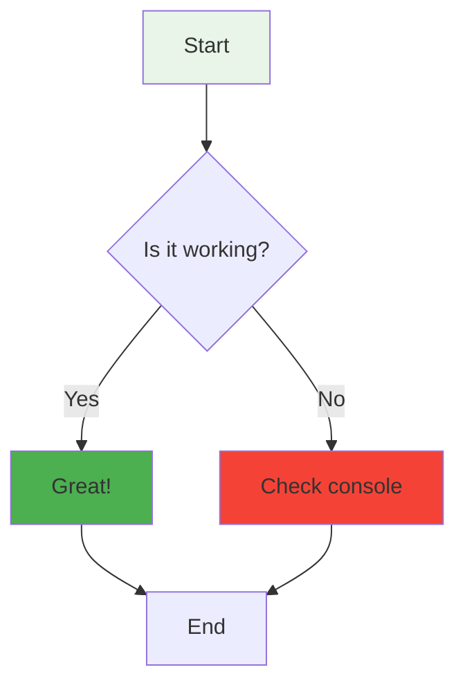
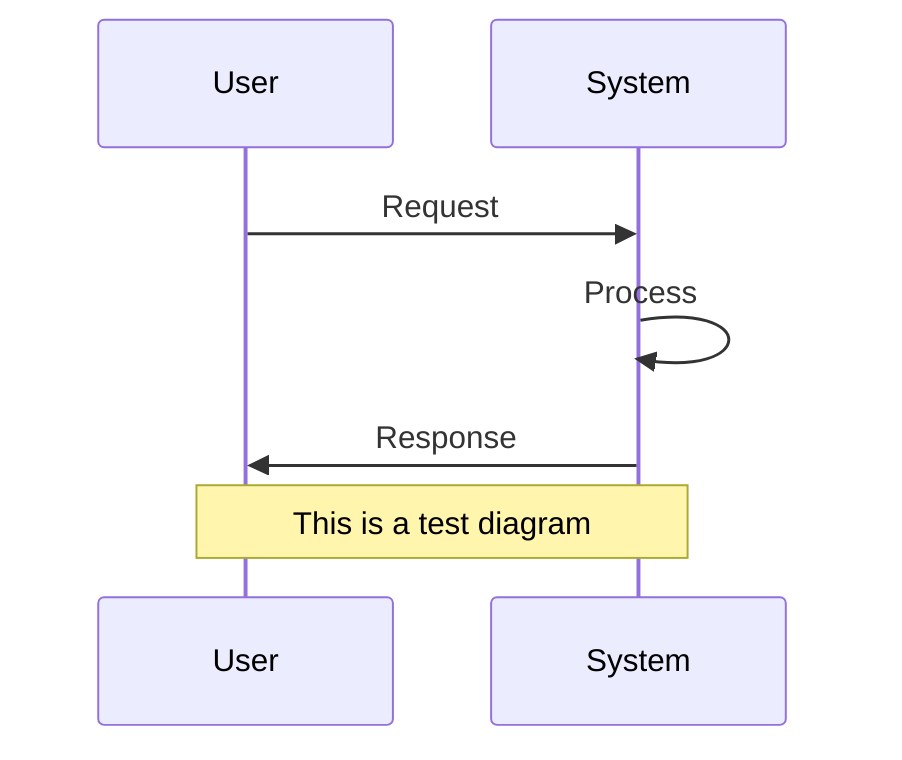
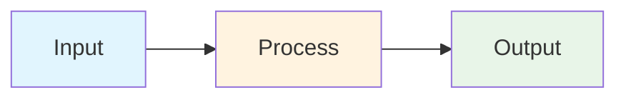

# 🧪 Mermaid Test Page

This page is for testing Mermaid diagram rendering.

## Test 1: Simple Flowchart

## Test 2: Sequence Diagram

## Test 3: Simple Graph

## Manual Mermaid Test

graph TD
    Start([Manual Test]) --> Process[Processing]
    Process --> End([Complete])
    
    style Start fill:#e8f5e8
    style End fill:#4caf50

## Debug Information

Open your browser's developer console (F12) to see debug information about Mermaid diagram detection and rendering.

If you see diagrams above, Mermaid is working correctly! If not, check the console for error messages. 