# 🔄 Unified Deployment Workflows

## 🎯 Overview

This guide demonstrates complete deployment workflows that integrate **Supabase** and **Eliza** through our unified API layer for seamless AI agent deployment and management. These workflows show how all components work together to provide a robust, scalable, and monitored agent infrastructure with abstracted container orchestration.

## 🏗️ Complete System Integration

```mermaid
flowchart TD
    subgraph "🎯 User Interface"
        WebUI[Web Dashboard]
        API[REST API]
        CLI[CLI Tools]
    end
    
    subgraph "🔐 Authentication Layer"
        SupaAuth[Supabase Auth]
        JWTValidation[JWT Validation]
        AuthService[Auth Service]
    end
    
    subgraph "📊 Data Layer"
        SupaDB[Supabase Database]
        ConfigStore[Configuration Store]
        MetadataStore[Metadata Store]
    end
    
    subgraph "🤖 Agent Management"
        AgentService[Agent Service]
        ConfigGen[Config Generator]
        TemplateEngine[Template Engine]
    end
    
    subgraph "🏗️ Build Pipeline"
        CodeGen[Code Generation]
        ContainerBuild[Container Build]
        SecurityScan[Security Scan]
        Registry[Container Registry]
    end
    
    subgraph "🎛️ Orchestration"
        DeploymentEngine[Deployment Engine]
        K8sCluster[Kubernetes Cluster]
        ContainerManager[Container Manager]
    end
    
    subgraph "🤖 Eliza Runtime"
        ElizaCore[Eliza Core]
        Plugins[Plugin System]
        Platforms[Platform Clients]
    end
    
    subgraph "📈 Monitoring"
        Prometheus[Prometheus]
        Grafana[Grafana]
        AlertManager[Alert Manager]
        RealTimeMetrics[Real-time Metrics]
    end
    
    %% User Flow
    WebUI --> SupaAuth
    API --> SupaAuth
    CLI --> SupaAuth
    
    %% Authentication Flow
    SupaAuth --> JWTValidation
    JWTValidation --> AuthService
    
    %% Data Flow
    SupaAuth --> SupaDB
    AuthService --> MetadataStore
    SupaDB --> ConfigStore
    
    %% Agent Management Flow
    ConfigStore --> AgentService
    AgentService --> ConfigGen
    ConfigGen --> TemplateEngine
    
    %% Build Pipeline Flow
    TemplateEngine --> CodeGen
    CodeGen --> ContainerBuild
    ContainerBuild --> SecurityScan
    SecurityScan --> Registry
    
    %% Deployment Flow
    Registry --> DeploymentEngine
    DeploymentEngine --> K8sCluster
    K8sCluster --> ContainerManager
    
    %% Runtime Flow
    ContainerManager --> ElizaCore
    ElizaCore --> Plugins
    Plugins --> Platforms
    
    %% Monitoring Flow
    K8sCluster --> Prometheus
    DeploymentEngine --> Prometheus
    SupaDB --> RealTimeMetrics
    Prometheus --> Grafana
    Prometheus --> AlertManager
    
    %% Feedback Loops
    RealTimeMetrics --> SupaDB
    AlertManager --> SupaDB
    Grafana --> WebUI
    
    style WebUI fill:#e3f2fd
    style SupaAuth fill:#4caf50
    style DeploymentEngine fill:#00bcd4
    style ElizaCore fill:#ff9800
    style Prometheus fill:#f44336
```



## 🚀 Complete Deployment Workflow

### Phase 1: Authentication & Setup

```bash
#!/bin/bash
# Complete deployment workflow script

echo "🔐 Phase 1: Authentication & Setup"

# 1. Authenticate with Supabase
echo "🔑 Authenticating with Supabase..."
SUPABASE_RESPONSE=$(curl -s -X POST https://your-project.supabase.co/auth/v1/token?grant_type=password \
  -H "apikey: $SUPABASE_ANON_KEY" \
  -H "Content-Type: application/json" \
  -d '{
    "email": "'$USER_EMAIL'",
    "password": "'$USER_PASSWORD'"
  }')

SUPABASE_JWT=$(echo $SUPABASE_RESPONSE | jq -r '.access_token')
USER_ID=$(echo $SUPABASE_RESPONSE | jq -r '.user.id')

if [ "$SUPABASE_JWT" == "null" ]; then
    echo "❌ Supabase authentication failed"
    exit 1
fi

echo "✅ Supabase authentication successful"

# 2. Authenticate with Portainer
echo "🐳 Authenticating with Portainer..."
PORTAINER_RESPONSE=$(curl -s -X POST https://portainer.yourdomain.com/api/auth \
  -H "Content-Type: application/json" \
  -d '{
    "username": "'$PORTAINER_USER'",
    "password": "'$PORTAINER_PASSWORD'"
  }')

PORTAINER_JWT=$(echo $PORTAINER_RESPONSE | jq -r '.jwt')

if [ "$PORTAINER_JWT" == "null" ]; then
    echo "❌ Portainer authentication failed"
    exit 1
fi

echo "✅ Portainer authentication successful"

# 3. Validate cluster access
echo "☸️ Validating Kubernetes cluster access..."
kubectl cluster-info > /dev/null 2>&1
if [ $? -ne 0 ]; then
    echo "❌ Kubernetes cluster access failed"
    exit 1
fi

echo "✅ Kubernetes cluster access validated"
```

### Phase 2: Agent Configuration

```bash
echo "🤖 Phase 2: Agent Configuration"

# 1. Create agent configuration
AGENT_CONFIG=$(cat << EOF
{
  "agent": {
    "name": "$AGENT_NAME",
    "description": "$AGENT_DESCRIPTION",
    "user_id": "$USER_ID",
    "character": {
      "name": "$CHARACTER_NAME",
      "bio": [
        "$CHARACTER_BIO"
      ],
      "personality": "$CHARACTER_PERSONALITY",
      "instructions": [
        "$CHARACTER_INSTRUCTIONS"
      ],
      "adjectives": ["$CHARACTER_ADJECTIVES"],
      "topics": ["$CHARACTER_TOPICS"]
    },
    "plugins": [
      "@elizaos/plugin-discord",
      "@elizaos/plugin-supabase"
    ],
    "platforms": ["$PLATFORMS"],
    "resources": {
      "memory": "$MEMORY_LIMIT",
      "cpu": "$CPU_LIMIT",
      "replicas": $REPLICAS
    },
    "scaling": {
      "minReplicas": $MIN_REPLICAS,
      "maxReplicas": $MAX_REPLICAS,
      "targetCPU": $TARGET_CPU,
      "targetMemory": $TARGET_MEMORY
    },
    "environment": {
      "NODE_ENV": "production",
      "SUPABASE_URL": "$SUPABASE_URL",
      "SUPABASE_ANON_KEY": "$SUPABASE_ANON_KEY",
      "DISCORD_TOKEN": "$DISCORD_TOKEN"
    }
  },
  "portainer": {
    "template": "eliza-agent-template",
    "stack_name": "eliza-$AGENT_NAME",
    "deployment_strategy": "rolling",
    "health_checks": {
      "enabled": true,
      "interval": "30s",
      "timeout": "10s",
      "retries": 3
    }
  },
  "monitoring": {
    "enabled": true,
    "metrics_endpoint": "/metrics",
    "log_level": "info"
  }
}
EOF
)

echo "📝 Agent configuration created"

# 2. Store configuration in Supabase
echo "💾 Storing configuration in Supabase..."
SUPABASE_INSERT=$(curl -s -X POST https://your-project.supabase.co/rest/v1/agents \
  -H "Authorization: Bearer $SUPABASE_JWT" \
  -H "apikey: $SUPABASE_ANON_KEY" \
  -H "Content-Type: application/json" \
  -d "$AGENT_CONFIG")

AGENT_ID=$(echo $SUPABASE_INSERT | jq -r '.[0].id')

if [ "$AGENT_ID" == "null" ]; then
    echo "❌ Failed to store configuration in Supabase"
    exit 1
fi

echo "✅ Configuration stored in Supabase (ID: $AGENT_ID)"
```

### Phase 3: Container Template Generation

```bash
echo "📦 Phase 3: Container Template Generation"

# 1. Generate Eliza character file
echo "🎭 Generating Eliza character file..."
cat << EOF > /tmp/character.json
{
  "name": "$CHARACTER_NAME",
  "bio": [
    "$CHARACTER_BIO"
  ],
  "personality": "$CHARACTER_PERSONALITY",
  "instructions": [
    "$CHARACTER_INSTRUCTIONS"
  ],
  "adjectives": ["$CHARACTER_ADJECTIVES"],
  "topics": ["$CHARACTER_TOPICS"],
  "plugins": [
    "@elizaos/plugin-discord",
    "@elizaos/plugin-supabase"
  ]
}
EOF

# 2. Generate Dockerfile
echo "🐳 Generating Dockerfile..."
cat << EOF > /tmp/Dockerfile
FROM node:18-alpine

WORKDIR /app

# Install Eliza dependencies
RUN npm install -g @elizaos/cli

# Copy character configuration
COPY character.json /app/character.json

# Install required plugins
RUN npm install @elizaos/plugin-discord @elizaos/plugin-supabase

# Copy application code
COPY package.json package-lock.json ./
RUN npm ci --only=production

COPY . .

# Health check
HEALTHCHECK --interval=30s --timeout=10s --start-period=60s --retries=3 \
  CMD curl -f http://localhost:3000/health || exit 1

# Expose port
EXPOSE 3000

# Start agent
CMD ["node", "index.js"]
EOF

# 3. Generate Portainer stack template
echo "🏗️ Generating Portainer stack template..."
STACK_TEMPLATE=$(cat << EOF
{
  "name": "eliza-$AGENT_NAME",
  "stackFileContent": "version: '3.8'\n\nservices:\n  eliza-agent:\n    image: \${REGISTRY}/eliza-agent:latest\n    environment:\n      - NODE_ENV=production\n      - AGENT_NAME=$AGENT_NAME\n      - SUPABASE_URL=\${SUPABASE_URL}\n      - SUPABASE_ANON_KEY=\${SUPABASE_ANON_KEY}\n      - DISCORD_TOKEN=\${DISCORD_TOKEN}\n    deploy:\n      replicas: $REPLICAS\n      resources:\n        limits:\n          cpus: '$CPU_LIMIT'\n          memory: $MEMORY_LIMIT\n        reservations:\n          cpus: '0.25'\n          memory: 256M\n      restart_policy:\n        condition: on-failure\n        delay: 30s\n        max_attempts: 3\n      update_config:\n        parallelism: 1\n        delay: 30s\n        failure_action: rollback\n        order: start-first\n    networks:\n      - agent-network\n    labels:\n      - 'traefik.enable=true'\n      - 'traefik.http.routers.agent-$AGENT_NAME.rule=Host(\`$AGENT_NAME.yourdomain.com\`)'\n      - 'prometheus.io/scrape=true'\n      - 'prometheus.io/port=3000'\n      - 'prometheus.io/path=/metrics'\n    healthcheck:\n      test: ['CMD', 'curl', '-f', 'http://localhost:3000/health']\n      interval: 30s\n      timeout: 10s\n      retries: 3\n      start_period: 60s\n\n  agent-monitor:\n    image: \${REGISTRY}/agent-monitor:latest\n    environment:\n      - AGENT_NAME=$AGENT_NAME\n      - SUPABASE_URL=\${SUPABASE_URL}\n      - SUPABASE_SERVICE_ROLE_KEY=\${SUPABASE_SERVICE_ROLE_KEY}\n    deploy:\n      replicas: 1\n      resources:\n        limits:\n          cpus: '0.25'\n          memory: 256M\n    networks:\n      - agent-network\n      - monitoring-network\n    depends_on:\n      - eliza-agent\n\nnetworks:\n  agent-network:\n    driver: overlay\n    encrypted: true\n  monitoring-network:\n    external: true\n\nvolumes:\n  agent-data:\n    driver: local",
  "env": [
    {
      "name": "REGISTRY",
      "value": "$CONTAINER_REGISTRY"
    },
    {
      "name": "SUPABASE_URL",
      "value": "$SUPABASE_URL"
    },
    {
      "name": "SUPABASE_ANON_KEY",
      "value": "$SUPABASE_ANON_KEY"
    },
    {
      "name": "SUPABASE_SERVICE_ROLE_KEY",
      "value": "$SUPABASE_SERVICE_ROLE_KEY"
    },
    {
      "name": "DISCORD_TOKEN",
      "value": "$DISCORD_TOKEN"
    }
  ]
}
EOF
)

echo "✅ Container templates generated"
```

### Phase 4: Build and Security Scan

```bash
echo "🔨 Phase 4: Build and Security Scan"

# 1. Build container image
echo "🏗️ Building container image..."
docker build -t $CONTAINER_REGISTRY/eliza-agent:$AGENT_NAME-$(date +%Y%m%d-%H%M%S) /tmp/

BUILD_TAG=$(docker images --format "table {{.Repository}}:{{.Tag}}" | grep eliza-agent | head -1 | cut -d':' -f2)

if [ -z "$BUILD_TAG" ]; then
    echo "❌ Container build failed"
    exit 1
fi

echo "✅ Container built: $CONTAINER_REGISTRY/eliza-agent:$BUILD_TAG"

# 2. Security scan with Trivy
echo "🛡️ Running security scan..."
trivy image --format json --output /tmp/scan-results.json $CONTAINER_REGISTRY/eliza-agent:$BUILD_TAG

CRITICAL_VULNS=$(cat /tmp/scan-results.json | jq '.Results[].Vulnerabilities[]? | select(.Severity == "CRITICAL") | length')

if [ "$CRITICAL_VULNS" -gt 0 ]; then
    echo "❌ Security scan failed: $CRITICAL_VULNS critical vulnerabilities found"
    exit 1
fi

echo "✅ Security scan passed"

# 3. Push to registry
echo "📤 Pushing to container registry..."
docker push $CONTAINER_REGISTRY/eliza-agent:$BUILD_TAG

# 4. Update Supabase with build info
echo "📊 Updating Supabase with build information..."
curl -s -X PATCH https://your-project.supabase.co/rest/v1/agents?id=eq.$AGENT_ID \
  -H "Authorization: Bearer $SUPABASE_JWT" \
  -H "apikey: $SUPABASE_ANON_KEY" \
  -H "Content-Type: application/json" \
  -d '{
    "build_info": {
      "image_tag": "'$BUILD_TAG'",
      "build_time": "'$(date -u +%Y-%m-%dT%H:%M:%SZ)'",
      "security_scan": "passed"
    },
    "status": "built"
  }'

echo "✅ Build phase completed"
```

### Phase 5: Portainer Deployment

```bash
echo "🚀 Phase 5: Portainer Deployment"

# 1. Deploy stack via Portainer API
echo "📦 Deploying stack via Portainer..."
DEPLOYMENT_RESPONSE=$(curl -s -X POST https://portainer.yourdomain.com/api/stacks \
  -H "Authorization: Bearer $PORTAINER_JWT" \
  -H "Content-Type: application/json" \
  -d "$STACK_TEMPLATE")

STACK_ID=$(echo $DEPLOYMENT_RESPONSE | jq -r '.Id')

if [ "$STACK_ID" == "null" ]; then
    echo "❌ Stack deployment failed"
    echo "Error: $(echo $DEPLOYMENT_RESPONSE | jq -r '.message')"
    exit 1
fi

echo "✅ Stack deployed successfully (ID: $STACK_ID)"

# 2. Wait for deployment to complete
echo "⏳ Waiting for deployment to complete..."
for i in {1..30}; do
    STACK_STATUS=$(curl -s -H "Authorization: Bearer $PORTAINER_JWT" \
        https://portainer.yourdomain.com/api/stacks/$STACK_ID | jq -r '.Status')
    
    if [ "$STACK_STATUS" == "1" ]; then
        echo "✅ Stack deployment completed"
        break
    elif [ "$STACK_STATUS" == "2" ]; then
        echo "❌ Stack deployment failed"
        exit 1
    fi
    
    echo "⏳ Deployment in progress... ($i/30)"
    sleep 10
done

# 3. Update Supabase with deployment info
echo "📊 Updating Supabase with deployment information..."
curl -s -X PATCH https://your-project.supabase.co/rest/v1/agents?id=eq.$AGENT_ID \
  -H "Authorization: Bearer $SUPABASE_JWT" \
  -H "apikey: $SUPABASE_ANON_KEY" \
  -H "Content-Type: application/json" \
  -d '{
    "deployment_info": {
      "stack_id": "'$STACK_ID'",
      "deployment_time": "'$(date -u +%Y-%m-%dT%H:%M:%SZ)'",
      "portainer_url": "https://portainer.yourdomain.com/#!/1/docker/stacks/'$STACK_ID'"
    },
    "status": "deployed"
  }'

echo "✅ Deployment phase completed"
```

### Phase 6: Health Checks and Monitoring

```bash
echo "🔍 Phase 6: Health Checks and Monitoring"

# 1. Verify agent health
echo "❤️ Checking agent health..."
for i in {1..12}; do
    HEALTH_STATUS=$(curl -s -o /dev/null -w "%{http_code}" "https://$AGENT_NAME.yourdomain.com/health")
    
    if [ "$HEALTH_STATUS" == "200" ]; then
        echo "✅ Agent health check passed"
        break
    fi
    
    echo "⏳ Waiting for agent to be healthy... ($i/12)"
    sleep 10
done

if [ "$HEALTH_STATUS" != "200" ]; then
    echo "❌ Agent health check failed"
    exit 1
fi

# 2. Setup monitoring
echo "📊 Setting up monitoring..."
curl -s -X POST https://your-project.supabase.co/rest/v1/agent_metrics \
  -H "Authorization: Bearer $SUPABASE_JWT" \
  -H "apikey: $SUPABASE_ANON_KEY" \
  -H "Content-Type: application/json" \
  -d '{
    "agent_id": "'$AGENT_ID'",
    "timestamp": "'$(date -u +%Y-%m-%dT%H:%M:%SZ)'",
    "cpu_usage": 0,
    "memory_usage": 0,
    "status": "initializing"
  }'

# 3. Enable real-time monitoring
echo "⚡ Enabling real-time monitoring..."
curl -s -X POST https://your-project.supabase.co/rest/v1/monitoring_subscriptions \
  -H "Authorization: Bearer $SUPABASE_JWT" \
  -H "apikey: $SUPABASE_ANON_KEY" \
  -H "Content-Type: application/json" \
  -d '{
    "agent_id": "'$AGENT_ID'",
    "user_id": "'$USER_ID'",
    "channels": ["agent_status", "performance_metrics", "error_logs"],
    "enabled": true
  }'

# 4. Final status update
echo "🎉 Updating final status..."
curl -s -X PATCH https://your-project.supabase.co/rest/v1/agents?id=eq.$AGENT_ID \
  -H "Authorization: Bearer $SUPABASE_JWT" \
  -H "apikey: $SUPABASE_ANON_KEY" \
  -H "Content-Type: application/json" \
  -d '{
    "status": "running",
    "deployed_at": "'$(date -u +%Y-%m-%dT%H:%M:%SZ)'",
    "health_status": "healthy",
    "monitoring_enabled": true
  }'

echo "✅ Monitoring setup completed"
```

### Phase 7: Post-Deployment Verification

```bash
echo "✅ Phase 7: Post-Deployment Verification"

# 1. Verify all components
echo "🔍 Verifying all components..."

# Check Supabase connection
SUPABASE_CHECK=$(curl -s -X GET https://your-project.supabase.co/rest/v1/agents?id=eq.$AGENT_ID \
  -H "Authorization: Bearer $SUPABASE_JWT" \
  -H "apikey: $SUPABASE_ANON_KEY" | jq -r '.[0].status')

if [ "$SUPABASE_CHECK" != "running" ]; then
    echo "❌ Supabase verification failed"
    exit 1
fi

# Check Portainer stack
PORTAINER_CHECK=$(curl -s -H "Authorization: Bearer $PORTAINER_JWT" \
    https://portainer.yourdomain.com/api/stacks/$STACK_ID | jq -r '.Status')

if [ "$PORTAINER_CHECK" != "1" ]; then
    echo "❌ Portainer verification failed"
    exit 1
fi

# Check agent endpoint
AGENT_CHECK=$(curl -s -o /dev/null -w "%{http_code}" "https://$AGENT_NAME.yourdomain.com/health")

if [ "$AGENT_CHECK" != "200" ]; then
    echo "❌ Agent endpoint verification failed"
    exit 1
fi

echo "✅ All components verified successfully"

# 2. Display deployment summary
echo "📋 Deployment Summary"
echo "===================="
echo "Agent Name: $AGENT_NAME"
echo "Agent ID: $AGENT_ID"
echo "Stack ID: $STACK_ID"
echo "Image Tag: $BUILD_TAG"
echo "Status: Running"
echo "Health: Healthy"
echo "Endpoint: https://$AGENT_NAME.yourdomain.com"
echo "Portainer: https://portainer.yourdomain.com/#!/1/docker/stacks/$STACK_ID"
echo "Supabase: https://your-project.supabase.co"
echo "Monitoring: Enabled"
echo "===================="

echo "🎉 Deployment completed successfully!"
```

## 🔄 Operational Workflows

### Agent Scaling Workflow

```bash
#!/bin/bash
# Agent scaling workflow

AGENT_ID=$1
NEW_REPLICAS=$2

echo "📈 Scaling agent $AGENT_ID to $NEW_REPLICAS replicas..."

# 1. Get current agent info
AGENT_INFO=$(curl -s -X GET https://your-project.supabase.co/rest/v1/agents?id=eq.$AGENT_ID \
  -H "Authorization: Bearer $SUPABASE_JWT" \
  -H "apikey: $SUPABASE_ANON_KEY")

STACK_ID=$(echo $AGENT_INFO | jq -r '.[0].deployment_info.stack_id')
CURRENT_REPLICAS=$(echo $AGENT_INFO | jq -r '.[0].resources.replicas')

echo "Current replicas: $CURRENT_REPLICAS"
echo "Target replicas: $NEW_REPLICAS"

# 2. Update stack in Portainer
echo "🐳 Updating Portainer stack..."
curl -s -X PUT https://portainer.yourdomain.com/api/stacks/$STACK_ID \
  -H "Authorization: Bearer $PORTAINER_JWT" \
  -H "Content-Type: application/json" \
  -d '{
    "env": [
      {
        "name": "REPLICAS",
        "value": "'$NEW_REPLICAS'"
      }
    ]
  }'

# 3. Update Supabase record
echo "📊 Updating Supabase record..."
curl -s -X PATCH https://your-project.supabase.co/rest/v1/agents?id=eq.$AGENT_ID \
  -H "Authorization: Bearer $SUPABASE_JWT" \
  -H "apikey: $SUPABASE_ANON_KEY" \
  -H "Content-Type: application/json" \
  -d '{
    "resources": {
      "replicas": '$NEW_REPLICAS'
    },
    "last_scaled": "'$(date -u +%Y-%m-%dT%H:%M:%SZ)'"
  }'

echo "✅ Scaling operation completed"
```

### Update Workflow

```bash
#!/bin/bash
# Agent update workflow

AGENT_ID=$1
NEW_VERSION=$2

echo "🔄 Updating agent $AGENT_ID to version $NEW_VERSION..."

# 1. Build new version
echo "🏗️ Building new version..."
docker build -t $CONTAINER_REGISTRY/eliza-agent:$NEW_VERSION .
docker push $CONTAINER_REGISTRY/eliza-agent:$NEW_VERSION

# 2. Update Portainer stack
echo "🐳 Updating Portainer stack..."
AGENT_INFO=$(curl -s -X GET https://your-project.supabase.co/rest/v1/agents?id=eq.$AGENT_ID \
  -H "Authorization: Bearer $SUPABASE_JWT" \
  -H "apikey: $SUPABASE_ANON_KEY")

STACK_ID=$(echo $AGENT_INFO | jq -r '.[0].deployment_info.stack_id')

curl -s -X PUT https://portainer.yourdomain.com/api/stacks/$STACK_ID \
  -H "Authorization: Bearer $PORTAINER_JWT" \
  -H "Content-Type: application/json" \
  -d '{
    "env": [
      {
        "name": "IMAGE_TAG",
        "value": "'$NEW_VERSION'"
      }
    ]
  }'

# 3. Update Supabase record
echo "📊 Updating Supabase record..."
curl -s -X PATCH https://your-project.supabase.co/rest/v1/agents?id=eq.$AGENT_ID \
  -H "Authorization: Bearer $SUPABASE_JWT" \
  -H "apikey: $SUPABASE_ANON_KEY" \
  -H "Content-Type: application/json" \
  -d '{
    "build_info": {
      "image_tag": "'$NEW_VERSION'",
      "updated_at": "'$(date -u +%Y-%m-%dT%H:%M:%SZ)'"
    },
    "status": "updating"
  }'

echo "✅ Update operation completed"
```

### Monitoring Workflow

```bash
#!/bin/bash
# Real-time monitoring workflow

AGENT_ID=$1

echo "📊 Starting real-time monitoring for agent $AGENT_ID..."

# 1. Setup monitoring loop
while true; do
    # Get metrics from Portainer
    AGENT_INFO=$(curl -s -X GET https://your-project.supabase.co/rest/v1/agents?id=eq.$AGENT_ID \
      -H "Authorization: Bearer $SUPABASE_JWT" \
      -H "apikey: $SUPABASE_ANON_KEY")
    
    STACK_ID=$(echo $AGENT_INFO | jq -r '.[0].deployment_info.stack_id')
    
    # Get container metrics
    CONTAINER_METRICS=$(curl -s -H "Authorization: Bearer $PORTAINER_JWT" \
        https://portainer.yourdomain.com/api/endpoints/1/docker/containers/json | \
        jq '.[] | select(.Labels."com.docker.stack.namespace" == "eliza-'$AGENT_ID'")')
    
    # Extract metrics
    CPU_USAGE=$(echo $CONTAINER_METRICS | jq -r '.Stats.cpu_stats.cpu_usage.total_usage')
    MEMORY_USAGE=$(echo $CONTAINER_METRICS | jq -r '.Stats.memory_stats.usage')
    
    # Update Supabase with metrics
    curl -s -X POST https://your-project.supabase.co/rest/v1/agent_metrics \
      -H "Authorization: Bearer $SUPABASE_JWT" \
      -H "apikey: $SUPABASE_ANON_KEY" \
      -H "Content-Type: application/json" \
      -d '{
        "agent_id": "'$AGENT_ID'",
        "timestamp": "'$(date -u +%Y-%m-%dT%H:%M:%SZ)'",
        "cpu_usage": '$CPU_USAGE',
        "memory_usage": '$MEMORY_USAGE',
        "status": "running"
      }'
    
    sleep 30
done
```

## 🎯 Complete Integration Example

Here's a complete example that demonstrates the entire workflow:

```bash
#!/bin/bash
# Complete integration example

export AGENT_NAME="trading-assistant"
export AGENT_DESCRIPTION="AI-powered cryptocurrency trading assistant"
export CHARACTER_NAME="TradingBot"
export CHARACTER_BIO="Expert cryptocurrency trader with real-time market analysis"
export CHARACTER_PERSONALITY="Professional, analytical, and data-driven"
export CHARACTER_INSTRUCTIONS="Always provide accurate market data and explain trading strategies clearly"
export CHARACTER_ADJECTIVES="analytical,professional,precise,helpful"
export CHARACTER_TOPICS="cryptocurrency,trading,market-analysis,portfolio-management"
export PLATFORMS="discord"
export MEMORY_LIMIT="1Gi"
export CPU_LIMIT="500m"
export REPLICAS=3
export MIN_REPLICAS=1
export MAX_REPLICAS=10
export TARGET_CPU=70
export TARGET_MEMORY=80

# Run complete deployment
./unified-deployment.sh

# Monitor deployment
./monitor-deployment.sh $AGENT_ID

# Scale if needed
./scale-agent.sh $AGENT_ID 5

# Update when ready
./update-agent.sh $AGENT_ID v2.0.0
```

This unified workflow demonstrates how Supabase, Eliza, and Portainer work together to provide a complete, scalable, and monitored AI agent deployment platform. The workflows handle authentication, configuration management, container orchestration, monitoring, and operational tasks in a seamless, integrated manner. 