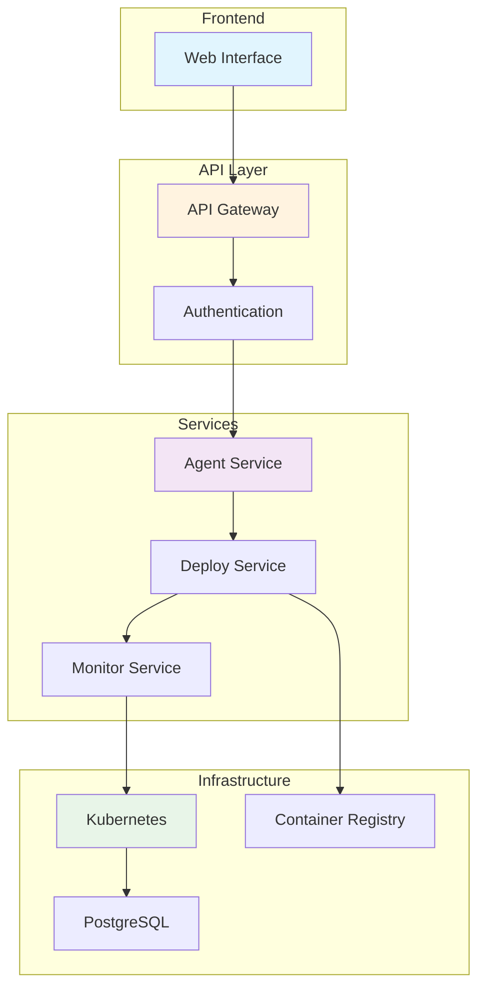

<div align="center">

# 🚀 AI Agent Launchpad

**Infrastructure Backend for Automated AI Agent Deployment**

[](LICENSE)
[](https://yourusername.github.io/agent-launchpad-infra)

---

</div>

## 🌟 What is AI Agent Launchpad?

The **AI Agent Launchpad** is a robust infrastructure backend that automates the deployment and management of [Eliza-based AI agents](https://github.com/elizaos/eliza) through a streamlined interface with Docker and Kubernetes orchestration.

### ✨ Key Features

<div style="display: grid; grid-template-columns: repeat(auto-fit, minmax(300px, 1fr)); gap: 20px; margin: 20px 0;">

<div style="border: 1px solid #e0e0e0; border-radius: 8px; padding: 20px;">
<h4>🤖 Automated Deployment</h4>
<p>Deploy Eliza agents with simple configuration - from code to production in minutes</p>
</div>

<div style="border: 1px solid #e0e0e0; border-radius: 8px; padding: 20px;">
<h4>🔒 Security First</h4>
<p>Container scanning, API authentication, and encrypted storage built-in</p>
</div>

<div style="border: 1px solid #e0e0e0; border-radius: 8px; padding: 20px;">
<h4>📊 Real-time Monitoring</h4>
<p>Health checks, metrics, and alerting with Prometheus and Grafana</p>
</div>

<div style="border: 1px solid #e0e0e0; border-radius: 8px; padding: 20px;">
<h4>⚡ Auto-scaling</h4>
<p>Dynamic resource management based on load and performance</p>
</div>

<div style="border: 1px solid #e0e0e0; border-radius: 8px; padding: 20px;">
<h4>🛡️ Container Security</h4>
<p>Vulnerability scanning with Trivy blocks insecure deployments</p>
</div>

<div style="border: 1px solid #e0e0e0; border-radius: 8px; padding: 20px;">
<h4>🔧 Simple Management</h4>
<p>Easy agent lifecycle operations through RESTful APIs</p>
</div>

</div>

---

## 🏗️ Architecture Overview



---

## 🚀 Quick Start

### 1. Prerequisites

- **Kubernetes cluster** (local or cloud)
- **Docker** for container building
- **PostgreSQL** database
- **Container registry** (Docker Hub, AWS ECR, etc.)

### 2. Installation

```bash
# Clone the repository
git clone https://github.com/yourusername/agent-launchpad-infra.git
cd agent-launchpad-infra

# Install dependencies
npm install

# Configure environment
cp .env.example .env
# Edit .env with your configuration

# Deploy to Kubernetes
kubectl apply -f k8s/
```

### 3. Create Your First Agent

```bash
# Using the API
curl -X POST https://your-domain.com/api/agents \
  -H "X-API-Key: your-api-key" \
  -H "Content-Type: application/json" \
  -d '{
    "agentName": "my-trading-bot",
    "description": "AI trading assistant",
    "plugins": ["@elizaos/plugin-discord", "@elizaos/plugin-web3"],
    "resources": {
      "memory": "1Gi",
      "cpu": "500m"
    }
  }'
```

---

## 📚 Documentation

<div style="display: grid; grid-template-columns: repeat(auto-fit, minmax(250px, 1fr)); gap: 15px; margin: 20px 0;">

<div style="border-left: 4px solid #2196F3; padding-left: 15px;">
<h4><a href="README.md">📋 Complete Architecture</a></h4>
<p>Detailed system architecture with flow charts and component documentation</p>
</div>

<div style="border-left: 4px solid #4CAF50; padding-left: 15px;">
<h4><a href="getting-started.md">🚀 Getting Started</a></h4>
<p>Step-by-step guide to set up and deploy your first agent</p>
</div>

<div style="border-left: 4px solid #FF9800; padding-left: 15px;">
<h4><a href="api-reference.md">📡 API Reference</a></h4>
<p>Complete REST API documentation with examples</p>
</div>

<div style="border-left: 4px solid #F44336; padding-left: 15px;">
<h4><a href="security.md">🔐 Security Guide</a></h4>
<p>Security architecture, best practices, and compliance</p>
</div>

<div style="border-left: 4px solid #9C27B0; padding-left: 15px;">
<h4><a href="deployment.md">⚙️ Deployment Guide</a></h4>
<p>Production deployment strategies and operations</p>
</div>

<div style="border-left: 4px solid #607D8B; padding-left: 15px;">
<h4><a href="monitoring.md">📊 Monitoring</a></h4>
<p>Observability, metrics, and alerting configuration</p>
</div>

</div>

---

## 🎯 Use Cases

### 🤖 Discord Trading Bots
Deploy AI agents that provide real-time market analysis and trading signals to Discord communities.

### 💬 Telegram Support Agents
Create customer support bots that can handle inquiries and provide automated assistance.

### 🌐 Web3 Interaction Agents
Deploy agents that can interact with blockchain networks and provide DeFi services.

### 📊 Analytics & Reporting Bots
Set up agents that generate automated reports and data analysis for your organization.

---

## 🛣️ Roadmap

- [x] **Basic Agent Deployment** - Core functionality complete
- [x] **Container Security** - Vulnerability scanning integrated
- [x] **API Authentication** - Secure access control
- [x] **Health Monitoring** - Real-time status tracking
- [ ] **Multi-cloud Support** - AWS, GCP, Azure deployment
- [ ] **Advanced Scaling** - Predictive auto-scaling
- [ ] **Plugin Marketplace** - Community plugin ecosystem
- [ ] **Visual Builder** - Drag-and-drop agent configuration

---

## 🤝 Contributing

We welcome contributions from the community! Here's how you can help:

1. **🐛 Report Bugs** - [Create an issue](https://github.com/yourusername/agent-launchpad-infra/issues)
2. **💡 Suggest Features** - Share your ideas for improvements
3. **📖 Improve Documentation** - Help make our docs better
4. **🔧 Submit Code** - Fork, develop, and create pull requests

### Development Setup

```bash
# Fork and clone the repository
git clone https://github.com/yourusername/agent-launchpad-infra.git

# Create a feature branch
git checkout -b feature/your-feature-name

# Make your changes and commit
git commit -m "Add your feature"

# Push and create a pull request
git push origin feature/your-feature-name
```

---

## 📞 Support

<div style="display: grid; grid-template-columns: repeat(auto-fit, minmax(200px, 1fr)); gap: 15px; margin: 20px 0;">

<div style="text-align: center; padding: 15px;">
<h4>💬 Discord Community</h4>
<p><a href="https://discord.gg/your-server">Join our Discord</a></p>
</div>

<div style="text-align: center; padding: 15px;">
<h4>🐛 Bug Reports</h4>
<p><a href="https://github.com/yourusername/agent-launchpad-infra/issues">GitHub Issues</a></p>
</div>

<div style="text-align: center; padding: 15px;">
<h4>📧 Email Support</h4>
<p><a href="mailto:support@your-domain.com">support@your-domain.com</a></p>
</div>

<div style="text-align: center; padding: 15px;">
<h4>📚 Documentation</h4>
<p><a href="README.md">Read the Docs</a></p>
</div>

</div>

---

## 📄 License

This project is licensed under the MIT License - see the [LICENSE](LICENSE) file for details.

---

<div align="center">

Made with ❤️ by the AI Agent Launchpad Team

[🏠 Home](/) • [📋 Docs](README.md) • [🚀 Quick Start](getting-started.md) • [📡 API](api-reference.md)

</div> 